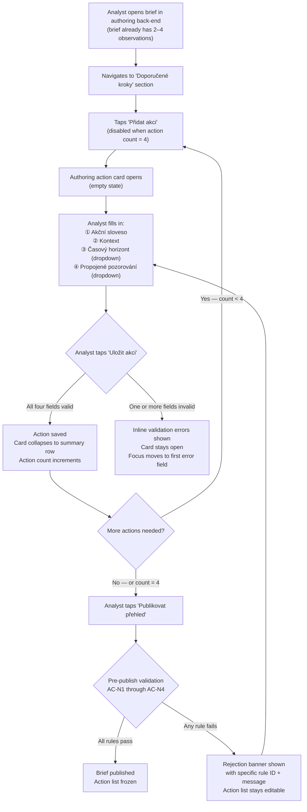
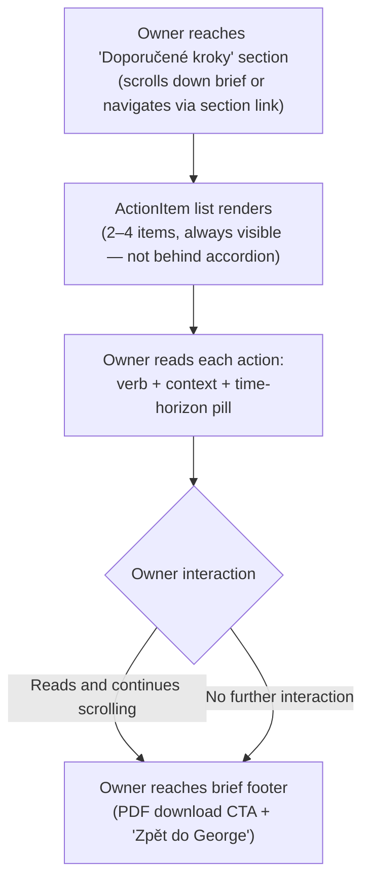

# Action Specificity Framing — Design

*Owner: designer · Slug: action-specificity-framing · Last updated: 2026-04-20*

---

## 1. Upstream link

- Product doc: [docs/product/action-specificity-framing.md](../product/action-specificity-framing.md)
- PRD sections driving constraints:
  - §7.2 Verdicts, not datasets — actions are the terminal verdict; without them the brief is commentary.
  - §7.3 Plain language — action copy reads like the owner's accountant, no analyst vocabulary.
  - §7.4 Day-one proof of value — actions must render in the first brief view with no configuration gate.
  - §7.5 Privacy — action copy must not name the owner, company, or any give-to-get flow.
  - §7.7 Bank-native distribution — primary surface is George Business WebView; authoring back-end is analyst-only, no owner interaction.
  - §8.1 Sector Briefing Engine — "2–4 specific, time-horizon-tagged actions" is the MVP contract.
  - §13.1 Brief production scaling — action schema must be tractable for human analysts at scale.
- Active decisions: D-003 (8-metric surface), D-004 (Czech only), D-005 (no cadence promise, B-001), D-006 (sector-only grain), D-009 (no advisor sharing, B-002), D-011 (canonical benchmark categories).
- IA reference: [docs/design/information-architecture.md §4.5 ActionItem](information-architecture.md) — owner-side component already specified; this artifact extends it with a time-horizon visual treatment and state matrix, and adds the authoring-side card.

---

## 2. Primary flow

### 2a. Authoring flow (ČS analyst → authoring back-end)

### 2b. Owner-side flow (read-only, brief web view)

**Owner actions are read-only at MVP.** No "mark as done", no click-through on individual actions. The closing action section is a terminal read surface. Tap-events on ActionItems are instrumented for engagement telemetry (see Q-PD-ASF-001) but the items themselves are not interactive controls.

---

## 2b. Embedded variant (George Business WebView)

The closing actions section in the WebView inherits the same layout constraints as the rest of the brief web view (§2b in `information-architecture.md`):

- Single-column, mobile-first. Content max-width 680 px above 768 px, centered.
- ActionItem touch target: minimum 44 × 44 px per item row (even though items are non-interactive controls, the pill + text block must meet this floor so that the row is comfortably readable and any future interactive state does not require a layout reflow — see Q-PD-ASF-001).
- Time-horizon pill: rendered inline at the end of the action text on the same line if it fits within 375 px viewport; wraps to a new line below the action text if not (never truncated, never clipped).
- No new browser tab. No clipboard use. No share sheet triggered by action items.
- The authoring back-end is analyst-only and is never embedded in George Business. It is a standalone web tool.

Standalone and embedded owner-side views are otherwise identical.

---

## 3. Screen inventory

### Authoring back-end screens

| Screen | Purpose | Entry | Exit | Empty state | Error states |
|---|---|---|---|---|---|
| Brief authoring — Doporučené kroky section | Analyst creates and edits 2–4 closing actions for a brief | Analyst navigates to this section within the brief authoring interface | Analyst taps "Publikovat přehled" (publish) or navigates away without publishing | No actions yet: section shows "Přidejte alespoň 2 doporučené kroky. Přehled bez nich nelze publikovat." with a single "Přidat akci" button | Publish blocked by validation: rejection banner with rule ID(s) and plain-language message(s); action list remains editable |
| Authoring action card — empty | New action form with four fields | Tap "Přidat akci" | "Uložit akci" (success → summary row) or "Zrušit" (card closes, no action created) | All four fields are blank; no pre-fill | See §4 AuthoringActionCard component spec |
| Authoring action card — filled | Analyst-completed form before save | Field entry within the card | "Uložit akci" or "Zrušit" | Not applicable | Validation errors per field; see §4 |
| Authoring action card — validation error | One or more fields fail inline validation | Tap "Uložit akci" with invalid state | Analyst corrects field(s) and re-taps "Uložit akci" | Not applicable | Inline error per field; pre-publish rejection banner |
| Authoring action card — count-out-of-bounds | Attempt to exceed 4 actions or publish with fewer than 2 | "Přidat akci" tapped when count = 4; or "Publikovat přehled" tapped with count < 2 | Analyst removes an action (if at 4) or adds an action (if below 2) | Not applicable | "Přidat akci" button is disabled and visually inert when count = 4; pre-publish rejection banner AC-N1 when count < 2 |

### Owner-facing screens (web view, Component 5)

| Screen | Purpose | Entry | Exit | Empty state | Error states |
|---|---|---|---|---|---|
| Brief web view — Doporučené kroky section | Display 2–4 closing actions to the owner | Owner scrolls to this section within the brief detail screen | Owner scrolls to brief footer | Not applicable — a brief without 2–4 actions is rejected at publish; this state cannot be reached by the owner | Network error loading the brief: handled at the brief-detail level (see `information-architecture.md` §3 Surface B); the closing actions section itself has no isolated error state — if the brief loads, actions render |
| Brief PDF — Doporučené kroky section | Print/forwardable rendering of all closing actions | PDF is generated server-side from the published brief | Not applicable — static document | Not applicable | PDF generation failure: handled at PDFDownloadCTA level (see `information-architecture.md` §4.6) |

**Cohort comparison note:** Closing actions carry no cohort-derived numbers. Actions synthesize from already-displayed observations and benchmark snippets; they do not introduce new comparative data. Therefore no cohort degradation state applies to the ActionItem component. The action list renders identically regardless of cohort floor status.

---

## 4. Component specs

### 4.1 AuthoringActionCard (authoring back-end only)

**Purpose:** Form card in the analyst authoring back-end for creating or editing a single closing action. Contains four fields matching the action schema: `action_verb`, `context`, `time_horizon`, `linked_observation_id`.

| State | Description |
|---|---|
| Empty | All four fields blank. "Uložit akci" button is disabled. "Zrušit" is always enabled. No pre-fill. |
| Partially filled | At least one field has content. "Uložit akci" remains disabled until all four fields are valid. |
| Filled — ready to save | All four fields valid. "Uložit akci" enabled. |
| Validation error | One or more fields failed validation on attempted save. Each failing field shows an inline error message directly below it. Focus moves programmatically to the first failing field. "Uložit akci" re-enabled after any field change (re-validates on save attempt). |
| Loading (observation list) | `linked_observation_id` dropdown is loading the list of observations from the current brief. Shows a loading indicator inside the dropdown control. If the load fails, the dropdown shows an inline error: "Pozorování se nepodařilo načíst. Zkuste to prosím znovu." with a retry action. |
| Saved / collapsed | Card collapses to a summary row showing: time-horizon pill + truncated action verb + context (max ~60 characters with ellipsis). Edit (pencil icon) and Delete (bin icon) controls on the right. |

**Fields and validation:**

| Field | Label (Czech) | Type | Validation rule | Error message |
|---|---|---|---|---|
| `action_verb` | Akční sloveso | Text input, single line | Non-empty; max 40 characters; imperative mood is a guideline (not auto-enforced); no raw numbers (see Q-PD-ASF-002) | "Zadejte akční sloveso." / "Akční sloveso nesmí být delší než 40 znaků." |
| `context` | Kontext | Text input, single line or short textarea | Non-empty; max 120 characters | "Zadejte kontext akce." / "Kontext nesmí být delší než 120 znaků." |
| `time_horizon` | Časový horizont | Single-select dropdown; closed enum | Must select one of the four values; no other value accepted | "Vyberte časový horizont." |
| `linked_observation_id` | Propojené pozorování | Single-select dropdown populated from the current brief's observations | Must select one observation from within the same brief; no null allowed | "Vyberte propojené pozorování." |

**Dropdown values for `time_horizon` (displayed exactly as below, in this order):**

| Enum value | User-facing label | Explanatory subtitle (shown in dropdown only) |
|---|---|---|
| `okamzite` | Okamžitě | Tento týden až tento měsíc |
| `do_3_mesicu` | Do 3 měsíců | V průběhu aktuálního čtvrtletí |
| `do_12_mesicu` | Do 12 měsíců | V průběhu aktuálního roku |
| `vice_nez_rok` | Více než rok | Vícelété nebo strategické kroky |

**`linked_observation_id` dropdown format:** Each option shows the observation's headline text (truncated to ~80 characters with ellipsis if longer). The observation's own time-horizon tag is shown as a small pill badge inside the option row for orientation. Analyst selects the observation most directly supporting the action.

**Pre-publish rejection banner (appears at the top of the Doporučené kroky section):**

| Rule violated | Rejection message |
|---|---|
| AC-N1 — fewer than 2 actions | "Přehled musí obsahovat alespoň 2 doporučené kroky. Přidejte další." |
| AC-N1 — more than 4 actions | Not reachable via UI (add button is disabled at 4); may be triggered by import or API; message: "Přehled může obsahovat nejvýše 4 doporučené kroky." |
| AC-N4 — all actions are `vice_nez_rok` | "Alespoň jedna akce musí mít kratší časový horizont než 'Více než rok'. Upravte horizont alespoň jedné akce." |

**Props needed:** `briefId`, `observations: Observation[]` (for linked-observation dropdown), `onSave: (action: ActionDraft) => void`, `onCancel: () => void`, `initialValues?: ActionDraft` (for edit mode).

**Used in:** Analyst authoring back-end — Doporučené kroky section of the brief editor.

---

### 4.2 ActionItem (owner surface — extends IA §4.5)

**Purpose:** Renders a single closing action in the owner-facing brief web view and PDF. Already specified in `information-architecture.md` §4.5. This section adds the time-horizon visual treatment and the full state matrix.

**Time-horizon pill treatment:**

The time-horizon pill reuses the same pill badge component used for observations (`ObservationCard` — IA §4.2). This keeps a single visual vocabulary for horizons throughout the brief.

| Enum value | Pill label | Visual treatment |
|---|---|---|
| `okamzite` | Okamžitě | Accent colour — highest-urgency signal. Specific token TBD pending design-system confirmation (see Q-PD-ASF-003). |
| `do_3_mesicu` | Do 3 měsíců | Mid-urgency colour. Token TBD (Q-PD-ASF-003). |
| `do_12_mesicu` | Do 12 měsíců | Lower-urgency colour. Token TBD (Q-PD-ASF-003). |
| `vice_nez_rok` | Více než rok | Neutral / muted. Token TBD (Q-PD-ASF-003). |

**Rule:** Colour is never the only signal differentiating horizon values. The pill always carries its text label. Colour is an additive cue only. This satisfies WCAG SC 1.4.1 (use of colour).

**Pill position:** Pill appears immediately before the action text on the same line (leading pill pattern), consistent with `ObservationCard`. On 375 px viewport the pill + text either fit on one line or the text wraps under the pill; the pill itself never wraps. Layout is tested at 375 px minimum.

**State matrix:**

| State | Description |
|---|---|
| Default | Leading time-horizon pill + action text (action verb + context). Non-interactive — no hover, no active state, no focus ring (not a focusable element). |
| Loading | Skeleton: pill placeholder (fixed width matching longest label) + one line of text placeholder. |
| Error | Not applicable — ActionItem is static authored content. If the brief body fails to load, the error is handled at the brief-detail screen level. |

**No empty state** — the owner surface cannot display a brief with fewer than 2 or more than 4 actions (rejected at publish). No empty or out-of-bounds state is reachable through the owner surface.

**No cohort degradation state** — actions contain no cohort-derived numbers. See §3 cohort note.

**Props needed (extending IA §4.5):** `actionText: string` (pre-concatenated verb + context), `timeHorizon: 'okamzite' | 'do_3_mesicu' | 'do_12_mesicu' | 'vice_nez_rok'`.

**Used in:** Brief web view — Doporučené kroky section (Component 5). Brief PDF — Doporučené kroky section (static, no interactive state). Brief email — not rendered (per IA §4.5 and product doc §4 out of scope).

---

### 4.3 ActionList (owner surface — container)

**Purpose:** Ordered list wrapper rendering 2–4 ActionItem components in the brief web view and PDF.

| State | Description |
|---|---|
| Default | Section heading "Doporučené kroky" (H2 level in document hierarchy) + ordered list of 2–4 ActionItems. Section is always visible and not behind an accordion (IA §3 Surface B layout spec). |
| Loading | Skeleton: section heading placeholder + 2 ActionItem skeletons. |
| Error | Not applicable — static authored content. |

**Props needed:** `actions: Action[]` (array of 2–4 items, each with `actionText` and `timeHorizon`).

**Used in:** Brief web view (Component 5), Brief PDF.

---

## 5. Copy drafts

All copy is Czech only (D-004). Formal register, vykání. Legal review required before production (OQ-005).

### 5.1 Time-horizon enum labels (frozen per IA §2 and PRD AC-N3 — use verbatim)

| Enum value | User-facing label |
|---|---|
| `okamzite` | Okamžitě |
| `do_3_mesicu` | Do 3 měsíců |
| `do_12_mesicu` | Do 12 měsíců |
| `vice_nez_rok` | Více než rok |

Subtitles shown only inside the authoring dropdown (not on owner surface):

| Enum value | Authoring dropdown subtitle |
|---|---|
| `okamzite` | Tento týden až tento měsíc |
| `do_3_mesicu` | V průběhu aktuálního čtvrtletí |
| `do_12_mesicu` | V průběhu aktuálního roku |
| `vice_nez_rok` | Vícelété nebo strategické kroky |

### 5.2 Authoring back-end — field labels

| Location | Czech label |
|---|---|
| Field 1 label | Akční sloveso |
| Field 1 placeholder | např. "Přehodnoťte", "Projednejte", "Zkontrolujte" |
| Field 2 label | Kontext |
| Field 2 placeholder | např. "marži na hlavní produktové řadě s ohledem na vývoj vstupních nákladů" |
| Field 3 label | Časový horizont |
| Field 3 placeholder (unselected) | Vyberte horizont |
| Field 4 label | Propojené pozorování |
| Field 4 placeholder (unselected) | Vyberte pozorování z tohoto přehledu |
| Save button | Uložit akci |
| Cancel button | Zrušit |
| Add action button | Přidat akci |
| Add action button (disabled at count = 4) | Přidat akci (tooltip: "Maximální počet akcí je 4.") |

### 5.3 Authoring back-end — field-level validation messages

| Field | Condition | Message |
|---|---|---|
| Akční sloveso | Empty | Zadejte akční sloveso. |
| Akční sloveso | Over 40 characters | Akční sloveso nesmí být delší než 40 znaků. |
| Kontext | Empty | Zadejte kontext akce. |
| Kontext | Over 120 characters | Kontext nesmí být delší než 120 znaků. |
| Časový horizont | Nothing selected | Vyberte časový horizont. |
| Propojené pozorování | Nothing selected | Vyberte propojené pozorování. |
| Propojené pozorování | Load failed | Pozorování se nepodařilo načíst. Zkuste to prosím znovu. |

### 5.4 Authoring back-end — section-level and pre-publish messages

| Condition | Location | Message |
|---|---|---|
| No actions yet in section | Section empty state | Přidejte alespoň 2 doporučené kroky. Přehled bez nich nelze publikovat. |
| AC-N1 violation — fewer than 2 actions at publish | Rejection banner | Přehled musí obsahovat alespoň 2 doporučené kroky. Přidejte další. |
| AC-N1 violation — more than 4 actions (API/import path) | Rejection banner | Přehled může obsahovat nejvýše 4 doporučené kroky. |
| AC-N4 violation — all actions are Více než rok | Rejection banner | Alespoň jedna akce musí mít kratší časový horizont než "Více než rok". Upravte horizont alespoň jedné akce. |
| AC-N2 violation — missing required field on a saved action | Rejection banner | Jedna nebo více akcí obsahuje neúplné údaje. Zkontrolujte a doplňte chybějící pole. |
| AC-N2 violation — orphan action (linked observation not found) | Rejection banner | Jedna nebo více akcí je propojena s pozorováním, které v tomto přehledu neexistuje. Opravte propojení. |

### 5.5 Owner surface — section heading

| Location | Copy |
|---|---|
| Doporučené kroky section heading (web view, PDF) | Doporučené kroky |
| Section subheading / descriptor (optional — only if PM approves; see Q-PD-ASF-004) | Konkrétní kroky vycházející z pozorování v tomto přehledu. |

### 5.6 Example well-formed action (for analyst editorial guidance — not UI copy)

Formatted as: [pill: Okamžitě] Přehodnoťte cenovou politiku hlavní produktové řady s ohledem na vývoj vstupních nákladů ve vašem sektoru.

This example follows AC-N2 (all four fields present), AC-N3 (valid time-horizon enum), AC-N5 (no statistical notation), AC-N6 (synthesizes from observation, no new number), AC-N7 (no owner name, no credit product reference).

---

## 6. Accessibility checklist

### Owner surface (ActionItem, ActionList)

- [ ] All interactive elements reachable by keyboard — **Not applicable:** ActionItems are non-interactive read-only content at MVP. The ActionList section itself is reachable via standard document scroll and heading navigation (H2 "Doporučené kroky" is in the heading hierarchy).
- [ ] Focus states visible with sufficient contrast — **Not applicable for ActionItems** (non-interactive). If a future state adds interactivity, focus rings must meet WCAG 2.4.7 at ≥ 3:1 contrast against the adjacent background.
- [ ] Color is never the only signal — **Yes, required.** Time-horizon pills use a text label as the primary differentiator. Colour is additive only. Each pill value must be distinguishable without colour (e.g., pattern, label, or icon supplement — confirmed by QA during Phase 3). See §4.2 ActionItem pill treatment and Q-PD-ASF-003 for token confirmation.
- [ ] Text contrast ≥ WCAG AA (4.5:1 body, 3:1 large) — Action text body must meet 4.5:1. Pill label text (small, ≥ 14 px bold or ≥ 18 px regular = large text) must meet 3:1. Token confirmation pending design-system response (Q-PD-ASF-003).
- [ ] Screen-reader labels on icon-only controls — **Not applicable to ActionList/ActionItem** (no icon-only controls on owner surface). PDF icons in the footer are covered by `information-architecture.md` §6.
- [ ] Form fields have associated labels and error descriptions — **Not applicable** to the read-only owner surface.
- [ ] Motion respects prefers-reduced-motion — ActionList renders without animation. If a loading skeleton fade-in is applied, it must be disabled under `prefers-reduced-motion: reduce`.

### Authoring back-end (AuthoringActionCard)

- [ ] All interactive elements reachable by keyboard — All four form fields, "Uložit akci" and "Zrušit" buttons, "Přidat akci" button, edit/delete controls on the summary row must be reachable and operable by keyboard alone. Tab order follows visual reading order.
- [ ] Focus states visible with sufficient contrast — All focusable controls must show a visible focus indicator meeting WCAG 2.4.7 (≥ 3:1 contrast against adjacent background).
- [ ] Color is never the only signal — Validation errors use an inline message and an icon (e.g., exclamation mark) in addition to a red border colour on the field. The rejection banner uses a distinct icon and text, not colour alone.
- [ ] Text contrast ≥ WCAG AA (4.5:1 body, 3:1 large) — All form labels, field values, error messages, and button labels must meet 4.5:1. Large text (pill labels, section headings) must meet 3:1. Token confirmation pending (Q-PD-ASF-003).
- [ ] Screen-reader labels on icon-only controls — Edit (pencil) and Delete (bin) icons on the summary row must have `aria-label` values: "Upravit akci" and "Odstranit akci" respectively. The summary row itself should have an accessible name that includes the action verb + context (truncated or full).
- [ ] Form fields have associated labels and error descriptions — Each of the four fields must have a `<label>` element associated via `for`/`id`. Inline error messages must be referenced by `aria-describedby` on the field. Validation errors must be announced to screen readers (use `aria-live="assertive"` or focus management on error appearance).
- [ ] Motion respects prefers-reduced-motion — Card expand/collapse animation (if any) must be disabled or instantaneous under `prefers-reduced-motion: reduce`.

**Touch targets (authoring back-end, WebView not applicable — analyst uses desktop browser):** "Uložit akci" and "Zrušit" buttons should be ≥ 44 px height regardless (good practice; not a WebView requirement for the authoring tool).

---

## 7. Design-system deltas (escalate if any)

The following components are assumed available from the ČS / George Business design system (or the Strategy Radar local minimal kit if OQ-006 resolves to a local kit):

- Pill badge / tag component — used for time-horizon labels on ActionItem. **Same component as ObservationCard.** If available in the system, no delta.
- Text input (single line) — used in AuthoringActionCard fields 1 and 2. Assumed standard.
- Single-select dropdown — used in AuthoringActionCard fields 3 and 4. Assumed standard; field 4 variant requires an option row with a nested pill badge (observation headline + time-horizon pill). If the standard dropdown does not support a pill badge inside an option row, this is a design-system delta.
- Inline error message pattern (error text + icon below a field) — assumed standard.
- Inline banner / alert component — used for section-level and pre-publish rejection messages. Assumed standard.
- Skeleton loader — used for ActionList and AuthoringActionCard loading states. Assumed standard.

**[BLOCKED — Q-PD-ASF-003]** Time-horizon pill colour tokens for the four horizon values (`okamzite`, `do_3_mesicu`, `do_12_mesicu`, `vice_nez_rok`) are not yet confirmed from the ČS design system or the Strategy Radar local kit. Intent: four visually distinct pill fills on a light background, ordered from highest urgency (accent / warm) to lowest (neutral / muted). States needed: default, accessible against both light and dark container backgrounds. Props: `variant: 'okamzite' | 'do_3_mesicu' | 'do_12_mesicu' | 'vice_nez_rok'`. Used in: ObservationCard (already in use), ActionItem (this feature). **Pending OQ-006 resolution and design-system confirmation before tokens can be specified.** Pill label text and layout are implementable without the colour decision.

**Dropdown with nested pill badge** — if the design system's standard select/dropdown does not support a pill badge inside an option row (for the `linked_observation_id` field), a custom dropdown component is needed. This is a potential design-system delta. Logged as Q-PD-ASF-005.

---

## 8. Open questions

| Local ID | Question | Blocking |
|---|---|---|
| Q-PD-ASF-001 | The owner ActionItem is non-interactive at MVP (no "mark as done", no click-through target). PRD §5 names "click-through rate on closing actions" as the primary engagement KPI. How is a tap/click on an ActionItem instrumented as a click-through if the item has no href or interactive role? Options: (a) wrap each ActionItem in a non-navigating tap-target that fires `brief.action.tap` telemetry only — visually unchanged; (b) defer the click-through metric to when actions gain a linked URL in a future increment; (c) instrument scroll-into-view as a proxy. Engineering telemetry spec ownership belongs to the engineer (per designer agent rules). Logged here for escalation to orchestrator. | PRD §5 engagement KPI measurement; engineering telemetry spec. |
| Q-PD-ASF-002 | The `action_verb` field allows free text. The PRD notes that AC-N5 (no statistical notation, no raw percentiles, no metric IDs) applies to action copy. Should the authoring card apply a client-side plain-language guardrail (e.g., regex blocking numbers or known metric ID strings) on the verb + context fields, or is this enforcement deferred to the `plain-language-translation` rule set at publish time? Impacts authoring card field validation spec. | AuthoringActionCard validation spec; engineer's AC-N5 implementation scope. |
| Q-PD-ASF-003 | Time-horizon pill colour tokens for the four values are not yet confirmed from the ČS design system or the Strategy Radar local kit (pending OQ-006). The pill label text and layout are specifiable without colour; colour tokens must be confirmed before the component can be fully implemented. | ActionItem and ObservationCard pill visual implementation. |
| Q-PD-ASF-004 | The Doporučené kroky section heading in the owner surface may benefit from a one-sentence descriptor subtitle ("Konkrétní kroky vycházející z pozorování v tomto přehledu.") — drafted in §5.5 but inclusion is a product copy decision. Does the PM approve including this subtitle, or should the section heading stand alone? | §5.5 owner surface copy. |
| Q-PD-ASF-005 | The `linked_observation_id` dropdown in the authoring card requires an option row that contains both observation headline text and a time-horizon pill badge for orientation. If the design system's standard single-select dropdown does not support a pill badge inside an option row, a custom dropdown component is needed. This is a design-system delta requiring orchestrator sign-off. | AuthoringActionCard field 4 implementation; §7 design-system deltas. |

---

## Changelog

- 2026-04-20 — initial draft — designer
