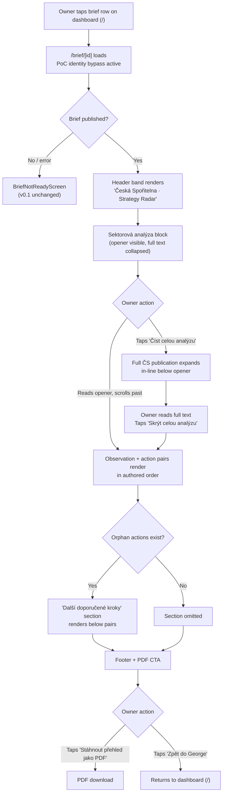

# Brief Detail Page (v0.2) — Design

*Owner: designer · Slug: brief-page-v0-2 · Last updated: 2026-04-21*

---

## 1. Upstream links

- Product doc: [docs/product/brief-page-v0-2.md](../product/brief-page-v0-2.md)
- PRD sections driving constraints: §7.1 (day-one proof of value), §7.2 (verdicts not datasets), §7.3 (plain language), §7.4 (proof of value before anything else), §7.5 (privacy as product), §7.6 (opportunity-flavored), §7.7 (bank-native distribution)
- Token set: [docs/design/dashboard-v0-2/layout.md §5](dashboard-v0-2/layout.md) — reused verbatim
- Consent tone: [docs/design/trust-and-consent-patterns.md](trust-and-consent-patterns.md)
- Decisions in force: D-018 (header wordmark), D-019 ("Analýzy" / "Přehled" vocabulary), D-020 (hybrid publication placement, "Sektorová analýza" label, paired observation+action model, benchmarks removed)
- v0.1 source: [src/app/brief/[id]/page.tsx](../../src/app/brief/%5Bid%5D/page.tsx)
- Build plan phase: 2.1 Track B → 2.2.d (brief page surgery), 2.2.e (furniture brief seed)

---

## 2. Primary flow



---

## 2b. Embedded variant (George Business WebView)

The brief page renders in a WebView via George Business (OQ-008 covers the full CSP / SSO contract). Differences from standalone:

- **No new browser tab** — all links that would open a new tab (PDF download, source attribution link if any) are handled as download attributes (`<a download>`) or in-page actions only. The existing v0.1 PDF CTA uses `download` — preserve this.
- **"Zpět do George" link** navigates to `/` (the dashboard), which George intercepts as an in-WebView navigation back to the embedding card. This is the existing v0.1 behaviour; no change.
- **Touch targets ≥ 44 px** — all interactive elements (disclosure control, time-horizon pills if tappable, PDF CTA, back link) meet this floor. The disclosure `<summary>` element must be `min-height: 44px`.
- **Horizontal padding** — 16 px each side at ≤600 px, 20 px on the existing single column above that.
- No `<details>` animated reveal (see §8 — `prefers-reduced-motion`); the native browser expand/collapse with no CSS animation satisfies this in all tested engines.
- **Container width:** the brief page uses its own `max-width: 680px` single-column container, independent of the dashboard's 960 px grid. This is the reading-first choice (OQ-057 is engineer-gated; this spec recommends 680 px for the brief and defers the shared-container question to the engineer per 2.2.a).

---

## 3. Screen inventory

| Screen | Purpose | Entry | Exit | Empty state | Error states |
|---|---|---|---|---|---|
| Brief detail (web) | Owner reads sector analysis, observations, and actions for one published brief | Dashboard brief-list row tap; direct URL | "Zpět do George" (→ `/`), PDF download (stays on page) | No `publication` object: publication block omitted; `opening_summary` renders if present, then observations directly. No `closing_actions`: no recommendations sections rendered. | Brief unpublished or not found → `BriefNotReadyScreen` (v0.1 unchanged). Consent revoked → `ConsentRevokedScreen` (v0.1 unchanged). Content JSON malformed → `BriefNotReadyScreen`. |
| BriefNotReadyScreen | Holding screen when brief is unavailable | Any `/brief/[id]` load where brief is null or not published | None (dead-end; owner waits for email) | Not applicable | Not applicable — this screen is itself the error state |
| ConsentRevokedScreen | Post-revocation blocking screen | Any `/brief/[id]` load where consent is absent | "Zpět do George" | Not applicable | Not applicable — this screen is itself the error state |

---

## 4. Component specs

### 4.1 Sektorová analýza block

**Purpose.** Renders the layperson opener (always visible) and the full ČS publication body (collapsed by default). The block is the trust-transfer mechanism: the opener is owner-legible, the full text is auditable.

**Recommended HTML element:** native `<details>` / `<summary>` — semantic, keyboard-accessible with no JS, reduced-motion-friendly (no animated transition unless CSS explicitly adds one), and screen-reader-announced via the browser's built-in expanded/collapsed state. Full-page route and modal both rejected per D-020 rationale (PM spec §4.3).

**Visual container.** Left border `4px solid --color-border-subtle (#e0e0e0)`, with `padding-left: 16px` on the block interior, on a background of `--color-surface-card (#fafafa)` with `border-radius: 6px` and `padding: 16px`. This reads as bank-authoritative and structured without walling off the content. The token is `--color-border-subtle` (already in the set from dashboard-v0-2/layout.md §5); no new token needed.

**States:**

| State | Appearance | Trigger |
|---|---|---|
| Default (collapsed) | Opener body text visible; source attribution line visible; `<summary>` shows "Číst celou analýzu" with a `▶` chevron (aria-hidden) | On page load |
| Expanded | Full publication body renders inline below opener; `<summary>` shows "Skrýt celou analýzu" with a `▼` chevron (aria-hidden) | Owner taps/clicks `<summary>` |
| Focus | `<summary>` shows `3px solid --color-focus-ring (#1a1a1a)` outline, `2px offset` | Keyboard focus on `<summary>` |
| Hover | `<summary>` background shifts to `#f0f0f0` (one step darker than `--color-surface-card`) | Mouse hover |

**Props / inputs it needs:** `publication.opener_markdown`, `publication.full_text_markdown`, `publication.source`, `publication.heading` (renders as the block's `<h2>` heading). All from `BriefContent.publication` as specified in product spec §5.2.

**Degraded state (no `publication` object).** Block is not rendered. The page opens with `opening_summary` if present (v0.1 behaviour), then observations. No empty-state placeholder is shown — the absence is silent; the owner sees observations and actions directly.

**Full-text typography.** The full ČS publication body is analyst-register prose. Style it as body text (`--text-body`, 15 px / 400 / line-height 1.6) at slightly muted colour (`--color-ink-secondary #444`) to visually subordinate it relative to the opener (which uses `--color-ink-primary #1a1a1a`). This makes the register difference legible without adding a separate label.

---

### 4.2 Paired observation + action card

**Purpose.** Renders one observation and its paired action as a single grouped visual unit. The pairing makes "here is the finding, here is what to do about it" unambiguous in reading order (PRD §7.4, product spec §5.1).

**Within-pair layout.**

```
┌─────────────────────────────────────────────────────────┐
│ ▌  [Observation time-horizon pill]                       │  ← left-border runs full height of pair
│ ▌  Observation headline (h3)                             │
│ ▌  Observation body text                                 │
│ ▌  ─────────────────────────────────────────────────    │  ← within-pair divider (1px --color-border-inner)
│ ▌  Doporučený krok:  [Action time-horizon pill]          │
│ ▌  Action body text                                      │
└─────────────────────────────────────────────────────────┘
```

**Connector treatment.** A continuous `4px solid --color-ink-primary (#1a1a1a)` left border that runs from the top of the observation through the within-pair divider to the bottom of the action. The border signals "this observation and this action belong together" without requiring a language-specific connecting label. A `"Doporučený krok:"` prefix on the action paragraph is retained as an additional text signal (not solely colour — Rule 10 accessibility parity). This is the default recommended in the brief: left-border connector plus labelled prefix.

**Type hierarchy within pair:**

| Element | Token | Notes |
|---|---|---|
| Observation headline | `--text-subheading` 15 px / 600 | `<h3>` — below the `<h2>` section heading "Doporučené kroky" |
| Observation body | `--text-body` 15 px / 400 / `--color-ink-secondary (#444)` | |
| Observation time-horizon pill | 12 px / 600, colour-coded per v0.1 `TimeHorizonPill` map | Signals "when the shift is expected" |
| "Doporučený krok:" label | `--text-caption` 12 px / 600, `--color-ink-muted (#888)`, letter-spacing 0.04em (small-caps effect via CSS `font-variant: small-caps` or explicit tracking) | Prefix on the action paragraph; muted to subordinate it |
| Action body | `--text-body` 15 px / 400 / `--color-ink-primary (#1a1a1a)` | Slightly stronger than observation body to give action forward prominence |
| Action time-horizon pill | 11 px / 600, same colour-code map but `opacity: 0.75` | Subordinated visually relative to the observation pill to avoid competition |

**Spacing:**
- Within a pair: `--space-s (8 px)` between headline and body, `--space-m (12 px)` above the within-pair divider, `--space-m (12 px)` below the divider before the "Doporučený krok:" prefix.
- Between pairs: `--space-2xl (32 px)` margin-bottom on each pair container. This generous gap signals "new observation begins here."
- Pair container: `padding: 16px 16px 16px 20px` (extra left padding accommodates the 4 px border without text running into it).

**Orphan observation state (no paired action).** Same card shape. Left border and `<h3>` headline render as normal. The within-pair divider and "Doporučený krok:" block are omitted. No placeholder, no "no action" label — a sector-wide insight without an action is a legitimate brief shape per product spec §5.1 and action-specificity-framing.md Q-ASF-003.

**States:**

| State | Appearance |
|---|---|
| Default | Paired card as above |
| Orphan observation | Card without connector divider or action slot |
| Empty section (no observations) | Section not rendered — `<h2>` heading and all cards omitted |

---

### 4.3 Orphan actions section ("Další doporučené kroky")

**Purpose.** Holds any `ClosingAction` with `paired_observation_index === null`. Renders after the last observation+action pair. Omitted entirely when the list is empty — the `<h2>` heading is not rendered.

**Card per action.** Simpler than paired cards: no left-border connector, no "Doporučený krok:" prefix (the section heading already contextualises these as actions). Layout:

```
┌─────────────────────────────────────────────────────────┐
│  [Action time-horizon pill]                              │
│  Action body text                                        │
└─────────────────────────────────────────────────────────┘
```

- Container: `border: 1px solid --color-border-subtle (#e0e0e0)`, `border-radius: 6px`, `padding: 14px 16px`, `background: --color-surface-card (#fafafa)`.
- Spacing: `--space-m (12 px)` between orphan action cards; `--space-2xl (32 px)` between the last observation+action pair and the section heading.

**States:**

| State | Appearance |
|---|---|
| Default | Card as above |
| Section empty | Entire section (heading + cards) not rendered |

---

### 4.4 Time-horizon pill (existing v0.1 component)

The v0.1 `TimeHorizonPill` component is reused unchanged for observation pills. Action pills within a pair use the same colour map with `opacity: 0.75` to subordinate them visually. No new component — a CSS modifier (`class="time-horizon-pill time-horizon-pill--subordinate"`) or inline style override is sufficient.

No design-system escalation needed; this is a style variant on an existing component.

---

### 4.5 Header band (existing v0.1)

Unchanged from v0.1 web surface: "Česká Spořitelna · Strategy Radar" wordmark consistent with dashboard (D-018). Brief `<h1>` title below the top band, `<p>` for `publication_month`. No redesign needed for v0.2.

---

### 4.6 Footer + PDF CTA (existing v0.1)

Unchanged from v0.1: `"Stáhnout přehled jako PDF"` primary button, `"Zpět do George"` text link. No redesign needed for v0.2.

---

## 5. Screen layout — text diagram (web surface)

Reading column: `max-width: 680px`, `margin: 0 auto`, `padding: 0 20px 80px`. Consistent with v0.1 web surface.

```
┌────────────────────────────────────────────────────────────┐
│  HEADER BAND (existing v0.1)                               │
│  "Česká Spořitelna · Strategy Radar"  ← brand mark         │
│  [h1] Brief title                                          │
│  [p] publication_month                                     │
│  border-bottom: 1px --color-border-subtle                  │
├────────────────────────────────────────────────────────────┤
│  SEKTOROVÁ ANALÝZA BLOCK                                   │
│  [h2] "Sektorová analýza"                                  │
│  ┌────────────────────────────────────────────────────┐    │
│  │ ▌  [opener body — always visible]                  │    │
│  │ ▌  Zdroj: … březen 2026  ← source attribution     │    │
│  │ ▌                                                  │    │
│  │ ▌  [summary] ▶ Číst celou analýzu                 │    │
│  │ ▌    [full ČS publication — collapsed by default]  │    │
│  │ ▌    becomes ▼ Skrýt celou analýzu when open      │    │
│  └────────────────────────────────────────────────────┘    │
├────────────────────────────────────────────────────────────┤
│  OBSERVATIONS + ACTIONS  (paired)                          │
│  [h2] "Doporučené kroky"                                   │
│                                                            │
│  ┌──────────────────────────────────────────────────┐      │
│  │▌ [obs time-horizon pill]                         │      │
│  │▌ [h3] Observation headline                       │      │
│  │▌ Observation body text                           │      │
│  │▌ ──────────────────────────────────────────────  │      │
│  │▌ Doporučený krok:  [action pill (subordinated)]  │      │
│  │▌ Action body text                                │      │
│  └──────────────────────────────────────────────────┘      │
│  [32px gap]                                                │
│  ┌──────────────────────────────────────────────────┐      │
│  │▌ [pair 2 …]                                      │      │
│  └──────────────────────────────────────────────────┘      │
│  …                                                         │
├────────────────────────────────────────────────────────────┤
│  DALŠÍ DOPORUČENÉ KROKY  (omitted when empty)              │
│  [h2] "Další doporučené kroky"                             │
│  ┌──────────────────────────────────────────────────┐      │
│  │ [action pill]  Action body text                  │      │
│  └──────────────────────────────────────────────────┘      │
├────────────────────────────────────────────────────────────┤
│  FOOTER (existing v0.1)                                    │
│  [pdf_footer_text if present]                              │
│  border-top: 1px --color-border-subtle                     │
│  [primary button] "Stáhnout přehled jako PDF"              │
│  [link] "Zpět do George"                                   │
└────────────────────────────────────────────────────────────┘
```

**Section heading for the paired block.** The v0.1 heading "Doporučené kroky" is reused for the primary observations+actions section. This heading covers both observations and their paired actions — the pairing merges what were two separate v0.1 sections ("Pozorování" + "Doporučené kroky") into one reading unit. The engineer should remove the separate v0.1 `<h2>Pozorování</h2>` heading. The v0.1 heading "Doporučené kroky" also changes its scope: it now covers paired observation+action units, not just a flat action list. This is a copy-neutral change (the heading is still accurate); flagged for engineer awareness during 2.2.d.

---

## 5b. Mobile layout (≤ 600 px)

Same vertical flow. Changes:
- `padding: 0 16px 64px` (tighter horizontal, slightly tighter bottom)
- Pair cards: `padding: 14px 14px 14px 18px` (4 px reduction each side, border still visible)
- Left-border connector: `4px` — unchanged, still visible on narrow screens
- Within-pair divider and "Doporučený krok:" prefix: unchanged
- Orphan action cards: `padding: 12px 14px`
- All pills, labels, and body text: unchanged (no font-size reduction at mobile — 15 px body is already the minimum readable at 320 px viewport)
- Touch targets: `<summary>` min-height 44 px, PDF CTA min-height 44 px — both satisfied by existing v0.1 CTA and proposed `<summary>` spec above

---

## 6. Removed elements — explicit list

The following v0.1 elements are removed from the owner-facing brief detail page at v0.2. The engineer performs this surgery in Phase 2.2.d.

**Srovnávací přehled `<section>` — web surface, lines ~528–543 of `src/app/brief/[id]/page.tsx`:**

```jsx
{/* Srovnávací přehled — four category accordions */}
{categories.length > 0 && (
  <section style={{ marginBottom: "28px" }}>
    <h2 …>Srovnávací přehled</h2>
    {categories.map((cat, idx) => (
      <BenchmarkCategorySection … />
    ))}
  </section>
)}
```

This `<section>` and its `<h2>Srovnávací přehled</h2>` are removed entirely from the web surface.

**Srovnávací přehled block — PDF surface, lines ~413–430:**

```jsx
{/* Benchmark categories — fully expanded in PDF */}
{categories.length > 0 && (
  <div style={{ marginBottom: "24px" }}>
    <h2 …>Srovnávací přehled</h2>
    {categories.map((cat) => (
      <div key={cat.category_id} …>…</div>
    ))}
  </div>
)}
```

This block is also removed from the PDF surface for consistency (per product spec §7).

**`BenchmarkCategorySection` component — lines ~103–175.** This component becomes unused after the above removals. Whether to delete it or leave it in place for v0.3 resurrection is the **engineer's judgement** per product spec §7.

**`BenchmarkSnippet` component — lines ~30–96.** Becomes unused if `BenchmarkCategorySection` is deleted. Same engineer-judgement applies — the `BenchmarkSnippet` type and `benchmark_snippet` column on `briefs` stay on disk; only the JSX render component is potentially dormant.

**`categories` variable — line ~342.** `const categories: BenchmarkCategory[] = brief.benchmark_snippet?.categories ?? content.benchmark_categories ?? [];` — once neither render site references `categories`, this variable is dead. Engineer removes it to prevent TypeScript lint noise.

**What stays untouched.** `benchmark_snippet` on `Brief` (top-level row field). `benchmark_categories` on `BriefContent` (JSONB field). The analyst edit page at `/admin/brief/[id]/edit`. All v0.1 brief data.

---

## 7. PDF mode (v0.2)

Not applicable as a design artifact. The engineer retains the `?format=pdf` pass-through; it renders the new web layout to PDF without visual polish. A proper PDF layout (two-column, print typography, ČS letterhead) is scoped to v0.3. The Puppeteer / `@sparticuz/chromium` path (OQ-010) is unchanged.

---

## 8. Accessibility checklist

- [ ] `<details>` / `<summary>` native element used for the "Číst celou analýzu" disclosure — browser handles `aria-expanded` announcement automatically; no ARIA override needed
- [ ] `<summary>` element has `min-height: 44px` — meets touch target floor
- [ ] Heading hierarchy: `<h1>` brief title → `<h2>` "Sektorová analýza" → `<h2>` "Doporučené kroky" → `<h3>` observation headline (within each pair) → `<h2>` "Další doporučené kroky" (when present). No levels skipped.
- [ ] "Doporučený krok:" label is visible text, not icon-only — colour is not the sole signal for the observation-to-action connector; the left-border is reinforced by the text label
- [ ] All interactive elements (disclosure `<summary>`, PDF CTA button, "Zpět do George" link) are reachable by keyboard (Tab / Shift+Tab); focus order follows DOM order (top to bottom: header → Sektorová analýza → pairs → orphan actions → footer)
- [ ] Focus states visible: `3px solid --color-focus-ring (#1a1a1a)`, `2px offset` — consistent with dashboard spec
- [ ] Color is never the only signal: time-horizon pills use both colour and text label; the left-border connector is reinforced by "Doporučený krok:" text
- [ ] Text contrast ≥ WCAG AA: `--color-ink-primary (#1a1a1a)` on `#ffffff` = 18.1:1 (passes). `--color-ink-secondary (#444)` on `#ffffff` = 9.73:1 (passes). `--color-ink-muted (#888)` on `#ffffff` = 3.54:1 (borderline AA for normal text at 13 px — if "Doporučený krok:" label at 12 px fails audit, shift to `--color-ink-tertiary (#666)` at 5.74:1). Flagged for engineer measurement during 2.2.d — see §9 Q-TBD.
- [ ] Screen-reader labels on icon-only controls: the `▶` / `▼` chevrons in the disclosure control are `aria-hidden="true"`; the text label ("Číst celou analýzu" / "Skrýt celou analýzu") provides the accessible name
- [ ] No `<form>` fields on this page — "Form fields have associated labels" not applicable
- [ ] `prefers-reduced-motion`: the `<details>` native expand/collapse has no CSS animation in this spec; if the engineer adds a CSS transition on the `details[open]` content, it must be wrapped in `@media (prefers-reduced-motion: no-preference) { … }`. Default state: no animation.
- [ ] Long-form full ČS publication text (when expanded): `line-height: 1.6`, max readable width within 680 px column — no change needed; the reading column constraint handles this
- [ ] `<section>` elements use implicit landmark roles; `<main>` wraps the full content area (v0.1 already does this)

---

## 9. Tokens

All tokens reused verbatim from [docs/design/dashboard-v0-2/layout.md §5](dashboard-v0-2/layout.md). No new tokens introduced.

Token usage in this spec:

| Token | Value | Used for |
|---|---|---|
| `--color-ink-primary` | `#1a1a1a` | Observation headline, action body, left-border connector, PDF CTA button background |
| `--color-ink-secondary` | `#444` | Observation body, full-text publication body |
| `--color-ink-tertiary` | `#666` | "Zpět do George" link (v0.1), potential fallback for "Doporučený krok:" label if muted fails AA |
| `--color-ink-muted` | `#888` | "Doporučený krok:" label, source attribution line, metadata |
| `--color-surface-page` | `#ffffff` | Page background |
| `--color-surface-card` | `#fafafa` | Sektorová analýza block background, orphan action card background |
| `--color-border-subtle` | `#e0e0e0` | Sektorová analýza block left border, orphan action card border, section dividers |
| `--color-border-inner` | `#f0f0f0` | Within-pair divider line |
| `--color-focus-ring` | `#1a1a1a` | Focus ring on `<summary>` and other interactive elements |
| `--space-xs` | `4 px` | Pill internal padding |
| `--space-s` | `8 px` | Within-pair: headline-to-body gap |
| `--space-m` | `12 px` | Within-pair: divider margins; orphan card gap |
| `--space-l` | `16 px` | Horizontal padding inside pair cards and Sektorová analýza block |
| `--space-xl` | `24 px` | Between-section spacing; Sektorová analýza block padding |
| `--space-2xl` | `32 px` | Between-pair gap; orphan section top margin |
| `--space-3xl` | `48 px` | Page bottom padding |

**Potential addition flagged.** The `opacity: 0.75` modifier on action time-horizon pills is not a formal token — it is an inline style variant on the existing `TimeHorizonPill` component. No new token needed; a CSS modifier class suffices. Not escalated.

---

## 10. Copy reference

No new Czech copy is introduced in this file. All strings are owned by the PM spec. References:

| String | Location in PM spec |
|---|---|
| Section heading "Sektorová analýza" | [product/brief-page-v0-2.md §5.2](../product/brief-page-v0-2.md) `publication.heading` |
| Source attribution line "Zdroj: Ekonomické a strategické analýzy…" | [product/brief-page-v0-2.md §4.3](../product/brief-page-v0-2.md) and §6.1 |
| Disclosure control "Číst celou analýzu" / "Skrýt celou analýzu" | [product/brief-page-v0-2.md §4.1](../product/brief-page-v0-2.md) |
| Action prefix label "Doporučený krok:" | Proposed by designer in this spec as a design-level label; confirm with PM that this string is acceptable before Phase 2.2.d implementation. Logged as Q-TBD below. |
| Section heading "Doporučené kroky" | v0.1 existing string (reused scope-extended) |
| Section heading "Další doporučené kroky" | [product/brief-page-v0-2.md §5.1](../product/brief-page-v0-2.md) |
| Furniture brief opener text | [product/brief-page-v0-2.md §6.1](../product/brief-page-v0-2.md) |
| Furniture observations + actions | [product/brief-page-v0-2.md §6.2](../product/brief-page-v0-2.md) |

---

## 11. Design-system deltas (escalate if any)

No new design-system components are introduced. All elements below are composed from existing tokens and HTML primitives:

- `<details>` / `<summary>` — HTML primitive, no design-system component needed
- Left-border connector — CSS border, no component
- "Doporučený krok:" label — inline text with existing `--text-caption` token
- Orphan action card — variant of the v0.1 action card shape, no new component

The existing `TimeHorizonPill` component (v0.1) is reused with a CSS opacity modifier for action pills. Not a design-system addition.

**No entries in `docs/project/open-questions.md` required for design-system reasons.**

---

## 12. Open questions

These are raised by this design spec. The orchestrator assigns final `OQ-NNN` IDs when merging into `docs/project/open-questions.md`.

| Local ID | Question | Blocking |
|---|---|---|
| Q-TBD-BPV-001 | **"Doporučený krok:" label copy confirmation.** This label prefix on the action within a paired card is a design-level string not explicitly named in the PM spec. PM must confirm the exact Czech string before Phase 2.2.d implementation. Candidate: "Doporučený krok:" (formal vykání-compatible, plain, unambiguous). | Phase 2.2.d — brief page surgery copy |
| Q-TBD-BPV-002 | **`--color-ink-muted (#888)` at 12 px — AA contrast.** The "Doporučený krok:" label at `--text-caption` (12 px) against `--color-surface-card (#fafafa)` yields approximately 3.24:1 — below the 4.5:1 WCAG AA threshold for normal text at 12 px. Fallback: use `--color-ink-tertiary (#666)` (5.74:1, passes AA). Engineer to measure and apply the fallback if confirmed below threshold. | Phase 2.2.d accessibility pass |
| Q-TBD-BPV-003 | **Section heading scope change for "Doporučené kroky".** The v0.1 heading "Doporučené kroky" covered a flat action list only; at v0.2 it covers paired observation+action units. The heading is still semantically accurate but the engineer should confirm there are no copy references elsewhere (email, PDF, admin) that assume the old one-section-one-purpose mapping. | Phase 2.2.d — brief page surgery |

---

## 13. Tracking spec ownership (conversion-critical interactions)

The following interactions are conversion-critical for G1 engagement (PRD §6). Tracking spec ownership belongs to the engineer, not this design artifact. Flagged here so the engineer does not overlook them during Phase 2.2.d:

- **First view of the Sektorová analýza block** — scroll depth / time-on-section signal
- **"Číst celou analýzu" disclosure expand** — explicit engagement signal; tells the moderator (and post-PoC analysis) whether owners inspect the source
- **Paired action visibility** — scroll-into-view for each observation+action pair (per OQ-053 non-click telemetry note)

---

## Changelog

- 2026-04-21 — initial draft for v0.2 customer-testing PoC brief detail page. Consumes D-018, D-019, D-020. Reuses token set from dashboard-v0-2/layout.md verbatim. Recommends `<details>/<summary>` disclosure and left-border+label-prefix connector. — designer
