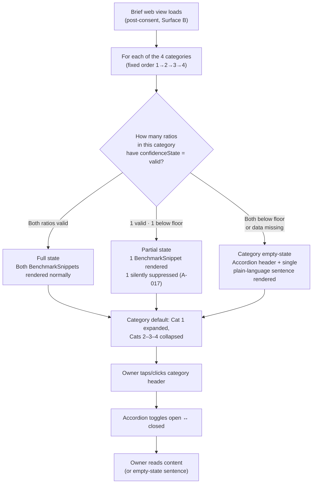

# Category-Based Layout — Design

*Owner: designer · Slug: category-based-layout · Last updated: 2026-04-20*

---

## 1. Upstream links

- Product doc: [docs/product/category-based-layout.md](../product/category-based-layout.md)
- PRD sections driving constraints:
  - §7.1 Briefs are the atomic unit of value — categories exist only inside briefs; no standalone category screen.
  - §7.2 Verdicts, not datasets — category-level empty-state must read as a plain-language verdict, not a technical message.
  - §7.3 Plain language — no statistical notation, no English in user-facing strings (D-004).
  - §7.4 Proof of value before anything else — first brief renders all four categories without any configuration step.
  - §13.5 Cold-start risk — category empty-state is load-bearing graceful degradation when an entire cohort cell is below floor.
- Decisions in force: D-001, D-003, D-004, D-006, D-010, D-011.
- Assumptions in force: A-003 (eight ratios fixed), A-005 (no cadence promise), A-006 (NACE-only personalization), A-017 (single-ratio suppression is silent; category-level suppression is visible).
- Existing design artifact depended on: [docs/design/information-architecture.md](information-architecture.md) §4.4 BenchmarkCategory — this artifact extends that component spec. Do not edit the IA file directly.

---

## 2. Primary flow

Categories render passively inside the brief — there is no user-initiated category flow. The interaction surface is accordion expand/collapse on the web view. The flow below shows how the BenchmarkCategory component resolves its state when the brief loads.

All four categories always render regardless of suppression state. No category is ever silently omitted.

---

## 2b. Embedded variant (George Business WebView)

The accordion interaction in the WebView is touch-first. No differences in the data or copy logic; layout adjustments only:

- Accordion header tap target: full row width, minimum 44 × 44 px height (enforced even when the category label text is short).
- Chevron/indicator icon sits at the trailing edge of the header row; it rotates 180° on expand (CSS transform only; must respect `prefers-reduced-motion` — if motion is reduced, toggle visibility instead of rotation).
- No hover state on touch devices; focus state is required for bluetooth-keyboard and external-keyboard users on iPad (OQ-006 dependency for exact focus-ring token).
- Expand/collapse animation: max 200 ms ease-out height transition; suppressed entirely under `prefers-reduced-motion`.
- PDF surface: all four categories fully expanded (no interactive disclosure); empty-state sentence renders in the body block exactly as on web view.

---

## 3. Screen inventory

The category-based layout is a sub-section of the Brief detail screen (Surface B per IA §3). It does not introduce new screens. The table below covers the states of the Srovnávací přehled (Component 4) block.

| Screen / block | Purpose | Entry | Exit | Empty state | Error states |
|---|---|---|---|---|---|
| Srovnávací přehled — Category 1 Ziskovost | Profitability benchmark group | Brief detail loads; first category is expanded by default | Owner taps header to collapse; scrolls past | Both ratios suppressed: renders `categoryEmptyText` for Ziskovost (see §5) | Falls back to category empty-state copy — never a raw number without a comparison; never silently omitted |
| Srovnávací přehled — Category 2 Náklady a produktivita | Cost and productivity benchmark group | Brief detail loads; collapsed by default | Owner taps header to expand, reads, taps to collapse | Both ratios suppressed: renders `categoryEmptyText` for Náklady a produktivita | Same as above |
| Srovnávací přehled — Category 3 Efektivita kapitálu | Capital efficiency benchmark group | Brief detail loads; collapsed by default | Owner taps header to expand, reads, taps to collapse | Both ratios suppressed: renders `categoryEmptyText` for Efektivita kapitálu | Same as above |
| Srovnávací přehled — Category 4 Růst a tržní pozice | Growth and market position benchmark group | Brief detail loads; collapsed by default | Owner taps header to expand, reads, taps to collapse | Both ratios suppressed: renders `categoryEmptyText` for Růst a tržní pozice | Same as above |

**Empty state rendering rule (all four categories):** The category header renders at its normal visual weight — same typography, same spacing, same chevron indicator — and the body block shows the `categoryEmptyText` sentence instead of BenchmarkSnippet children. The empty-state category is not shrunk, dimmed, or hidden. It occupies the same vertical rhythm as a populated category to signal that the structure is intentionally consistent month to month.

**Low-confidence state (partial suppression — one ratio valid, one suppressed):** The one valid BenchmarkSnippet renders normally. The suppressed ratio is absent without explanation (A-017 — silent suppression for single ratio). No "1 of 2 metrics available" label is shown. This is not a degraded visual state for the category header itself.

---

## 4. Component specs

This section extends [docs/design/information-architecture.md §4.4 BenchmarkCategory](information-architecture.md). Do not edit the IA file. The IA §4.4 entry remains canonical for prop names and the `Expanded / Collapsed / All-snippets-degraded / Loading` states it already defines. This artifact adds the following:

---

### 4.1 BenchmarkCategory — full state matrix (extends IA §4.4)

**Component name:** `BenchmarkCategory`

**Purpose:** Groups 0–2 BenchmarkSnippet children under a named, collapsible category heading. Renders a plain-language empty-state sentence when all children are suppressed.

| State | Trigger | Category header | Category body | Chevron indicator | Interactive? |
|---|---|---|---|---|---|
| **Collapsed** | Default for categories 2, 3, 4 on brief load | Category label — normal weight | Hidden (height: 0) | Points right (▶ or ›) | Yes — tap/click/Enter/Space toggles to Expanded |
| **Expanded** | Default for category 1 on brief load; or any category after tap/keyboard activation | Category label — normal weight | BenchmarkSnippet children visible | Points down (▼ or ∨) | Yes — tap/click/Enter/Space toggles to Collapsed |
| **Focused** | Keyboard Tab reaches the accordion header; or touch focus on interactive element | Category label — normal weight + visible focus ring (WCAG AA contrast) | Unchanged (follows current open/closed state) | Unchanged | Yes — Enter or Space activates toggle |
| **Keyboard expanding** | User presses Enter or Space on a Focused + Collapsed header | Transitions to Expanded | Appears; focus remains on header | Rotates to down | Yes |
| **Keyboard collapsing** | User presses Enter or Space on a Focused + Expanded header | Transitions to Collapsed | Disappears; focus remains on header | Rotates to right | Yes |
| **Populated (both ratios valid)** | Both child BenchmarkSnippets have `confidenceState === 'valid'` | Category label — normal weight | Two BenchmarkSnippet components rendered normally | Per open/closed state | Per above |
| **Partial (one ratio suppressed)** | One child has `confidenceState === 'valid'`; one has `confidenceState === 'low-confidence'` or `'empty'` | Category label — normal weight (no indicator of partial state on the header) | One BenchmarkSnippet rendered; suppressed ratio absent silently (A-017) | Per open/closed state | Per above |
| **Empty (both ratios suppressed)** | Both children have `confidenceState !== 'valid'`, or no children are emitted for this category | Category label — normal weight (no dim, no warning icon on the header) | `categoryEmptyText` sentence rendered — same body font size and color as a BenchmarkSnippet verdict sentence; no icon prefix | Per open/closed state | Per above; empty category is still fully interactive (owner can open/close it) |
| **Loading** | Brief data is still fetching | Skeleton: category label line (gray rectangle, 40% width) | Two snippet skeleton lines | No chevron during loading | No |
| **PDF-expanded** | All categories in PDF output | Category label — same weight as web | All valid BenchmarkSnippets rendered + `categoryEmptyText` for suppressed categories | No chevron (non-interactive) | No |

**Props (extending IA §4.4):**

| Prop | Type | Description |
|---|---|---|
| `categoryLabel` | `string` | One of the four canonical labels per D-011. See §5. |
| `categoryEmptyText` | `string` | Per-category empty-state sentence. Required. See §5. |
| `children` | `BenchmarkSnippet[]` | Zero-length array triggers empty state. |
| `defaultExpanded` | `boolean` | `true` for category 1 (Ziskovost); `false` for categories 2–4. |
| `ariaLabelledById` | `string` | ID of the heading element used as the accessible name for the accordion region. Required for ARIA pattern compliance. |

**ARIA pattern:**
- The accordion header is a `<button>` (or an element with `role="button"`) with `aria-expanded="true|false"` and `aria-controls` pointing to the body panel ID.
- The body panel has `role="region"` and `aria-labelledby` pointing to the header button ID.
- When the body is collapsed (`aria-expanded="false"`), the panel is `hidden` (not `display:none` alone — use `hidden` attribute or `aria-hidden="true"` so screen readers skip it).
- The screen reader reads the header as: `[categoryLabel] — [expanded or collapsed]`. When expanded and in the empty state, it reads: `[categoryLabel] — expanded — [categoryEmptyText]`. This satisfies the requirement that category name and empty-state sentence are read together.

**Where used:** Brief web view (Component 4 — four instances, fixed order 1→4); Brief PDF (same structure, non-interactive, all expanded).

---

## 5. Copy drafts

All copy is Czech only (D-004, A-004). Formal register, vykání. Legal review required before production (OQ-005 covers all brief-surface copy).

### 5.1 Canonical category header labels

These are frozen per D-011. Do not modify.

| # | `categoryLabel` value | Internal English gloss (not user-facing) |
|---|---|---|
| 1 | Ziskovost | Profitability |
| 2 | Náklady a produktivita | Cost structure & productivity |
| 3 | Efektivita kapitálu | Capital efficiency |
| 4 | Růst a tržní pozice | Growth & market position |

### 5.2 Category empty-state strings (`categoryEmptyText`)

**Constraints applied** (from product PRD §6 item 6 and §3 AC):
- One sentence.
- Verdict-framed: the sentence tells the owner what is happening ("we are not bringing you this comparison"), not what went wrong technically.
- No technical terminology (no "floor", no "threshold", no "N", no "cohort size").
- No cadence promise — no "check back next month" or any implication of a fixed delivery cycle (A-005, B-001).
- Formal Czech, vykání.
- The sentence reads as if the owner's accountant wrote it — honest, plain, not apologetic.

**Proposed strings:**

| Category | `categoryEmptyText` |
|---|---|
| **Ziskovost** | "Srovnání ziskovosti pro váš sektor a velikost firmy tento měsíc nepřinášíme — počet srovnatelných firem v kohortě je zatím nedostatečný." |
| **Náklady a produktivita** | "Srovnání nákladů a produktivity pro váš sektor a velikost firmy tento měsíc nepřinášíme — počet srovnatelných firem v kohortě je zatím nedostatečný." |
| **Efektivita kapitálu** | "Srovnání efektivity kapitálu pro váš sektor a velikost firmy tento měsíc nepřinášíme — počet srovnatelných firem v kohortě je zatím nedostatečný." |
| **Růst a tržní pozice** | "Srovnání růstu a tržní pozice pro váš sektor a velikost firmy tento měsíc nepřinášíme — počet srovnatelných firem v kohortě je zatím nedostatečný." |

**Rationale for the template structure:** "Srovnání [category-noun] ... nepřinášíme" is verdict-framed (active voice, first-person plural on behalf of the product/analyst, mirrors how an accountant speaks). "Počet srovnatelných firem v kohortě je zatím nedostatečný" gives a plain reason without statistical vocabulary. "Zatím" signals temporariness without promising a specific future delivery (satisfying A-005). The per-category variation is the opening noun phrase only — this keeps the strings recognizably consistent while anchoring to the specific category.

**Flag Q-PD-CBL-001:** The word "kohorta" appears in all four strings. The assumption log does not confirm whether "kohorta" is in the owner-legible vocabulary for Czech SME operators. If user research or ČS analyst review finds it opaque, a substitute such as "firem ve vašem oboru" (firms in your sector) or "srovnatelných firem" (comparable firms — already used in the string) should be tested. Logged in §8 and to be raised to orchestrator for `open-questions.md` assignment.

### 5.3 Accordion interaction affordance (screen-reader only)

These strings are `aria-label` supplements, not visible copy.

| Element | `aria-label` pattern |
|---|---|
| Accordion header button (collapsed) | "{{categoryLabel}}, sbaleně. Rozbalte pro zobrazení srovnání." |
| Accordion header button (expanded) | "{{categoryLabel}}, rozbaleno. Sbalte pro skrytí srovnání." |

**Note:** These patterns are only needed if the design system does not already provide `aria-expanded` announcement via its accordion component. If OQ-006 resolves as "ČS design system accordion is available and accessible", these may be redundant — the engineer should audit and omit if already covered. Flagged as Q-PD-CBL-002 (§8).

---

## 6. Accessibility checklist

- [x] All interactive elements reachable by keyboard — accordion header is a focusable button; Tab key reaches each category in document order (1→2→3→4); Enter and Space toggle expand/collapse.
- [x] Focus states visible with sufficient contrast — focus ring required on accordion header; exact token depends on OQ-006 design-system resolution (flagged Q-PD-CBL-002); minimum contrast 3:1 against adjacent background (WCAG AA large component).
- [x] Color is never the only signal — the empty-state is not distinguished from populated categories by color alone; the difference is the presence of the `categoryEmptyText` sentence in place of BenchmarkSnippet children (structural, not chromatic).
- [x] Text contrast ≥ WCAG AA — `categoryEmptyText` sentence uses the same font color as a BenchmarkSnippet verdict sentence; this must be ≥ 4.5:1 against the card/panel background. Specific token is OQ-006 dependent.
- [x] Screen-reader labels on icon-only controls — the chevron indicator (expand/collapse icon) must have `aria-hidden="true"`; the button's accessible name comes from the category label text (not the icon). When the icon is the only visual cue for direction, `aria-expanded` state provides the programmatic equivalent.
- [x] Form fields have associated labels and error descriptions — not applicable; the accordion contains no form fields.
- [x] Motion respects `prefers-reduced-motion` — accordion height animation (max 200 ms) and chevron rotation are suppressed entirely when `prefers-reduced-motion: reduce` is set; toggle is still functional.
- [x] Screen reader reads category name + empty-state together — achieved via the ARIA region pattern in §4.1: when expanded, the region label is the category header, and the body (containing `categoryEmptyText`) is announced as the region's content. No additional aria attributes are needed beyond the standard accordion pattern.
- [x] Touch targets ≥ 44 × 44 px — accordion header row must be a minimum of 44 px tall in the WebView; enforced with `min-height: 44px` and `padding` rather than fixed `height` to accommodate long category labels on narrow viewports.
- [x] Empty state is not hidden from assistive technology — the `categoryEmptyText` sentence is in the DOM and visible; it is not `aria-hidden`. When the category is collapsed, the body panel is hidden (via `hidden` attribute) but this applies equally to populated and empty categories.

---

## 7. Design-system deltas (escalate if any)

The BenchmarkCategory accordion component is assumed to be available in the ČS / George Business design system (already flagged under OQ-006 in `docs/project/open-questions.md`). No new component, token, or pattern is introduced by this artifact beyond what the IA §4.4 already specified.

**One extension to the existing component spec:** the `categoryEmptyText` prop and the empty-body rendering logic are new requirements not explicitly present in IA §4.4. If the design system's accordion component does not natively support a "body with a plain-text string instead of structured children" mode, this is a variant that must be built. The component structure is identical (same wrapper, same header, same ARIA pattern); only the body content differs. No new design-system component is required — this is a prop variant.

**Not escalating as a new component.** If engineering determines the design system's accordion cannot accept a plain-text body slot without a structural change to the component API, that finding should be escalated by the engineer to `docs/project/open-questions.md`.

---

## 8. Open questions

| Local ID | Question | Blocking | Orchestrator action |
|---|---|---|---|
| Q-PD-CBL-001 | Is "kohorta" in the owner-legible vocabulary for Czech SME operators? If not, the `categoryEmptyText` strings in §5.2 require a substitution (candidate: replace "v kohortě" with "ve vašem oboru a velikostní kategorii"). Requires user research or ČS analyst review. | Category empty-state copy production readiness | Raise with orchestrator for `docs/project/open-questions.md` assignment and routing to PM or user-research |
| Q-PD-CBL-002 | If OQ-006 resolves as "ČS design system accordion is not available", the `aria-label` pattern for the accordion header button (§5.3) must be confirmed as compatible with the locally-built accordion implementation. Engineers should audit and confirm or adjust. | Accessibility of accordion affordance on screen readers | Delegate to engineer as part of OQ-006 resolution |

---

## Changelog

- 2026-04-20 — initial draft — designer
