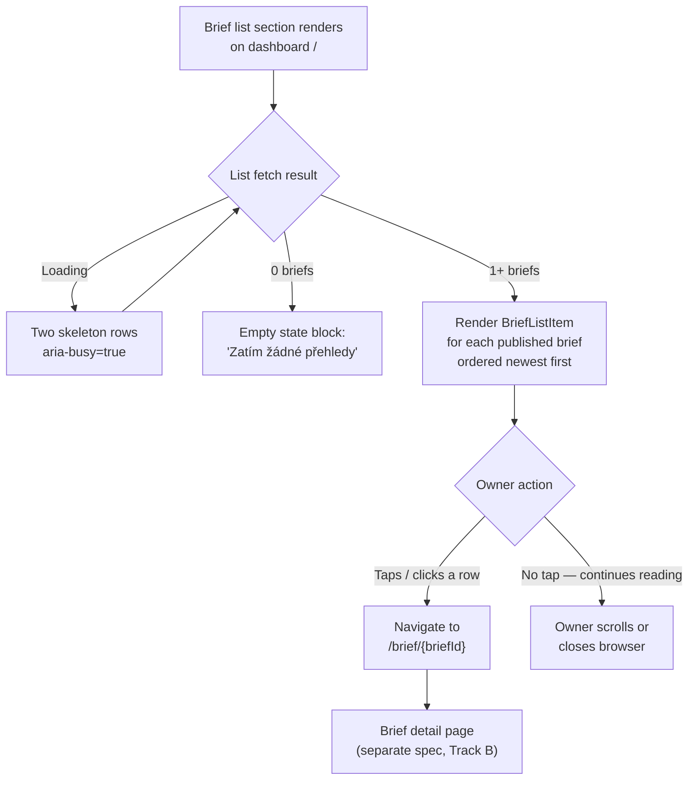

# Dashboard v0.2 — Brief List Item

*Owner: designer · Slug: dashboard-v0-2/brief-list-item · Last updated: 2026-04-21*

## 1. Upstream links

- Layout spec: [layout.md](layout.md) — section context, token set, breakpoints.
- Product brief: [docs/project/build-plan.md §10](../../project/build-plan.md) — 3 briefs in PoC (1 furniture + 2 placeholders); spec handles 0/1/many.
- Customer-testing framing: [docs/project/customer-testing-brief.md](../../project/customer-testing-brief.md) — §4.3 brief contents; §9 "first-minute reaction" as the activation signal.
- Decisions in force: D-004 (Czech only), D-006 (NACE sector grain), B-001 (no cadence promise copy), B-002 (no in-product sharing).
- Design upstream: [docs/design/information-architecture.md §3 Surface B](../information-architecture.md) — brief detail screen; list item rows link to that surface.
- Visual language: existing brief page card shapes (`border: 1px solid #e0e0e0; border-radius: 8px; padding: 16px`).
- Companion specs: [layout.md](layout.md), [tile-states.md](tile-states.md).

---

## 2. Fields surfaced per row

A brief list item is a navigational row — it tells the owner enough to recognise the brief and decide whether to open it. It does not summarise content (the brief page does that).

### 2.1 Field selection rationale

| Field | Shown? | Rationale |
|---|---|---|
| Brief title | Yes | Primary identifier. The title is analyst-authored and sector-specific (e.g., "Nábytkářský průmysl — Duben 2026"). |
| Publication month + year | Yes | The owner needs to know how recent the brief is. Month + year only; no precise date (B-001: no cadence promise; avoid implying "you should have seen this last Tuesday"). |
| NACE badge | Yes | In the PoC all briefs are NACE 31 (furniture). The badge confirms relevance. At scale, the owner may have briefs from multiple sectors; the badge disambiguates. Czech short-label: "NACE {{code}}" — e.g., "NACE 31". |
| "Nový" marker | Yes, if published ≤ 30 days ago | Draws attention to the most recent brief in the natural reading order. "Nový" (new) is simple, unambiguous. 30-day window aligns with the monthly brief cadence (a brief is "new" for the month it covers). |
| Brief status (draft/published) | No | The owner-facing list shows only published briefs. Draft state is an analyst concern. |
| Reading time estimate | No | Not established by the product at this phase; would be a speculative number. |
| Brief summary / excerpt | No | The list is a navigation surface, not a preview surface. Adding an excerpt risks the owner not clicking through — the customer-testing goal is to measure whether the full brief produces an "this is me" reaction (customer-testing-brief §9). |
| Sector name (written out) | Optional — see Q-TBD-D-008 | "NACE 31 — Výroba nábytku" would be more readable than "NACE 31" alone. If the engineer can resolve the NACE code to a display name, include it. If not, NACE code alone is sufficient for PoC. |

### 2.2 Field layout within a row

```
┌────────────────────────────────────────────────────────────────┐
│  [NACE badge]  [Nový] (if applicable)              (right end) │  ← Row A: metadata line
│                                                                │
│  Brief title                                                   │  ← Row B: title (primary text)
│                                                                │
│  {{Měsíc}} {{rok}}                           [chevron →]      │  ← Row C: month + affordance
└────────────────────────────────────────────────────────────────┘
```

**Row A (metadata line).** Horizontal flex row, gap 8 px. NACE badge is leftmost. "Nový" pill is immediately right of NACE badge. Nothing at right end.

**Row B (title).** Full width. Wraps to multiple lines if long. `--text-body` (15 px / 400) — not bold; the title is descriptive, not a CTA. The row itself (the `<a>` element) carries the interactive affordance — the title text does not need to be bold to be actionable.

Actually: reconsider. At 15 px / 400, a long title against a white background may not have enough visual weight to read as "tappable." Upgrade to `--text-subheading` (15 px / 600) for the title. This matches the category-label weight in the brief page accordion headers.

**Row C (month + chevron).** `--text-caption` (12 px / 400). Month in Czech nominative form: "Duben 2026", "Březen 2026". A right-pointing chevron glyph (›) or arrow icon at the far right of Row C provides a standard navigational affordance. If icon glyph: `aria-hidden="true"` (the row's accessible name carries navigation intent; the chevron is decorative).

**Internal padding.** 14 px top / 14 px bottom, 16 px left / 16 px right — matching the ObservationCard padding from the brief page.

**Minimum row height.** 72 px. This comfortably exceeds the 44 px minimum touch target requirement. The full row is the tap target — not just the title text.

---

## 3. Hover / focus / pressed states

The entire row is wrapped in a `<a href="/brief/[id]">` that covers the full list item area. No separate button inside.

| State | Treatment |
|---|---|
| Default | Background: `--color-surface-page` (#ffffff); border-bottom: 1 px `--color-border-subtle` (#e0e0e0); no border-radius on the row itself (list rows use dividers, not individual card boxes). |
| Hover (pointer device) | Background changes to `--color-surface-card` (#fafafa). Transition: `background-color 120ms ease`. Suppress if `prefers-reduced-motion`. The chevron does not animate. |
| Focus (keyboard) | 3 px solid `--color-focus-ring` (#1a1a1a) inset or outset on the row element; 2 px offset. The focus ring must be visible against both the default and hover backgrounds. |
| Pressed / active | `background-color: #f0f0f0` (one step darker than hover) while finger/pointer is held down. |
| Visited | No visited-link styling change. The `<a>` should not use browser default purple visited colour (apply `color: inherit` on the `<a>`). The "Nový" pill disappears after 30 days per the field spec, which is the natural staleness signal — visited state is redundant. |

---

## 4. List variants: 0, 1, and many items

### 4.1 Many items (normal state)

All rows share the same layout. Rows are separated by a 1 px divider (`border-bottom: 1px solid --color-border-subtle`) rather than card boxes or gutters. The last row has no bottom divider.

No pagination or "load more" at v0.2. The PoC has 3 briefs. If more than 10 briefs ever appear, add a "Zobrazit starší přehledy" text link below the last row (product decision — log as Q-TBD-D-009).

### 4.2 One item

Single row, same treatment as many. No special layout. The "Nový" pill will typically be present since a single brief is likely the most recent.

### 4.3 Zero items (empty state)

The list container is rendered but contains no rows. An empty-state block replaces the rows.

**Empty-state layout:**

```
┌──────────────────────────────────────────────────────────────┐
│                                                              │
│   Zatím žádné přehledy                                       │  ← Heading, --text-subheading
│                                                              │
│   Váš první sektorový přehled bude k dispozici               │  ← Body, --text-caption
│   jakmile bude připraven analytikem.                         │     colour: --color-ink-muted
│                                                              │
└──────────────────────────────────────────────────────────────┘
```

Padding: 24 px top and bottom, 0 left (aligns with row left edge). No icon, no illustration — consistent with the low-chrome register.

No cadence promise copy (B-001). No "check back on…" phrasing.

### 4.4 Loading state

When the brief list is being fetched, show two skeleton rows. Each skeleton row has the same height (72 px min) and padding as a real row, with skeleton bars replacing the metadata, title, and month fields. Shimmer animation respects `prefers-reduced-motion`.

`aria-busy="true"` on the list container while loading.

---

## 5. Spacing and divider treatment

```
[Section heading: "Vaše přehledy"]
  ↓ 12 px (--space-m) margin-bottom on the heading
[List container <ul>]
  [Row 1 <li>]
  → border-bottom: 1px solid #e0e0e0
  [Row 2 <li>]
  → border-bottom: 1px solid #e0e0e0
  [Row 3 <li>]
  → no border-bottom on last item (suppress with :last-child rule)
[End of list]
  ↓ 48 px (--space-3xl) page bottom padding
```

No outer border or box-shadow on the list container itself. The list sits directly on the page surface. This matches the "low-chrome" register from the customer-testing brief and is consistent with the brief page's section treatment.

---

## 6. Copy drafts

All copy Czech only (D-004). Formal register, vykání.

### 6.1 NACE badge label

`NACE <code>` — e.g., "NACE 31".

If the engineer resolves NACE code to a display name (Q-TBD-D-008): "NACE 31 — Výroba nábytku". The NACE code is always shown even when a display name is available (some owners know their NACE number from tax registration).

### 6.2 "Nový" pill label

`Nový`

Accessible name on the pill element: `aria-label="Nový přehled"` (full phrase; the standalone "Nový" lacks noun context in isolation for screen readers).

### 6.3 Publication month format

Czech month name in nominative, followed by year: `{{Měsíc}} {{RRRR}}`.

| Month number | Czech nominative |
|---|---|
| 1 | Leden |
| 2 | Únor |
| 3 | Březen |
| 4 | Duben |
| 5 | Květen |
| 6 | Červen |
| 7 | Červenec |
| 8 | Srpen |
| 9 | Září |
| 10 | Říjen |
| 11 | Listopad |
| 12 | Prosinec |

Example: "Duben 2026".

### 6.4 Empty-state copy

| Element | Copy |
|---|---|
| Heading | "Zatím žádné přehledy" |
| Body | "Váš první sektorový přehled bude k dispozici jakmile bude připraven analytikem." |

No placeholder or cadence promise (B-001 constraint). The copy is plain and factual: a person (analyst) is preparing it. This is accurate at MVP (human-authored briefs) and consistent with the customer-testing brief §4.4 framing ("every briefing is written by a Česká Spořitelna analyst").

### 6.5 Accessible row label (for the `<a>` element)

```
aria-label="Přehled: {briefTitle}, {měsíc} {rok}"
```

Example: `aria-label="Přehled: Nábytkářský průmysl — Duben 2026, Duben 2026"`

The month is somewhat redundant when the title includes it, but screen readers skipping row-internal content will still get the full identification. If the title already contains the month, the engineer may simplify to `aria-label="{briefTitle}"`. Flag as Q-TBD-D-010.

---

## 7. Tap/click target specification

**Minimum touch target: 44 × 44 px (mandatory — CLAUDE.md Rule 5).**

Implementation: the `<a>` element wraps the entire `<li>` content and receives `display: block` with `padding: 14px 16px` (Row C padding). At a minimum row height of 72 px and full container width, the effective tap target vastly exceeds 44 × 44 px.

The NACE badge and "Nový" pill within Row A are visually distinct but are not separate interactive elements — the whole row is one link. Avoid nesting a second `<a>` or `<button>` inside the row (would violate HTML nesting rules and create confusing focus behaviour).

The chevron in Row C is `aria-hidden="true"` and has no `onClick` handler — it is purely visual.

---

## 8. Component spec: BriefListItem

**Purpose.** Renders one entry in the brief list on the owner dashboard. A navigational row linking to the brief detail page.

**Existing pattern.** The v0.1 codebase does not have a brief-list view (the owner landing page was not implemented in v0.1). This is a new component for v0.2.

**States:** default · hover · focus · pressed · loading · empty (list-level, not row-level)

| Prop | Type | Required | Notes |
|---|---|---|---|
| `briefId` | `string` | Yes | Used to construct the `href="/brief/{briefId}"` |
| `title` | `string` | Yes | Analyst-authored brief title |
| `publicationMonth` | `string` | Yes | Czech nominative month + year (e.g., "Duben 2026") — pre-formatted by the data layer |
| `naceCode` | `string` | Yes | e.g., "31" — displayed as "NACE 31" |
| `naceName` | `string \| null` | No | Optional resolved NACE display name; null → badge shows code only |
| `isNew` | `boolean` | Yes | True if published ≤ 30 days ago |

**No content/excerpt prop.** The list item does not receive summary text — navigation only.

**Interaction states:**

| State | Description |
|---|---|
| Default | White background; bottom border divider |
| Hover | `#fafafa` background; 120 ms transition (suppressed under `prefers-reduced-motion`) |
| Focus | 3 px solid `#1a1a1a` focus ring |
| Pressed / active | `#f0f0f0` background while held |
| Loading | Skeleton row (no props needed — skeleton is a fixed-height placeholder) |

---

## 9. Primary flow (Mermaid)



---

## 10. Accessibility checklist — brief list item

- [ ] The `<ul>` list container has `role="list"` (explicit, since some CSS `list-style: none` resets strip the implicit list role in VoiceOver on Safari).
- [ ] Each `<li>` contains exactly one `<a>` covering the full row tap area — no nested interactive elements.
- [ ] `<a>` has `aria-label` per §6.5 — includes brief title and month for screen reader identification without relying on visual layout.
- [ ] "Nový" pill: `aria-label="Nový přehled"` per §6.2; the brief list item's row-level `aria-label` also communicates recency if "Nový" is present. Engineer to ensure no double announcement (pill aria-label may be suppressed if the row aria-label includes "nový" context — Q-TBD-D-010).
- [ ] NACE badge is presentational context within the row's accessible name — `aria-hidden="true"` on the badge element itself (the text is included in the row `aria-label`).
- [ ] Chevron in Row C: `aria-hidden="true"` and no interactive role.
- [ ] Focus ring: 3 px solid `#1a1a1a`, 2 px offset — visible on both white and `#fafafa` backgrounds (contrast of focus ring against white background = 18.1:1, passes WCAG 2.4.7).
- [ ] `prefers-reduced-motion`: hover background-color transition suppressed (instant switch); no other animation on this component.
- [ ] Empty state: the empty-state block is announced to screen readers as plain text content (not hidden); no `role="status"` needed since it is a static server-rendered element.
- [ ] Loading skeleton: `aria-busy="true"` on `<ul>` container; skeleton rows have `aria-hidden="true"` (they are decorative placeholders, not meaningful content).
- [ ] Minimum touch target verified: row height ≥ 72 px, full container width — well exceeds 44 × 44 px.
- [ ] Color is never the only signal: "Nový" is a text label (not a colour dot); row hover is a background colour change that does not carry information (the row is navigable with or without hover).
- [ ] Visited link styling: suppressed (no purple; `color: inherit` on `<a>`) — visual staleness is conveyed by the 30-day "Nový" pill logic, not by browser default visited colouring.

---

## 11. Design-system deltas (escalate if any)

**`BriefListItem` is a new component.** It does not exist in the v0.1 codebase. As with `MetricTile`, this is a v0.2 addition. The orchestrator's build-plan §10.1 explicitly includes "a list of briefs relevant to the owner's NACE" as a dashboard deliverable — this component is expected scope, not speculative. Per CLAUDE.md Rule 7: logged here; orchestrator confirms in scope before build.

The component requires no new external dependencies:

- No icon library (chevron is a Unicode glyph "›" or CSS-drawn).
- No animation library (hover transition is CSS-only).
- No new colour tokens beyond those already defined in layout.md §5.

**"Nový" pill styling** reuses the existing TimeHorizonPill pattern from the brief page (coloured pill with small bold label text). It is not a separate pill variant — the engineer can apply the same inline-style pattern with a green-tinted background. Suggested: background `#e8f5e9`, text `#1b5e20` — matching "Do 12 měsíců" pill from the brief page (already in the codebase at `src/app/brief/[id]/page.tsx` line 183). WCAG contrast: `#1b5e20` on `#e8f5e9` = 7.2:1 ✓ AA.

No other design-system additions needed.

---

## 12. Open questions

| Local ID | Question | Blocking |
|---|---|---|
| Q-TBD-D-008 | Should the NACE badge show only the code ("NACE 31") or resolve it to a display name ("NACE 31 — Výroba nábytku")? The data layer must be able to supply the display name. If not available from the seed data, code-only is the fallback. Engineer to confirm at implementation time. | Engineering data layer; not blocking spec |
| Q-TBD-D-009 | If the brief list grows beyond ~10 items (post-PoC), should it paginate or load more? Out of scope for v0.2 (3 briefs) but needs a decision before v0.3 if production brief cadence is confirmed. | v0.3 planning only |
| Q-TBD-D-010 | Screen-reader double announcement: if the "Nový" pill has `aria-label="Nový přehled"` and the row `<a>` aria-label also references recency, the screen reader may announce "new" twice. Engineer to test with VoiceOver / NVDA and resolve with either (a) removing the pill aria-label and relying on the row label, or (b) keeping the pill aria-label and omitting recency from the row label. | Accessibility; does not block visual implementation |

---

## Changelog

- 2026-04-21 — initial draft — designer
