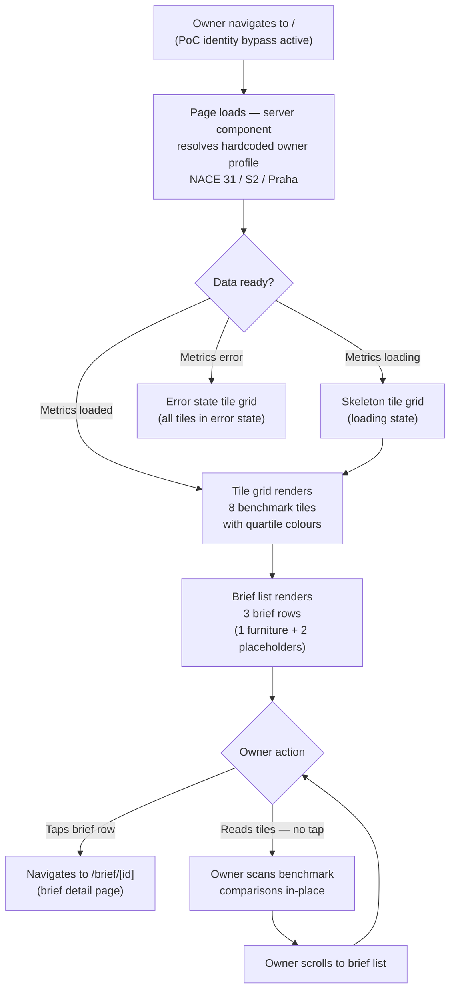

# Dashboard v0.2 — Layout

*Owner: designer · Slug: dashboard-v0-2/layout · Last updated: 2026-04-21*

## 1. Upstream links

- Product brief: [docs/project/build-plan.md §10](../../project/build-plan.md) — v0.2 scope and framing (no `docs/product/dashboard-v0-2.md` yet; PM artifact is in-flight per §10.5 delegation map).
- Customer-testing framing: [docs/project/customer-testing-brief.md](../../project/customer-testing-brief.md) — register, persona, trust constraints.
- PRD sections driving constraints: §3 (persona — Exposed Owner, Bank-Referred Passive Adopter), §7.2 (verdicts not datasets), §7.3 (plain language), §7.4 (day-one proof of value), §7.7 (bank-native distribution).
- Decisions in force: D-003 (8 MVP metrics), D-004 (Czech only), D-011 (canonical 4 categories), D-015 (Phase 2 PM+PD gate ratified — frozen metric list), D-016 (Supabase + Vercel + Next.js App Router).
- Design upstream: [docs/design/information-architecture.md](../information-architecture.md) — visual language established there (spacing, type scale, colour tokens) carries into this surface.
- Visual language source: [src/app/brief/[id]/page.tsx](../../../src/app/brief/%5Bid%5D/page.tsx) — existing card shapes, section spacing, font stack, colour values.
- Companion specs: [tile-states.md](tile-states.md), [brief-list-item.md](brief-list-item.md).

**Note on missing PM artifact.** `docs/product/dashboard-v0-2.md` is not yet written (PM track is parallel per §10.4 phase 2.1 Track A). This spec proceeds from the orchestrator's explicit scope definition in build-plan §10.1 and the customer-testing brief. If the PM artifact contradicts anything here when it lands, the conflict must be escalated to the orchestrator — not resolved unilaterally by either specialist.

---

## 2. Scope boundary

This file covers the owner's landing page at `/` only. It does not touch:

- `/brief/[id]` — brief detail page (separate spec, Track B, blocked on publication hand-off).
- `/consent`, `/onboarding`, `/settings/soukromi` — bypassed for the PoC owner (build-plan §10.1).
- Analyst admin pages (`/admin/*`) — unchanged from v0.1.

---

## 3. Page-level structure

The page has three stacked regions and nothing else.

```
┌──────────────────────────────────────────────────────────────┐
│  HEADER BAND                                                 │
│  "Strategy Radar"  wordmark left-aligned                     │
│  height: 48 px mobile / 56 px desktop                        │
│  background: white; border-bottom: 1 px #e0e0e0             │
├──────────────────────────────────────────────────────────────┤
│  TILE SECTION                                                │
│  Section heading (H2): "Srovnání s vaším oborem"            │
│  Grid of 8 benchmark tiles (2 per row mobile,               │
│  4 per row tablet+, 4 per row desktop)                       │
│  padding-top: 24 px; padding-bottom: 32 px                   │
├──────────────────────────────────────────────────────────────┤
│  BRIEF LIST SECTION                                          │
│  Section heading (H2): "Vaše přehledy"                      │
│  Vertical list of brief-list-item rows                       │
│  padding-top: 0 (section heading provides spacing);          │
│  padding-bottom: 48 px                                       │
└──────────────────────────────────────────────────────────────┘
```

No navigation tabs, no sidebar, no floating action buttons, no footer links beyond the brief-list-item row's tap target. This is consistent with the PoC register: the owner is testing whether the content is useful, not the navigation model.

---

## 4. Responsive grid — tile section

### 4.1 Breakpoints

| Name | Range | Columns in tile grid | Tiles per row | Gutter |
|---|---|---|---|---|
| Mobile | ≤ 600 px | 2 | 2 | 12 px |
| Tablet | 601–1024 px | 4 | 4 | 16 px |
| Desktop | > 1024 px | 4 | 4 | 20 px |

**Why 4 columns at tablet/desktop.** Eight tiles in 4 columns = 2 rows. This gives the owner a compact, at-a-glance comparison without scrolling on a laptop or tablet — consistent with the "day-one proof of value" principle (PRD §7.4). Mobile 2-column requires 4 rows, which is acceptable since mobile is a scroll medium.

**Why not 8 in a single row at desktop.** At 8 columns the tiles would be too narrow for the metric name + value + quartile label + pill to breathe at ≥ 44 px touch targets. 4 is the readable floor.

### 4.2 Max content width

| Breakpoint | Max content width | Horizontal padding (each side) |
|---|---|---|
| Mobile | 100% | 16 px |
| Tablet | 100% | 24 px |
| Desktop | 960 px (centered) | auto |

The 960 px desktop max matches the existing brief page's 680 px single-column content width for the brief section, but tiles benefit from a slightly wider container to show 4 per row at comfortable size. If the engineer's layout uses a single max-width container for both sections, 960 px works for both.

### 4.3 Vertical spacing between tile section and brief list section

A visual divider separates the two sections:

```
[tile grid ends]
  ↓ 32 px margin-bottom on tile grid container
[horizontal rule: 1 px, colour token --border-subtle (#e0e0e0 from v0.1)]
  ↓ 24 px padding-top on brief list section heading
[brief list section heading (H2)]
```

Total white space between last tile row and brief list heading: 32 + 1 + 24 = 57 px. This is intentional: the two sections carry different information types (metric tiles vs narrative briefs) and the gap signals a section boundary without a full-page header.

---

## 5. Token set (v0.2 proposal — carry forward from existing brief page)

The `src/app/brief/[id]/page.tsx` implementation establishes the following values through inline styles. These are the canonical v0.2 tokens. They are **not yet in a formal design-token file** — the engineer currently uses inline hex values. Flag: they should be consolidated into a `src/styles/tokens.css` or `tailwind.config.ts` in v0.3. Logged in §11.

| Token name (proposed) | Value | Used for |
|---|---|---|
| `--color-ink-primary` | `#1a1a1a` | Body text, headings, primary button background |
| `--color-ink-secondary` | `#444` | Supporting body text, observation body |
| `--color-ink-tertiary` | `#666` | Secondary labels, "Zpět do George" link |
| `--color-ink-muted` | `#888` | Metadata, footnotes, empty-state copy |
| `--color-surface-page` | `#ffffff` | Page background |
| `--color-surface-card` | `#fafafa` | Card / tile background (see tile-states.md for quartile overrides) |
| `--color-border-subtle` | `#e0e0e0` | Card borders, section dividers |
| `--color-border-inner` | `#f0f0f0` | Inner dividers within cards |
| `--color-focus-ring` | `#1a1a1a` | Keyboard focus ring (3 px solid, 2 px offset) |

**Type scale (v0.2 proposal):**

| Token name | Size | Weight | Line height | Used for |
|---|---|---|---|---|
| `--text-display` | 22 px | 700 | 1.3 | Page-level H1 (not used on dashboard — header band is wordmark only) |
| `--text-heading` | 18 px | 700 | 1.35 | H2 section headings ("Srovnání s vaším oborem", "Vaše přehledy") |
| `--text-subheading` | 15 px | 600 | 1.4 | Card headings, category labels |
| `--text-body` | 15–16 px | 400 | 1.5–1.6 | Body text, brief titles in list |
| `--text-label` | 13 px | 600 | 1.3 | Metric name label inside tile |
| `--text-caption` | 12 px | 400 | 1.4 | Metadata, footnotes, tile quartile label text |

**Font stack (v0.2 proposal):** `system-ui, -apple-system, BlinkMacSystemFont, "Segoe UI", Roboto, sans-serif` — inheriting from the existing brief page. Inter or a ČS brand font may replace this pending OQ-006 (design system availability); not blocked on that OQ for the PoC.

**Spacing ramp (v0.2 proposal):**

| Token | Value | Notes |
|---|---|---|
| `--space-xs` | 4 px | Inner padding increments |
| `--space-s` | 8 px | Small gaps, pill padding |
| `--space-m` | 12 px | Tile internal row gaps |
| `--space-l` | 16 px | Gutter (mobile), section internal padding |
| `--space-xl` | 24 px | Section padding, gutter (tablet) |
| `--space-2xl` | 32 px | Section vertical margin |
| `--space-3xl` | 48 px | Page bottom padding |

---

## 6. Header band

The header band is minimal — this is a PoC, and the brief explains the product, not the chrome.

```
┌──────────────────────────────────────────────────────────────┐
│  Strategy Radar                                              │
│  (wordmark, --text-subheading weight 700, --color-ink-primary│
│   left-aligned, vertically centered in 48 px band)           │
└──────────────────────────────────────────────────────────────┘
```

- **Height:** 48 px (mobile), 56 px (desktop). Matches the existing brief page's header rhythm.
- **Background:** `--color-surface-page` (#ffffff).
- **Border-bottom:** 1 px `--color-border-subtle` (#e0e0e0).
- **No navigation links.** No user menu, no settings link, no logout. The PoC owner is hardcoded; settings and consent surfaces are bypassed.
- **No ČS logo.** The ČS wordmark is present in the brief page and consent screen; the dashboard PoC omits it to keep the header uncluttered. If the PM artifact specifies it, add. Logged as Q-TBD-D-001.

### Heading levels

- The wordmark is not a heading — it is a decorative text element (`<div>` or `<span>`, not `<h1>`). There is no page-level `<h1>` on the dashboard; the content sections carry `<h2>` headings. This is intentional: the page is a dashboard, not a document, and the visual wordmark substitutes for an accessible `<h1>`.

**Wait — accessibility note.** Screen readers expect one `<h1>` per page. The wordmark should be marked as `<h1 aria-label="Strategy Radar">` with `role="banner"` on the header element. See §9 accessibility checklist.

---

## 7. Tile section

### 7.1 Section heading

```
<h2>Srovnání s vaším oborem</h2>
```

- Style: `--text-heading` (18 px / 700).
- Colour: `--color-ink-primary`.
- Margin-bottom: `--space-l` (16 px) before the tile grid.
- Not sticky. Scrolls with page.

### 7.2 Tile grid

8 tiles in a CSS Grid:

```css
/* Mobile */
display: grid;
grid-template-columns: repeat(2, 1fr);
gap: 12px;                /* --space-l */

/* Tablet (601–1024 px) */
grid-template-columns: repeat(4, 1fr);
gap: 16px;                /* --space-l */

/* Desktop (>1024 px) */
grid-template-columns: repeat(4, 1fr);
gap: 20px;                /* --space-xl */
```

Tile order within the grid follows the D-011 canonical category order, then metric order within each category:

| Grid position | Metric | Category |
|---|---|---|
| 1 | Hrubá marže | Ziskovost |
| 2 | Marže EBITDA | Ziskovost |
| 3 | Podíl osobních nákladů | Náklady a produktivita |
| 4 | Tržby na zaměstnance | Náklady a produktivita |
| 5 | Cyklus pracovního kapitálu | Efektivita kapitálu |
| 6 | ROCE | Efektivita kapitálu |
| 7 | Růst tržeb vs. medián kohorty | Růst a tržní pozice |
| 8 | Cenová síla | Růst a tržní pozice |

**Rationale for order.** Category-coherent ordering (pairs of tiles per category) lets a returning owner scan by topic rather than by index. This matches the D-011 four-category structure already understood from the brief. Category boundaries are not labelled above the tiles — the tile-level category label (in the tile spec) carries this context.

Visual specs for individual tiles: see [tile-states.md](tile-states.md).

---

## 8. Brief list section

### 8.1 Section heading

```
<h2>Vaše přehledy</h2>
```

- Style: `--text-heading` (18 px / 700).
- Colour: `--color-ink-primary`.
- Margin-top: `--space-xl` (24 px) after the section divider.
- Margin-bottom: `--space-m` (12 px) before the first list item.

### 8.2 List container

- Semantic element: `<ul>` with `list-style: none; padding: 0; margin: 0`.
- Each row is a `<li>` containing a `<a>` that covers the full row.
- Visual specs for individual rows: see [brief-list-item.md](brief-list-item.md).

---

## 9. Accessibility checklist — dashboard page

- [ ] `<header role="banner">` wraps the header band; contains `<h1 aria-label="Strategy Radar">` for screen readers (wordmark text may be visually styled but must have semantic heading role — see §6 note).
- [ ] `<main>` wraps both the tile section and the brief list section.
- [ ] `<h2>` headings are used for both section headings ("Srovnání s vaším oborem" and "Vaše přehledy"); no heading levels are skipped.
- [ ] Focus order follows visual reading order: header band → tile section heading → tile 1 → tile 2 → … → tile 8 → section divider (non-interactive, skipped) → brief list heading → brief row 1 → brief row 2 → brief row 3.
- [ ] Tile grid: tiles are either non-interactive (read-only metric display) or interactive links — if non-interactive, they carry `role="region"` with an accessible name equal to the metric name; if interactive (tap-to-brief), the `<a>` carries the full accessible description. Defined further in [tile-states.md §5](tile-states.md).
- [ ] Tab flow from tile grid to brief list section is natural DOM order (no `tabindex` manipulation needed; tile section precedes brief list in DOM).
- [ ] Color is never the only signal for quartile position — mandatory redundant signal specified in [tile-states.md §3](tile-states.md).
- [ ] All interactive elements have ≥ 44 × 44 px touch targets (brief list rows: full-width tap target; tiles: see tile-states.md §2 for tile dimensions).
- [ ] Text contrast ≥ WCAG AA (4.5:1 body, 3:1 large): `--color-ink-primary` (#1a1a1a) on `--color-surface-page` (#ffffff) = 18.1:1 (passes). `--color-ink-tertiary` (#666) on #ffffff = 5.74:1 (passes AA). Tile text-on-tile-background ratios specified in [tile-states.md §4](tile-states.md).
- [ ] Section divider (`<hr>`) is `aria-hidden="true"` — presentational only, already conveyed by heading structure.
- [ ] No motion on the page beyond brief-list-item hover state (colour transition); hover is suppressed for `prefers-reduced-motion` (instant colour switch).
- [ ] Screen-reader label on the wordmark `<h1>`: "Strategy Radar" (full name).
- [ ] Loading state: when tiles or brief list are loading, a visible skeleton is shown (see [tile-states.md §2](tile-states.md) and [brief-list-item.md §4](brief-list-item.md)); loading regions carry `aria-busy="true"`.

---

## 10. Primary flow (Mermaid)



---

## 11. Design-system deltas (escalate if any)

The following items require consolidation but do not need new components:

1. **Token file.** All hex values and spacing constants used across v0.1 (brief page) and this dashboard spec are currently inline in `src/`. They should be lifted to a CSS custom-properties file or Tailwind config in v0.3. This is not a new component — it is refactoring of existing values. No escalation needed; logged as a v0.3 engineering task.

2. **CSS Grid for tile layout.** The existing brief page does not use CSS Grid (it is single-column). The dashboard introduces a 2-column / 4-column grid. This is a standard CSS pattern — no new design-system dependency. The engineer implements it directly.

No new components, icon sets, or design-system dependencies are introduced by this layout spec. Tile component specs (new `MetricTile` component) are specified in [tile-states.md §4](tile-states.md) — that file evaluates whether `MetricTile` is a design-system addition.

---

## 12. Open questions

These are raised by the designer; the orchestrator assigns final `OQ-NNN` IDs when merging into `docs/project/open-questions.md`.

| Local ID | Question | Blocking |
|---|---|---|
| Q-TBD-D-001 | Should the ČS wordmark appear in the dashboard header band alongside or instead of "Strategy Radar"? The brief page shows "Česká Spořitelna · Strategy Radar" in a metadata line above H1. The dashboard PoC omits the ČS wordmark from the header to keep chrome minimal. If the PM artifact specifies branding requirements, this needs reconciliation. | PM artifact; not blocking PoC build |
| Q-TBD-D-002 | Are tiles purely informational (read-only, `role="region"`) or do they link to something (e.g., deep-link to the relevant brief section)? At v0.2 there is no tile-to-section deep-link behaviour specified. If tiles become interactive, touch-target and focus-state specs in tile-states.md must be updated. | tile-states.md §4 interactive states; not blocking v0.2 PoC |
| Q-TBD-D-003 | Desktop max-width for the tile grid is proposed at 960 px (vs 680 px for the brief page single column). If the engineer uses a single layout container for both sections, the tile grid at 4 columns will be narrower than 960 px at a 680 px container. Engineer to confirm container strategy and whether a wider container is acceptable for this page. | Engineering layout implementation; not blocking design |

---

## Changelog

- 2026-04-21 — initial draft — designer
