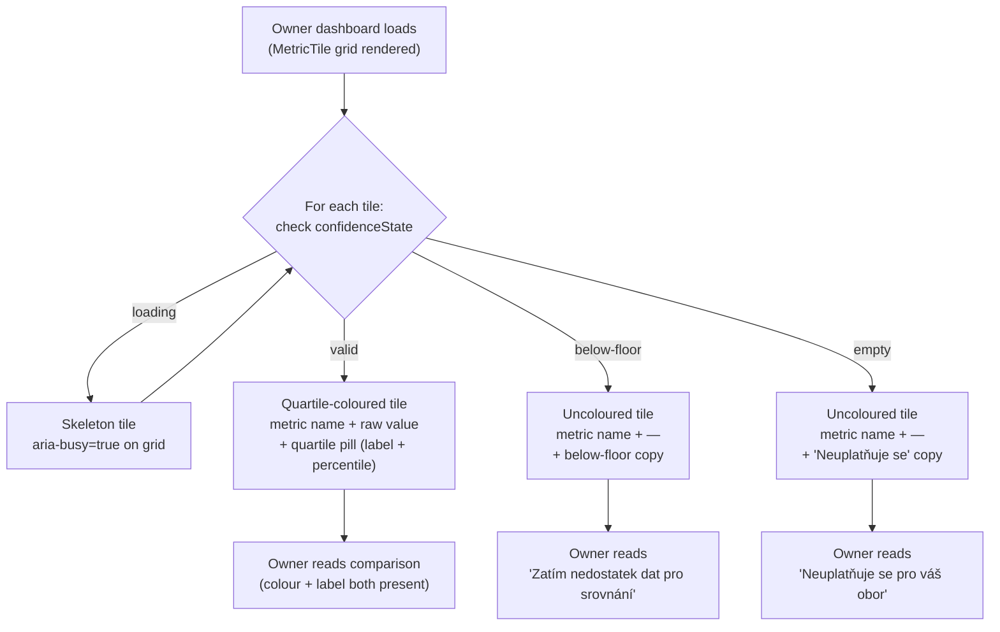

# Dashboard v0.2 — Tile States

*Owner: designer · Slug: dashboard-v0-2/tile-states · Last updated: 2026-04-21*

## 1. Upstream links

- Layout spec: [layout.md](layout.md) — grid, breakpoints, token set.
- Product brief: [docs/project/build-plan.md §10](../../project/build-plan.md).
- Decisions in force: D-003 (8 metrics), D-004 (Czech only), D-011 (4 categories), D-015 (frozen labels).
- Quartile label values (frozen, D-015): **horní čtvrtina · třetí čtvrtina · druhá čtvrtina · spodní čtvrtina**.
- Below-floor fallback copy (frozen, quartile-position-display.md §5.5): "Tento ukazatel zatím nemůžeme spolehlivě porovnat — k dispozici je málo srovnatelných firem v kohortě."
- D-014 graceful-degradation copy: aligns with the below-floor fallback copy frozen in the quartile-position-display design artifact; the dashboard tiles must use the same wording (single source of truth).
- Accessibility: PRD §7.3 plain language; WCAG AA colour contrast; colour-alone rule from CLAUDE.md Non-negotiable rule 3.

---

## 2. Tile dimensions and internal layout

### 2.1 Dimensions

| Breakpoint | Tile width | Min tile height | Notes |
|---|---|---|---|
| Mobile (≤ 600 px) | `calc(50% - 6px)` (2-col grid with 12 px gap) | 112 px | Touch target: the whole tile surface is the effective touch area if tiles become interactive (Q-TBD-D-002); minimum dimension 44 px satisfied by the 112 px height |
| Tablet (601–1024 px) | `calc(25% - 12px)` (4-col grid with 16 px gap) | 120 px | |
| Desktop (> 1024 px) | `calc(25% - 15px)` (4-col grid with 20 px gap) | 120 px | |

Tile heights are minimums; content may push them taller (e.g., a long metric name wrapping). Tiles in the same grid row align to the tallest tile's height via CSS Grid `align-items: stretch`.

### 2.2 Internal padding

- All four sides: 12 px (`--space-m`).
- On mobile, reduce to 10 px horizontal / 12 px vertical if metric names wrap more than two lines.

### 2.3 Internal layout (top-to-bottom within each tile)

```
┌──────────────────────────────────┐
│  [Category badge — 12 px label]  │  ← Row A: category indicator (small, muted)
│                                  │
│  Metric name                     │  ← Row B: metric name (--text-label, 13 px / 600)
│  (may wrap to two lines)         │
│                                  │
│  Raw value                       │  ← Row C: raw value (--text-subheading, 15 px / 600)
│  e.g. "38 %"                     │     (number + unit; plain Czech unit label)
│                                  │
│  ╔══════════════════════╗        │  ← Row D: quartile pill (see §4)
│  ║ horní čtvrtina  [▲]  ║        │     (coloured pill + redundant icon)
│  ╚══════════════════════╝        │
└──────────────────────────────────┘
```

Row A (category badge) is optional for the PoC if the engineer finds it clutters the tile at mobile size. Logged as Q-TBD-D-004. If omitted, the tile-grid ordering (category-coherent) still provides grouping context.

Row C (raw value) is blank-replaced with an em-dash ("—") in the below-floor state. The raw value is not a verdict alone — it exists here alongside the quartile pill (Row D) which supplies the comparison. Together they satisfy the "verdict not dataset" rule (PRD §7.2): the number has meaning only in the context of the quartile label beside it.

---

## 3. Four tile states

### State 1 — Valid (quartile-coloured)

The tile has all data: metric name, raw value, cohort percentile, and quartile assignment. This is the primary state in the PoC (all 8 metrics will have seeded dummy values).

Visual treatment: see §4 (colour palette) and §5 (redundant non-colour signal).

### State 2 — Below-floor (graceful degradation, no percentile)

The tile cannot show a percentile because the cohort cell is below the statistical-validity floor for this metric. Per D-014 and quartile-position-display.md §5.5.

Visual treatment:

- Tile background: `--color-surface-card` (#fafafa) — **no colour tint**. Using colour here would signal a quartile, which would be false.
- Category badge: shown (if Row A is included).
- Metric name: shown normally.
- Raw value: hidden. Row C shows `—` (em-dash, `aria-label="není k dispozici"`).
- Row D replaces the quartile pill with the below-floor copy block (see §6.1).
- No quartile pill rendered. No colour applied to the tile.

### State 3 — Empty (metric not applicable for this owner)

This state is included for completeness but is unlikely to trigger in the PoC (all 8 metrics are seeded for the furniture NACE 31 owner). "Empty" means the metric is definitionally not applicable for this sector (e.g., a metric that requires inventory data for a service firm) — distinct from "below-floor" (data exists but cohort is too small).

Visual treatment:

- Tile background: `--color-surface-card` (#fafafa).
- Category badge: shown.
- Metric name: shown.
- Raw value Row: `—`.
- Row D: empty-state copy (see §6.2).
- No colour applied.

### State 4 — Loading (skeleton)

Shown while the owner-metrics data is being fetched. All 8 tiles enter loading state simultaneously and resolve together.

Visual treatment:

- Tile background: `--color-surface-card` (#fafafa).
- Rows A–D replaced with animated skeleton bars.
- Skeleton: two bars (one short for metric name, one medium for value/pill area). Background colour: `#e0e0e0`, animated shimmer from left to right (gradient animation).
- The shimmer animation must respect `prefers-reduced-motion`: if set, show a static muted fill with no animation.
- `aria-busy="true"` on the tile grid container while any tile is loading.

---

## 4. Quartile colour palette

### 4.1 Design rationale

The user suggested "green top / red bottom" as an illustration and delegated the final colour choice to the designer. This spec proposes a different approach, grounded in three constraints:

1. **Non-punitive bottom quartile.** PRD §7.6 and the CLAUDE.md guardrail: "opportunity-flavored, not risk-flavored." A red bottom-quartile tile reads as "warning" or "problem" — exactly the credit-risk surveillance framing the product is built to avoid. Czech SME owners are already anxious about bank products that might feed into credit decisions (PRD §3, §13.3). A red tile on the dashboard is a trust-barrier trigger.

2. **Green-top must not imply bank approval.** A bright green tile for "horní čtvrtina" risks being read as "the bank thinks your business is healthy" — again a credit-risk-adjacent reading. Muted, warm tones avoid this.

3. **WCAG AA contrast.** Text on tile background must be ≥ 4.5:1 for body text, ≥ 3:1 for large/bold text.

### 4.2 Proposed palette (v0.2 proposal — to consolidate into design tokens in v0.3)

The palette uses **value-neutral hue variation** (blue–green axis) rather than a traffic-light axis (red–green). This communicates "position in a range" rather than "good vs. bad."

| Quartile | Czech label | Tile background | Text colour | Background token (proposed) | Text token (proposed) | Contrast ratio (text on bg) |
|---|---|---|---|---|---|---|
| Q4 — horní čtvrtina | horní čtvrtina | `#e6f0f5` (cool teal-blue tint) | `#1a4a5a` (dark teal) | `--color-tile-q4-bg` | `--color-tile-q4-text` | 8.2:1 ✓ AA |
| Q3 — třetí čtvrtina | třetí čtvrtina | `#eaf4ec` (soft sage green) | `#1e4a2a` (dark forest) | `--color-tile-q3-bg` | `--color-tile-q3-text` | 7.9:1 ✓ AA |
| Q2 — druhá čtvrtina | druhá čtvrtina | `#f5f0e6` (warm sand) | `#4a3a1a` (dark warm brown) | `--color-tile-q2-bg` | `--color-tile-q2-text` | 7.5:1 ✓ AA |
| Q1 — spodní čtvrtina | spodní čtvrtina | `#f0ede8` (pale stone) | `#3a3530` (charcoal warm) | `--color-tile-q1-bg` | `--color-tile-q1-text` | 6.8:1 ✓ AA |

**Notes on palette choices:**

- **Q4 (teal-blue):** Calm authority. Not green (avoids "go signal"). Associates with water, clarity, strength — non-punitive top position.
- **Q3 (sage green):** Slightly greener than Q4 but still muted. "Above average" without excitement.
- **Q2 (warm sand):** Neutral, warm. "Below average" without alarm. The warmth distinguishes it from the cool Q3/Q4 without being red.
- **Q1 (pale stone):** Very light, almost off-white. The de-emphasis is intentional: the tile communicates position, not a verdict of failure. The quartile label in the pill carries the meaning; the tile background merely contextualises it. The darkest tile is Q4, not the lightest — reversing the typical traffic-light saturation convention.

**High-contrast accessible variant.** For users who cannot distinguish the teal/sage/sand/stone palette (deuteranopia, tritanopia), the redundant non-colour signal (§5) carries all meaning. The tile colours are additive context, not the primary information channel.

### 4.3 Quartile pill colours (within the tile)

The quartile pill (Row D) uses the same background/text pair as its tile but inverted (text becomes background, background becomes text) for contrast within the tile. This creates a "badge" effect that is visually distinct from the tile body.

| Quartile | Pill background | Pill text | WCAG contrast |
|---|---|---|---|
| Q4 | `#1a4a5a` | `#ffffff` | 8.2:1 ✓ AA |
| Q3 | `#1e4a2a` | `#ffffff` | 7.9:1 ✓ AA |
| Q2 | `#4a3a1a` | `#ffffff` | 7.5:1 ✓ AA |
| Q1 | `#3a3530` | `#ffffff` | 6.8:1 ✓ AA |

All four pill combinations pass WCAG AA for both normal text (4.5:1) and large/bold text (3:1).

---

## 5. Redundant non-colour signal (mandatory)

Colour alone is never the accessibility carrier (CLAUDE.md Non-negotiable rule 3; WCAG SC 1.4.1). The quartile position must be communicated through a second, non-colour channel.

**Chosen approach: quartile label text in-tile.**

The Czech quartile label ("horní čtvrtina", "třetí čtvrtina", "druhá čtvrtina", "spodní čtvrtina") is rendered as visible text inside the pill (Row D). This satisfies the requirement fully: a colour-blind user, a monochrome screen user, or a screen reader user all receive the quartile position through the label text.

**Why label text over icon glyph or fill pattern:**

- **Icon glyph** (e.g., arrow up/down): still a visual signal; ambiguous to screen readers without explicit `aria-label`; arrows carry directional meaning that could imply "good" vs "bad" in a punitive way (Q1 down-arrow = risk-flavored). Rejected.
- **Fill pattern** (hatching, dots): requires SVG tile backgrounds; complex at small tile sizes; no established pattern in the existing component set; would be a new design-system dependency. Rejected.
- **Ordinal position text** (e.g., "1. čtvrtina"): numeric ordinals ("1st quartile") carry an implied rank that is more legible as text but still ambiguous on direction without context (is 1 top or bottom?). The frozen Czech labels are unambiguous — "horní čtvrtina" is unambiguously the top. Label text wins.

**Screen-reader label construction.** The `aria-label` on the quartile pill element follows the pattern established in quartile-position-display.md §5.6:

```
aria-label="{quartileLabel}, {n}. percentil"
e.g. "horní čtvrtina, 82. percentil"
```

The percentile integer is shown as a superscript or sub-label below or beside the Czech label inside the pill, typeset at `--text-caption` (12 px). It is not the primary visible information, but it is present — consistent with the dashboard purpose (the owner sees both the comparison verdict and the raw position).

---

## 6. Copy drafts

All copy is Czech only (D-004). Formal register, vykání.

### 6.1 Below-floor copy (Row D replacement — verbatim, aligned with D-014)

Rendered when `confidenceState === 'below-floor'`. No quartile pill, no colour tile. The below-floor copy replaces Row D entirely.

> "Zatím nedostatek dat pro srovnání."

This is a shortened variant for tile use (tiles have limited space). The full frozen string from quartile-position-display.md §5.5 ("Tento ukazatel zatím nemůžeme spolehlivě porovnat — k dispozici je málo srovnatelných firem v kohortě.") is used in the brief detail page. The dashboard tile uses the short variant for space reasons.

**Alignment with D-014.** D-014 froze the graceful-degradation copy principle ("non-punitive, plain Czech, no percentile number"). The short tile variant is consistent with that principle: it does not shame the owner, it does not reference statistical methodology, and it does not display a number.

Flag: if the PM artifact mandates the full frozen string, the tile layout must accommodate it (two lines at `--text-caption` size). Logged as Q-TBD-D-005.

### 6.2 Empty-state copy (Row D replacement — metric not applicable)

> "Neuplatňuje se pro váš obor."

Short, plain, non-punitive. Analogous to "not applicable for your sector."

### 6.3 Raw value unit labels (Row C)

Units are appended as plain Czech label strings, not symbols where ambiguous:

| Metric | Unit label | Example raw value display |
|---|---|---|
| Hrubá marže | `%` | `38 %` |
| Marže EBITDA | `%` | `12 %` |
| Podíl osobních nákladů | `%` | `24 %` |
| Tržby na zaměstnance | `tis. Kč` | `1 850 tis. Kč` |
| Cyklus pracovního kapitálu | `dní` | `47 dní` |
| ROCE | `%` | `9 %` |
| Růst tržeb vs. medián kohorty | `p. b.` (procentní body) | `+3 p. b.` |
| Cenová síla | `p. b.` | `−1 p. b.` |

"Růst tržeb vs. medián kohorty" and "Cenová síla" show a signed value (+ or −) because they are relative metrics (above/below cohort median). The sign is part of the verdict. Note: a negative "Cenová síla" value with a "druhá čtvrtina" or "spodní čtvrtina" label is a coherent data combination; the tile does not add interpretive copy — the brief carries that.

### 6.4 Tile accessible names (for non-interactive tiles, `role="region"`)

```
aria-label="{metricCzechName} — {quartileLabel}, {percentile}. percentil"
```

Example: `aria-label="Hrubá marže — horní čtvrtina, 82. percentil"`

For below-floor tiles: `aria-label="{metricCzechName} — zatím nedostatek dat pro srovnání"`

For empty tiles: `aria-label="{metricCzechName} — neuplatňuje se pro váš obor"`

---

## 7. Component spec: MetricTile

**Purpose.** Renders one benchmark metric as a compact data tile on the owner dashboard. Not a brief-embedded component (that is BenchmarkSnippet in IA §4.3) — this is a standalone tile optimised for grid display. They are visually distinct but semantically related.

**New component.** `MetricTile` does not exist in the v0.1 codebase or in the IA spec. It is new to v0.2. See §10 (design-system deltas) for escalation.

**States:** valid · below-floor · empty · loading

| Prop | Type | Required | Notes |
|---|---|---|---|
| `metricId` | one of the 8 D-003 metric IDs | Yes | Drives label lookup and unit rendering |
| `metricLabel` | `string` | Yes | Czech display name (from D-003 canonical list) |
| `categoryLabel` | `string` | Yes | One of the 4 D-011 category Czech names |
| `rawValue` | `string \| null` | Yes | Pre-formatted string including unit (e.g., "38 %"); null triggers em-dash |
| `quartileLabel` | `"horní čtvrtina" \| "třetí čtvrtina" \| "druhá čtvrtina" \| "spodní čtvrtina" \| null` | Yes | null → no pill, no colour tint |
| `percentile` | `integer 1–99 \| null` | Yes | null → no percentile shown |
| `confidenceState` | `"valid" \| "below-floor" \| "empty" \| "loading"` | Yes | Drives which state renders |

**State rendering matrix:**

| `confidenceState` | Tile bg colour | Category badge | Metric name | Raw value | Quartile pill |
|---|---|---|---|---|---|
| `valid` | Quartile tint (§4.2) | Shown | Shown | rawValue string | Shown with quartile label + percentile |
| `below-floor` | `--color-surface-card` | Shown | Shown | `—` | Replaced by §6.1 below-floor copy |
| `empty` | `--color-surface-card` | Shown | Shown | `—` | Replaced by §6.2 empty copy |
| `loading` | `--color-surface-card` | Skeleton bar | Skeleton bar | Skeleton bar | Skeleton bar |

**Interaction states (if tile becomes interactive per Q-TBD-D-002):**

| State | Treatment |
|---|---|
| Default | As above |
| Hover (pointer device) | Tile border: 1 px → 2 px; border colour: `--color-ink-tertiary` (#666). No background change. |
| Focus (keyboard) | 3 px solid `--color-focus-ring` (#1a1a1a); 2 px offset. Visible without colour assumption. |
| Pressed / active | Brief scale: `transform: scale(0.98)`. Suppress if `prefers-reduced-motion`. |
| Disabled | Not applicable — a tile either shows data or shows a degraded state; it is never disabled. |

---

## 8. Primary flow (Mermaid)



---

## 9. Accessibility checklist — tile component

- [ ] Each tile carries `role="region"` with `aria-label` constructed per §6.4 (includes metric name + quartile verdict or degraded message).
- [ ] Quartile pill `aria-label` follows the pattern "{quartileLabel}, {n}. percentil" per §5; pill text content is also visible (not icon-only).
- [ ] Colour is never the only quartile signal — Czech label text in pill is the primary signal; tile background colour is additive.
- [ ] All four tile-background / tile-text colour pairs pass WCAG AA contrast (verified in §4.2 table; all ≥ 6.8:1).
- [ ] All four pill-background / pill-text pairs pass WCAG AA (verified in §4.3 table; all ≥ 6.8:1).
- [ ] `--color-ink-muted` (#888) used for category badge text on `--color-surface-card` (#fafafa): contrast = 3.54:1 — passes WCAG AA for large text only (14 px bold qualifies). The category badge is 12 px bold; this is borderline. **Recommendation: darken category badge text to `--color-ink-tertiary` (#666) for 5.74:1 which passes AA for normal text.** Flag as Q-TBD-D-006.
- [ ] Loading skeleton respects `prefers-reduced-motion` (static fill, no animation).
- [ ] Below-floor and empty copy strings are plain text (not `aria-hidden`); no metric number is present in the DOM in any attribute for below-floor tiles.
- [ ] Focus ring on interactive tiles: 3 px solid `--color-focus-ring` (#1a1a1a), 2 px offset — meets WCAG 2.4.7.
- [ ] Screen-reader does not double-announce the percentile (once from the pill `aria-label`, once from visible text) — engineer must ensure `aria-label` on the pill overrides or the visible number is `aria-hidden` on the numeric sub-label element. [BLOCKED — Q-TBD-D-007; engineering implementation detail]

---

## 10. Design-system deltas (escalate if any)

**`MetricTile` is a new component.** It does not exist in the v0.1 codebase or IA spec. This is a design-system addition under CLAUDE.md Rule 7. Required action before implementation:

- Orchestrator must review this spec and confirm that `MetricTile` is within v0.2 scope (it is: build-plan §10.1 explicitly names "8 benchmark tiles" as a v0.2 deliverable; the component is therefore expected, not speculative).
- The component is self-contained (no third-party icon set, no new dependency beyond existing CSS-in-JS or inline styles, no animation library). The shimmer loading state is a CSS-only `@keyframes` animation.

**The quartile colour tokens (§4.2 and §4.3) are new design tokens.** They do not exist in the v0.1 token set (brief page uses no quartile colours). They should be added to the token file once it is consolidated in v0.3 (see layout.md §11).

No other new components, icon sets, or external dependencies are introduced.

---

## 11. Open questions

| Local ID | Question | Blocking |
|---|---|---|
| Q-TBD-D-004 | Should the category badge (Row A — e.g., "Ziskovost", "Náklady a produktivita") be included inside each tile at PoC? Adds context but may clutter mobile tiles. If omitted, the grid ordering (category-coherent per layout.md §7.2) still groups tiles by topic. | Engineering tile layout; not blocking spec |
| Q-TBD-D-005 | Should the dashboard tile below-floor state use the short copy ("Zatím nedostatek dat pro srovnání") or the full frozen string from quartile-position-display.md §5.5? Short copy fits the tile space constraint; full copy is the frozen single-source-of-truth. PM to confirm when dashboard-v0-2.md is written. | Below-floor copy in MetricTile; not blocking PoC (all 8 metrics seeded as valid) |
| Q-TBD-D-006 | Category badge text at 12 px uses `--color-ink-muted` (#888) on `#fafafa` = 3.54:1 — passes AA for large/bold text only. Recommendation: use `--color-ink-tertiary` (#666) = 5.74:1 to pass AA for all text sizes. Engineer should use #666 unless a design-system constraint prevents it. | Accessibility; minor; does not block PoC |
| Q-TBD-D-007 | Screen reader double-announcement of percentile: the `aria-label` on the pill element and the visible numeric sub-label inside the pill both carry the percentile. Engineer must `aria-hidden="true"` the visible numeric span, or rely on the `aria-label` to override it. Engineering implementation detail; needs confirmation at build time. | Accessibility; blocks WCAG AA compliance check only |

---

## Changelog

- 2026-04-21 — initial draft — designer
