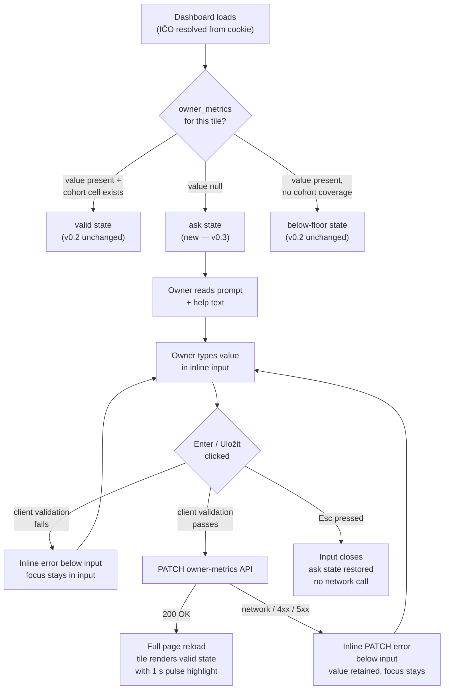

# In-tile prompts — "ask when missing" UX (v0.3) — Design

*Owner: designer · Slug: in-tile-prompts · Last updated: 2026-04-27*

## 1. Upstream link

- Product doc: [docs/product/in-tile-prompts.md](../product/in-tile-prompts.md)
- PRD sections driving constraints: §7.1 (day-one proof of value), §7.2 (verdicts not datasets), §7.3 (plain language), §7.5 (privacy as product), §7.6 (opportunity-flavored), §7.8 (give-to-get in mind, not in build)
- Decisions in force: D-010 (lane identifiers), D-023 (real-firm IČO switcher), D-024 (Net margin replaces ROCE), D-025 (synthetic cohort fallback)
- v0.2 tokens reused verbatim from: [docs/design/dashboard-v0-2/layout.md](dashboard-v0-2/layout.md) §5
- v0.2 tile chrome reused from: [docs/design/dashboard-v0-2/tile-states.md](dashboard-v0-2/tile-states.md)
- Existing component: [src/components/dashboard/MetricTile.tsx](../../src/components/dashboard/MetricTile.tsx) — four states already implemented (valid / below-floor / empty / loading); this spec adds the fifth state (`ask`).

---

## 2. Primary flow



## 2b. Embedded variant (George Business WebView)

Not applicable at v0.3 — George Business embedding is deferred per build-plan §11.5. The IČO switcher and in-tile forms are moderator-facing PoC features; they will not be embedded in George. When embedding lands (v0.4+), revisit: (a) bottom-sheet vs expand-in-place for the inline form on narrow viewports inside a WebView, (b) whether the IČO switcher field is suppressed in the customer-facing embedded variant.

---

## 3. Screen inventory

| Screen / region | Purpose | Entry | Exit | Empty state | Error states |
|---|---|---|---|---|---|
| Dashboard (tile grid) — ask state | Show per-metric CTA when owner value is null | `owner_metrics.<metric>` is null on page load | Owner submits value → page reload | Not applicable — the ask tile *is* the empty-data state | n/a (no network call on paint) |
| Inline form (expand-in-place within tile) | Collect one numeric metric value | Click / tap tile CTA button; or Tab + Enter on the CTA | Esc → reverts to ask state; save success → full page reload | Not applicable | Client validation error (inline below input); PATCH failure (inline below input) |
| Tile — just-saved (valid + pulse) | Confirm save landed; show populated verdict | Full page reload after successful PATCH | Owner reads verdict; scans other tiles | Not applicable | Not applicable |
| Header band — IČO switcher | Moderator switches active demo firm | Visible on every page load | Form submit → full page reload with new firm's data | Not applicable — first pre-seeded firm loads by default | IČO not found; IČO format invalid; server/network failure (all inline below the field) |
| AI disclaimer footer | Mandatory AI-generated prototype notice | Every screen | n/a | n/a | n/a |

**AI disclaimer footer — mandatory on every page:**
> "Tento prototyp byl vygenerován pomocí AI."
Centered, `--color-ink-muted` (#888 or closest GDS muted), 13 px, 24 px vertical padding, at the very bottom of the dashboard page. No change to the brief detail page (outside scope of this spec).

---

## 4. Component specs

### 4.1 MetricTile — new `ask` state

**Purpose.** Tile whose `owner_metrics` value is null for the active firm. Prompts the owner to enter the metric.

**Relationship to existing states.** The tile chrome (white card, 8 px radius, 1 px `#e4eaf0` border, 4 px top accent stripe, padding 16 px) is reused verbatim from the v0.2 component. Only the content area below the metric name changes. The `ask` state must be visually calm — it is an invitation, not an alert.

**Distinguishing `ask` from `below-floor`.** This is load-bearing:

- `below-floor` = data exists for the owner but the cohort is too small to compute a valid percentile. The tile shows an em-dash value and the copy "Nedostatek dat pro srovnání." No input. Accent stripe: `--gds-quartile-nodata` (#455A64, dark blue-gray).
- `ask` = the owner has not yet contributed this value. The tile shows a prompt sentence and an input field. No em-dash, no degradation copy. Accent stripe: `--color-cta-accent` (proposed new token — see §7).

The two states must not share a visual identity. `below-floor` is the bank saying "we cannot compute this yet." `ask` is the product saying "we need your number."

**States:**

| State | Trigger | Visual treatment |
|---|---|---|
| Default (ask, idle) | `confidenceState === 'ask'` on paint | White card bg, amber-tinted top stripe, metric name, prompt sentence, help text, numeric input (empty), Uložit button |
| Input focused | User tabs to or clicks the input | 2 px solid `--color-focus-ring` (#1a1a1a) ring on the input, 2 px offset; no tile-level change |
| Input has value | User types | Uložit button becomes visually active (opacity 1; previously 0.6 disabled-like) |
| Uložit hovered | Pointer over button | Background darkens by ~10 % (inline `filter: brightness(0.9)`) |
| Uložit focused (keyboard) | Tab to button | 3 px solid `--color-focus-ring`, 2 px offset |
| Uložit active / pressed | Mousedown / touch | `transform: scale(0.97)`; suppress under `prefers-reduced-motion` |
| Validation error | Client-side bounds check fails | Red inline message below input; input border 2 px `#C62828`; focus stays in input |
| PATCH error | Server returns non-2xx or network fails | Different inline message below input; input border 2 px `#C62828`; entered value retained |
| Zrušit pressed / Esc | Cancel gesture | Inline form disappears; tile returns to ask idle state; no network call |

**Internal layout (ask state, top-to-bottom within tile):**

```
┌──────────────────────────────────────────────────────┐
│  [4 px top accent stripe — amber #E65100]            │
│  Metric name (15 px / 600 / #1a1a1a)  [marginTop 4] │
│                                                      │
│  Prompt label (13 px / 400 / #616161)               │
│  e.g. "Uveďte prosím vaši hrubou marži…"            │
│                                                      │
│  [Numeric input field]    [unit suffix]              │
│  e.g.  [          38  ]   [%         ]              │
│                                                      │
│  (Error message — conditionally rendered)            │
│  "Tato hodnota se zdá být mimo obvyklý rozsah…"     │
│                                                      │
│  [Uložit]  [Zrušit]                                  │
└──────────────────────────────────────────────────────┘
```

The category badge (Row B in the v0.2 valid state) is suppressed in the `ask` state — there is no quartile verdict yet, so the category label has reduced informational value and the space is needed for the input. The metric name (Row A) stays as the primary anchor.

**Accent stripe colour — `ask` state:** `#E65100` (amber — the GDS "druhá čtvrtina" accent, reused here as an "attention without alarm" signal). This matches the amber category badge already in BADGE_STYLES and is familiar to the owner as "action needed" rather than a quartile label. It is distinctly warmer than the `#455A64` blue-gray used for `below-floor`, resolving the distinguishability requirement without introducing a net-new hue. See §7 for the new token name.

**Numeric input field:**

| Property | Value |
|---|---|
| Width | Full tile content width minus unit suffix width (~48 px) |
| Height | 40 px (meets 44 px touch target when combined with 4 px label margin above) |
| Font | 16 px / 400 / #1a1a1a (16 px avoids iOS zoom-on-focus) |
| Border | 1 px solid #9E9E9E (default); 2 px solid #1a1a1a (focused); 2 px solid #C62828 (error) |
| Border-radius | 4 px |
| Padding | 0 8 px |
| inputmode | `decimal` (triggers numeric keyboard on mobile; accepts comma and period) |
| type | `text` (not `number` — Czech decimal comma is not valid in `type="number"`) |
| autocomplete | `off` |

**Unit suffix:** rendered as a non-interactive text node (`<span aria-hidden="true">`) immediately to the right of the input, vertically centred, 13 px / 400 / #616161. It is also embedded in the input's `aria-label` so the screen-reader user hears the unit.

**Buttons:**

| Button | Label | Style |
|---|---|---|
| Primary save | `Uložit` | Background `#1565C0` (GDS primary blue); text white; height 36 px; padding 0 16 px; border-radius 4 px; font 14 px / 600 |
| Secondary cancel | `Zrušit` | Transparent background; text `#1565C0`; border none; height 36 px; padding 0 8 px; font 14 px / 400 |

Both buttons sit in a flex row (`gap: 8 px`) below the input. Minimum combined touch width: the Uložit button is ≥ 72 px wide; the Zrušit button ≥ 56 px wide. Combined row height + button height ≥ 44 px touch target satisfied.

**New `confidenceState` value added to MetricTileProps:** `"ask"`. The engineer adds this to the existing union type and adds a new render branch in `MetricTile.tsx`. The ask state requires `metricId` and `metricLabel` (already props); it additionally needs:

| New prop | Type | Required for ask | Notes |
|---|---|---|---|
| `promptHelpText` | `string` | Yes | Per-metric help text from PM spec §4; rendered below metric name |
| `unitSuffix` | `string` | Yes | Shown to the right of the input (`%`, `tis. Kč`, `dní`, `p. b.`) |
| `onSaveAction` | server action / API route path | Yes | Engineer detail — the form `action` or PATCH endpoint |
| `plausibilityMin` | `number` | Yes | Client-side lower bound per PM spec §5 |
| `plausibilityMax` | `number` | Yes | Client-side upper bound per PM spec §5 |
| `plausibilityDecimals` | `number` | Yes | Decimal places accepted |
| `errorCopyOutOfBounds` | `string` | Yes | Per-metric error string from PM spec §5 |

---

### 4.2 Just-saved feedback — tile pulse

**Chosen approach: tile pulse (one-second highlight on the just-saved tile on reload).**

Rationale: the page performs a full reload after a successful PATCH. On reload, the tile that just became valid is the most natural focus point. A brief background pulse on that specific tile confirms "this one just changed" without adding a floating toast layer that must be positioned, z-indexed, and timed independently. The tile is its own confirmation signal.

**Implementation:**

On reload, the server-side page component receives a query parameter `?saved=<metricId>` (set by the form submission redirect). The tile matching that `metricId` renders with an additional CSS class `mt-just-saved`. The class applies:

```css
@keyframes mt-pulse {
  0%   { box-shadow: 0 0 0 0 rgba(21, 101, 192, 0.35); }
  50%  { box-shadow: 0 0 0 6px rgba(21, 101, 192, 0.12); }
  100% { box-shadow: 0 0 0 0 rgba(21, 101, 192, 0.00); }
}
.mt-just-saved {
  animation: mt-pulse 1s ease-out forwards;
}
@media (prefers-reduced-motion: reduce) {
  .mt-just-saved {
    animation: none;
    box-shadow: 0 0 0 2px #1565C0;
    /* Static blue ring instead of animation; fades out is not possible without JS */
  }
}
```

Under `prefers-reduced-motion`, a static blue focus-like ring appears around the tile (2 px solid `#1565C0`) for the duration of the page view. The engineer may choose to clear it after 3 s via a brief client JS snippet, or leave it as a static signal.

No toast. No modal. No celebratory copy. Per PM §6: "Verdicts not datasets applies to the feedback too."

---

### 4.3 IČO switcher — header band component

**Purpose.** Moderator-only field in the dashboard header band. Switches the active demo firm. Not customer-facing chrome.

**Placement.** Right-aligned within the header band, vertically centred. The wordmark stays left-aligned. On mobile (≤ 600 px) the switcher wraps below the wordmark inside the header band; the band height extends to accommodate both rows (wordmark row: 40 px; switcher row: 40 px; total: 80 px with 8 px gap).

**Visual treatment — "DEMO" badge approach:**

A small pill badge reading `DEMO` sits immediately before the label `Demo:` prefix at the extreme left of the switcher cluster. Badge style:

| Property | Value |
|---|---|
| Background | `#FFF3E0` (amber tint — GDS "druhá čtvrtina" badge bg, already in BADGE_STYLES) |
| Text | `DEMO` — uppercase, 10 px / 700 / `#E65100` |
| Padding | 1 px 5 px |
| Border-radius | 3 px |
| Margin-right | 6 px |

The badge reads as a tool annotation, not a customer feature. It is positioned within the header but visually subordinate — smaller, lighter, right-side. A moderator scanning the page finds it immediately; an owner in a real deployment would not see it (the switcher is suppressed in non-demo builds, per engineer's feature-flag responsibility).

**Layout (desktop, single row):**

```
[Wordmark left-aligned]          [DEMO] Demo: [IČO input field] [Přepnout]
```

**Layout (mobile ≤ 600 px, two rows):**

```
[Wordmark left-aligned]
[DEMO] Demo: [IČO input field ——————————] [Přepnout]
```

**IČO input field:**

| Property | Value |
|---|---|
| Width | 100 px (8 digits + small padding; fixed, not growing) |
| Height | 32 px |
| Font | 13 px / 400 / #1a1a1a |
| Border | 1 px solid #9E9E9E (default); 2 px solid #1a1a1a (focused); 2 px solid #C62828 (error) |
| Border-radius | 4 px |
| Padding | 0 8 px |
| inputmode | `numeric` |
| maxlength | `8` |
| placeholder | `IČO firmy` (muted, #9E9E9E) |
| autocomplete | `off` |

**Přepnout button:**

| Property | Value |
|---|---|
| Label | `Přepnout` |
| Background | `#455A64` (GDS nodata blue-gray — deliberately subdued, not the primary blue) |
| Text | white, 13 px / 500 |
| Height | 32 px |
| Padding | 0 12 px |
| Border-radius | 4 px |

Using the nodata blue-gray instead of the primary blue signals "moderator tool" vs "primary action." The primary blue is reserved for Uložit in the in-tile form.

**States:**

| State | Visual treatment |
|---|---|
| Default (empty) | Placeholder `IČO firmy` in muted grey |
| Focused | 2 px `#1a1a1a` border on input; standard focus ring |
| Active IČO shown | Input value = the 8-digit IČO currently active (from cookie); no placeholder |
| Error: format invalid | Input border 2 px `#C62828`; inline message below switcher row: `IČO má 8 číslic. Zkontrolujte prosím zadání.` — 12 px / `#C62828` |
| Error: IČO not found | Input border 2 px `#C62828`; inline message: `Tuto firmu v datech nemáme. Zkuste prosím jiné IČO.` |
| Error: server/network | Inline message: `Přepnutí se nezdařilo. Zkuste to prosím znovu.` |
| Loading (after submit) | Přepnout button shows a muted spinner or "…" text; disabled pointer-events |

On successful switch, no toast — the full page reloads with the new firm's data. The IČO input then shows the now-active IČO as its value (from the updated cookie read on the next paint).

---

## 5. Copy drafts

All copy is from the PM spec (`docs/product/in-tile-prompts.md` §4, §5, §6, §8). This section records placement and rendering context only; no new Czech strings are introduced.

| String | Location | Source |
|---|---|---|
| Per-metric prompt label (e.g., `Hrubá marže`) | Ask tile — Row A (metric name, reused as prompt label) | PM spec §4 table, column "Prompt label" |
| Per-metric help text (e.g., `Uveďte prosím vaši hrubou marži za poslední uzavřený rok.`) | Ask tile — below metric name, above input; 13 px / 400 / #616161; never placeholder-only | PM spec §4 table, column "Help text" |
| Unit suffix (e.g., `%`, `tis. Kč`, `dní`, `p. b.`) | Ask tile — right of input field, 13 px / #616161, aria-hidden | PM spec §4 table, column "Unit suffix" |
| `Uložit` | Ask tile — primary button | PM spec §6 |
| `Zrušit` | Ask tile — secondary cancel affordance | PM spec §6 |
| Per-metric out-of-bounds error (e.g., `Tato hodnota se zdá být mimo obvyklý rozsah. Zkontrolujte prosím zadání.`) | Inline below input on failed client validation | PM spec §5 table, column "Error copy" |
| `Uveďte prosím číselnou hodnotu.` | Inline below input on non-numeric entry | PM spec §5 |
| `Hodnotu se nepodařilo uložit. Zkuste to prosím znovu.` | Inline below input on PATCH failure | PM spec §6 |
| `Demo:` | IČO switcher — label prefix, 12 px / muted / `#9E9E9E` | PM spec §8.2 |
| `IČO firmy` | IČO switcher — input placeholder | PM spec §8.2 |
| `Přepnout` | IČO switcher — submit button | PM spec §8.2 |
| `Tuto firmu v datech nemáme. Zkuste prosím jiné IČO.` | IČO switcher — not-found error, inline below field | PM spec §8.2 |
| `IČO má 8 číslic. Zkontrolujte prosím zadání.` | IČO switcher — format error, inline below field | PM spec §8.2 |
| `Přepnutí se nezdařilo. Zkuste to prosím znovu.` | IČO switcher — server error, inline below field | PM spec §8.2 |
| `Tento prototyp byl vygenerován pomocí AI.` | Dashboard page footer — centered, #9E9E9E, 13 px | Mandatory AI disclaimer (agent system instructions) |

---

## 6. Accessibility checklist

- [ ] Ask tile is `role="region"` with `aria-label="{metricLabel} — vyplňte prosím hodnotu"` so screen-reader users know the tile is awaiting input before they reach the form controls inside it.
- [ ] The numeric input has an associated `<label>` element (visually hidden or the prompt label text); `aria-describedby` points to the help text `<span>` and, when present, the error message `<span>`.
- [ ] Unit suffix span is `aria-hidden="true"`; the unit is embedded in the input's `aria-label` (e.g., `aria-label="Hrubá marže, hodnota v %"`).
- [ ] Error messages are in a `<span role="alert" aria-live="polite">` so screen readers announce them without requiring focus movement.
- [ ] Focus management on form open: when the ask tile becomes interactive (CTA button activated), focus moves to the numeric input automatically (`autofocus` on the input element within the form fragment).
- [ ] Focus management on cancel / Esc: focus returns to the CTA button within the ask tile (not the top of the page).
- [ ] Focus management after save (page reload): no specific focus management required on a full reload — the browser restores to top of page, which is the header band. This is acceptable since the just-saved tile's pulse ring provides the visual confirmation.
- [ ] Keyboard: Enter within the input submits (equivalent to clicking Uložit). Esc cancels and returns focus to the tile's CTA button.
- [ ] The Uložit and Zrušit buttons are reached via Tab from the input; no tab trap exists — Tab after Zrušit moves to the next tile in DOM order.
- [ ] The ask tile's input, Uložit, and Zrušit all have touch targets ≥ 44 px. The input is 40 px tall; combined with the 4 px label gap above it, the effective tap area meets 44 px. The buttons are 36 px tall; they are spaced ≥ 8 px apart and the surrounding tile padding provides additional tap margin.
- [ ] Color is never the only error signal: the error border colour change (grey → red) is accompanied by inline text.
- [ ] WCAG AA contrast — ask tile elements:
  - Metric name (#1a1a1a on white): 18.1:1 ✓
  - Help text (#616161 on white): 5.9:1 ✓ AA
  - Input text (#1a1a1a on white): 18.1:1 ✓
  - Uložit button (white on #1565C0): 8.5:1 ✓
  - Zrušit button (#1565C0 on white): 8.5:1 ✓
  - Error text (#C62828 on white): 5.9:1 ✓ AA
  - Unit suffix (#616161 on white): 5.9:1 ✓ AA
- [ ] WCAG AA contrast — IČO switcher:
  - `DEMO` badge text (#E65100 on #FFF3E0): 3.2:1 — passes AA for large/bold text (10 px bold qualifies as large at this weight). See Q-TBD-ITP-001 below.
  - Přepnout button (white on #455A64): 5.1:1 ✓ AA
  - Input placeholder (#9E9E9E on white): 2.85:1 — does not meet AA for normal text. Placeholder text is supplementary (the `aria-label` carries the affordance); this is a known WCAG exception for placeholder text. Logged as Q-TBD-ITP-001.
  - Error text (#C62828 on white): 5.9:1 ✓ AA
- [ ] Ask tile accent stripe (#E65100) is decorative and `aria-hidden`; it carries no information not also in the tile label.
- [ ] Tile pulse animation (§4.2) respects `prefers-reduced-motion`: animation replaced with a static 2 px ring.
- [ ] IČO switcher loading state (Přepnout disabled): `aria-disabled="true"` on the button and a visible spinner or `aria-label="Načítám…"` on the button text.
- [ ] Screen-reader announcement when tile state changes from `ask` to `valid` after reload: the page reload inherently re-announces the new tile `aria-label` ("Hrubá marže — horní čtvrtina, 82. percentil") without additional ARIA live regions needed.

---

## 7. Design-system deltas (escalate if any)

### 7.1 New token: `--color-cta-accent`

**Value:** `#E65100` (amber — already present in the GDS quartile palette as `--gds-quartile-second` / BADGE_STYLES `"druhá čtvrtina"` accent colour).

**Rationale:** the `ask` state needs a top-stripe accent that is visually distinct from both the quartile-coloured stripes (blue / green / amber / red, which carry quartile meaning) and the `below-floor` / `empty` nodata stripe (#455A64, dark blue-gray). Reusing the existing amber value from the GDS palette (not inventing a new hue) achieves distinction without a new dependency. The token name `--color-cta-accent` separates it from its quartile-palette origin — in this context amber means "action available," not "druhá čtvrtina."

**Not a new design-system component.** The amber hex already exists in `BADGE_STYLES` in `MetricTile.tsx`. Adding a CSS custom property alias is a token-consolidation task, not a new component. No escalation required for this specific item — the engineer adds it to `globals.css` during the v0.3 `owner-metrics` implementation phase.

**Impact on v0.2 quartile palette.** The `druhá čtvrtina` tiles that currently use `#E65100` as an accent colour remain unchanged. The `--color-cta-accent` alias points to the same hex; it does not change the quartile palette.

### 7.2 No new components introduced

The `ask` state is a new branch in the existing `MetricTile` component, not a new component. The IČO switcher is a small form cluster assembled from standard HTML elements (input + button + span). No new icon sets, no new external dependencies.

---

## 8. Mobile responsiveness (≤ 600 px)

### 8.1 Inline form (ask tile) on mobile

At ≤ 600 px the tile is half the grid width (`calc(50% - 6px)`, typically ~160–180 px on a 360 px phone). The inline form must adapt:

- The numeric input takes full tile content width (minus 12 px padding each side).
- The unit suffix moves to a second micro-row below the input or is appended as `aria-label` text only (not visible), with the placeholder showing it inline (e.g., placeholder `"38 %"`). **Recommended: keep unit suffix visible** as a small span on the same row, accepting that input width narrows to ~120 px on a 360 px phone. This is sufficient for a numeric input.
- The Uložit and Zrušit buttons stack vertically (flex-direction column) at tile widths < 160 px. At widths ≥ 160 px they remain side-by-side.
- Minimum input height stays 40 px (touch-target constraint).
- The tile minimum height extends from 130 px (v0.2 valid state) to approximately 180 px in the ask state to accommodate the extra rows (prompt text, input, buttons). CSS Grid `align-items: stretch` keeps the sibling tile in the same row at the taller height.

### 8.2 IČO switcher on mobile

See §4.3 — the switcher wraps below the wordmark on a second header row. Total header height on mobile: 80 px. The IČO input field takes full available row width on mobile (header width minus DEMO badge, label prefix, and Přepnout button).

---

## 9. Open questions

| Local ID | Question | Blocking |
|---|---|---|
| Q-TBD-ITP-001 | `DEMO` badge text (#E65100 on #FFF3E0) passes AA at bold large text (10 px bold) but this is borderline. If the `DEMO` badge needs to pass AA at all sizes, use a darker amber: `#BF360C` on `#FFF3E0` = 6.4:1. PM and designer should align before implementation. Does not block PoC (the badge is moderator-facing only). | Not blocking — moderator tool |
| Q-TBD-ITP-002 | OQ-IT-03 from PM spec: PM is indifferent to visual emphasis on the recommended first-ask tile. This design treats all ask tiles equally (no "začněte zde" cue). If the user later wants a soft emphasis on the first-ask tile (e.g., a slightly bolder prompt label or a small arrow icon), that requires a copy and icon decision outside this spec. Logged for orchestrator re-ID. | Not blocking |
| Q-TBD-ITP-003 | The `?saved=<metricId>` query parameter approach for just-saved tile pulse detection assumes a server-side redirect after PATCH. If the engineer implements the form submit as a Next.js Server Action (no URL change on redirect), the parameter mechanism needs adjustment — e.g., a session-scoped flash or a `revalidatePath` + URL `replace`. Engineering implementation detail; does not change the visual spec. Logged for orchestrator re-ID. | Not blocking — engineering detail |

---

## Changelog

- 2026-04-27 — initial draft for v0.3 in-tile prompts, IČO switcher, and just-saved feedback. Expands v0.2 `MetricTile` with a fifth `ask` state. Introduces one new token alias (`--color-cta-accent` = `#E65100`). Three non-blocking open questions raised (Q-TBD-ITP-001..003). — designer
