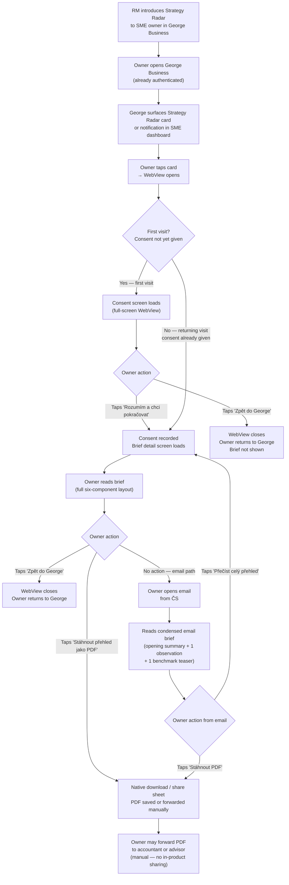

# Information Architecture — Brief Surfaces

*Owner: designer · Slug: information-architecture · Last updated: 2026-04-17*

---

## 1. Upstream links

- Product doc: [docs/product/glossary.md](../product/glossary.md)
- PRD sections driving constraints: §3 (persona), §7 (principles), §8.1 (Sector Briefing Engine), §8.2 (Peer Position Engine), §9 (MVP features, Multi-Format Delivery, Category-Based Layout), §11 (George Business GTM)
- Decisions in force: D-001, D-002, D-004, D-005, D-006, D-007, D-008, D-009
- Backlog items to respect: B-001 (no cadence promise to users), B-002 (no in-product sharing infrastructure)
- Parallel artifact dependency: [docs/product/mvp-metric-list.md](../product/mvp-metric-list.md) — four benchmark categories. Canonical names and ratio assignments now fixed per D-011 (Q-TBD-001 resolved).

---

## 2. Common brief content model

Every brief — regardless of delivery surface — is built from the same structural components. This model is the contract between the analyst authoring back-end and the three delivery surfaces.

### Brief content components (in order)

| # | Component | Description | Mandatory | Notes |
|---|---|---|---|---|
| 1 | **Záhlaví (Brief header)** | Brief title, publication month (e.g., "Duben 2026"), owner's sector name (from NACE), cohort label (e.g., "Výroba · 20–50 zaměstnanců · Praha") | Yes | Cohort label rendered only when the cohort is above the statistical-validity floor; otherwise shows "Sektorový přehled" with no cohort reference. See §4 BenchmarkSnippet component. |
| 2 | **Úvodní přehled (Opening summary)** | 2–4 sentence plain-language verdict for the sector this month. Reads like the owner's accountant speaking directly to them — no jargon, no raw numbers without a comparison. | Yes | Written by ČS analyst. |
| 3 | **Pozorování (Observations)** | 2–4 individual observations, each tagged with a time horizon. Each observation: one-sentence headline verdict, 1–2 sentences of plain-language context, one time-horizon tag. | Yes | §8.1; tags = Okamžitě (now), Do 3 měsíců (3 months), Do 12 měsíců (12 months), Více než rok (1+ year). |
| 4 | **Srovnávací přehled (Embedded benchmark snippets)** | Grouped comparative snippets across the four benchmark categories (see below). Each snippet is a single verdict: named quartile position + brief plain-language interpretation. Never a standalone number. | Yes — but each snippet degrades independently | Degrades to empty-state copy when cohort is below the statistical-validity floor (D-001, D-006). |
| 5 | **Doporučené kroky (Closing actions)** | 2–4 specific, time-horizon-tagged actions directly following from the observations. Each action has: action verb + context + time-horizon tag. | Yes | §8.1; §9 Action Specificity Framing. |
| 6 | **Zápatí (Footer/CTA)** | Surface-specific call to action (see §3 surface deltas). | Yes | Differs per surface — see below. |

### The four embedded benchmark categories

These map to the Category-Based Layout feature (PRD §9). Canonical names and ratio assignments per [D-011](../project/decision-log.md) and [docs/product/mvp-metric-list.md](../product/mvp-metric-list.md) §Category grouping.

| # | Category (Czech — user-facing) | Metrics it covers (from D-003) |
|---|---|---|
| 1 | **Ziskovost** (Profitability) | Gross margin, EBITDA margin |
| 2 | **Náklady a produktivita** (Cost structure & productivity) | Labor cost ratio, Revenue per employee |
| 3 | **Efektivita kapitálu** (Capital efficiency) | Working capital cycle, ROCE |
| 4 | **Růst a tržní pozice** (Growth & market position) | Revenue growth vs cohort median, Pricing power proxy |

Each category is a collapsible section in the web view, a printed block in PDF, and a condensed paragraph in email.

---

## 2b. Embedded variant (George Business WebView)

The brief web view embedded in George Business is the primary delivery surface per D-008 and PRD §7.7. It differs from a standalone web view as follows:

- **Container**: rendered inside a full-screen WebView panel within George Business. No new browser tab. Navigation back to George's main surface uses the George native back gesture / button — Strategy Radar does not render its own top-level navigation bar.
- **Entry point**: George Business surfaces a card or notification in the SME owner's existing George dashboard. The RM introduces the product; owner taps the card. The WebView opens within George.
- **Identity and auth**: the owner is already signed into George Business. Strategy Radar receives a session token from George's SSO mechanism (exact token format is an engineering decision — see Q-TBD-002). No separate login screen is shown to the owner.
- **Layout**: single-column, mobile-first. All touch targets minimum 44 × 44 px. No horizontal scrolling. Benchmark snippet groups are stacked vertically, each behind a tap-to-expand disclosure.
- **Navigation within the brief**: scroll-only. No tab bar. No sidebar. "Zpět do George" persistent link in the page footer (not a floating button — avoids obscuring content on small screens).
- **PDF download**: triggers the device's native share sheet / download manager. No clipboard. No new tab.
- **Consent screen**: appears as the first screen inside the WebView on first visit (before the brief body). Covers the full WebView viewport. See `docs/design/trust-and-consent-patterns.md`.
- **Breakpoints**: designed at 375 px width (iPhone SE) as the minimum; 390 px (iPhone 14) as the primary target; 768 px (iPad, George tablet variant) as the stretch. Above 768 px, content max-width 680 px, centered.

**Engineering alignment needed**: the exact WebView embedding variant (WebView component, iframe, or another mechanism) and the SSO token handoff are not yet specified in `docs/engineering/`. Logged as Q-TBD-002 — design proceeds with the above assumptions until the ADR is confirmed.

---

## 3. Screen inventory

### Surface A — Brief email

| Screen | Purpose | Entry | Exit | Empty state | Error states |
|---|---|---|---|---|---|
| Email body | Deliver a condensed brief verdict and route the owner to the web view or PDF | ČS sends email to registered address; owner opens it in their email client | Tap "Přečíst celý přehled" → opens web view (George Business WebView for bank-referred path; direct web URL for direct sign-up path). Or: tap "Stáhnout PDF" → downloads PDF. | Not applicable — email is always fully pre-rendered by ČS before send; if brief is unavailable, no email is sent | Rendering failure in email client: no JS dependency; email is plain HTML + inline CSS only so it degrades to readable text in all clients |

**Email layout spec (condensed):**
- Header: brief title + month + sector label
- Opening summary: 2–4 sentences verbatim from Component 2
- Single observation: the top-priority observation (analyst-selected) with time-horizon tag
- Cohort position teaser: one snippet from the highest-confidence benchmark category (or omitted if all categories below statistical-validity floor)
- CTA row: primary button "Přečíst celý přehled" + secondary link "Stáhnout PDF"
- Footer: unsubscribe link (legal requirement), ČS privacy notice URL
- Length budget: ≤ 400 words. No images except the ČS wordmark (decorative, alt text provided).
- No cadence promise copy (B-001 — "next brief on…" phrasing is prohibited at MVP)

### Surface B — Brief web view (George Business WebView, primary)

| Screen | Purpose | Entry | Exit | Empty state | Error states |
|---|---|---|---|---|---|
| Consent screen | Obtain single opt-in before first brief view | First launch of the WebView (session flag: consent not yet given) | Owner taps "Rozumím a chci pokračovat" → Brief detail screen. Or: owner taps "Zpět do George" → exits WebView without consenting; brief not shown. | Not applicable — consent screen is always the first screen | Network error loading consent screen: show inline error with retry button; copy: "Obsah se nepodařilo načíst. Zkuste to prosím znovu." |
| Brief detail | Display the full brief: all six content components | Post-consent on first visit; direct entry on subsequent visits | Tap "Stáhnout PDF" → native download/share sheet. Tap "Zpět do George" in footer → exits WebView. No other exit points. | Brief not yet published for owner's sector: show placeholder screen — copy: "Váš sektorový přehled je právě připravován. Dostanete e-mail, jakmile bude k dispozici." | Network error: "Přehled se nepodařilo načíst. Zkuste to prosím znovu." with retry. Auth failure (token expired/invalid): hand back to George's auth flow — no error copy shown in Strategy Radar surface; George handles re-auth. |

**Web view layout spec:**
- Brief header (Component 1) — sticky on scroll? No: sticky headers consume vertical space on mobile; scroll-away header is preferred.
- Opening summary (Component 2) — always visible above the fold on 375 px viewport.
- Observations (Component 3) — stacked cards; time-horizon tag as a small pill badge.
- Benchmark snippets (Component 4) — four category sections, each a tap-to-expand disclosure (accordion pattern). Default state: first category expanded, remaining collapsed. Shows degraded state when below statistical-validity floor.
- Closing actions (Component 5) — action list, each item with time-horizon tag. This section is always visible and not behind an accordion (it is the primary output).
- PDF download CTA (Component 6 / footer) — persistent at bottom of page; "Stáhnout přehled jako PDF".
- "Zpět do George" — text link in page footer, below PDF CTA.
- No "share" button, no "invite advisor" flow (D-009, B-002).

### Surface C — Brief PDF

| Screen | Purpose | Entry | Exit | Empty state | Error states |
|---|---|---|---|---|---|
| PDF document | Provide a self-contained, printable, forwardable brief | Tap "Stáhnout PDF" in web view or email → triggers device download/share sheet | Owner saves or shares file via device OS mechanisms; no in-product exit point | Not applicable — PDF is pre-generated by ČS before delivery; if brief unavailable, download button is hidden | PDF generation failure: button shows "PDF není momentálně k dispozici." with no retry (retry = re-tap the button later); no console-level error shown to user |

**PDF layout spec:**
- Full brief: all six components, all benchmark categories (with degraded-state copy where applicable).
- Typography: system-safe serif for body (Georgia as target), ČS brand wordmark on page 1 header.
- Page footer: "Důvěrné — jen pro interní potřebu firmy · Česká Spořitelna · Duben 2026" — explicit confidentiality notice, no sharing infrastructure required (D-009).
- Length: 2–3 A4 pages per brief (aligned with §8.1 "2–3 page" spec).
- No interactive elements. All accordion content from web view is fully expanded in PDF.
- No cadence promise copy (B-001).

---

## 4. Component specs

### 4.1 BriefHeader

**Purpose:** Identifies the brief (month, sector, cohort context) at the top of every surface.

| State | Description |
|---|---|
| Default | Title + month + sector name + cohort label (e.g., "Výroba · 20–50 zaměstnanců · Praha") |
| Cohort-degraded | Cohort label replaced by "Sektorový přehled" — no size/region reference shown; no tooltip or explanation on this component (explanation lives in the BenchmarkSnippet component's empty state) |
| Loading | Skeleton text placeholder; two lines |
| Error | Not applicable — header is server-rendered and never loaded async in isolation |

**Props needed:** `briefTitle`, `publicationMonth`, `sectorName`, `cohortLabel | null` (null triggers degraded state).

**Used in:** Brief web view (Component 1), Brief email (header block), Brief PDF (page 1 header).

---

### 4.2 ObservationCard

**Purpose:** Renders a single observation with its time-horizon tag.

| State | Description |
|---|---|
| Default | Headline (bold, 1 line), body text (1–2 sentences), time-horizon pill badge |
| Loading | Skeleton: one line bold + two lines body + pill placeholder |
| Error | Not applicable — observations are static, pre-authored content |

**Time-horizon pill values:** "Okamžitě", "Do 3 měsíců", "Do 12 měsíců", "Více než rok"

**Props needed:** `headline`, `body`, `timeHorizon` (enum).

**Used in:** Brief web view (Component 3 stack), Brief email (single selected observation), Brief PDF (full stack).

---

### 4.3 BenchmarkSnippet

**Purpose:** Renders one benchmark metric comparison as a verdict within its category group.

| State | Description |
|---|---|
| Default | Metric name, quartile position label (e.g., "druhý kvartil"), plain-language verdict sentence (1 sentence), no raw number without a comparison |
| Low-confidence / below floor | Content blurred or replaced with a plain-language placeholder (see copy in §5). Warning badge: "Nedostatečný počet firem v tomto srovnání." No percentile number shown. |
| Empty (no data for metric) | Placeholder: "Tento ukazatel není pro váš sektor v tomto měsíci k dispozici." |
| Loading | Skeleton: one metric label line + one verdict line |
| Error | Falls back to empty state copy — never shows a partial or stale number |

**Props needed:** `metricName`, `quartileLabel | null`, `verdictText | null`, `confidenceState` (enum: `valid` | `low-confidence` | `empty`).

**Used in:** Brief web view (Component 4 inside BenchmarkCategory accordion), Brief PDF (expanded), Brief email (single teaser snippet — only if `confidenceState === 'valid'`).

**Rule:** If `confidenceState !== 'valid'`, the email surface omits this snippet entirely (does not show the degraded copy). The web view and PDF surfaces show the degraded copy.

---

### 4.4 BenchmarkCategory (accordion)

**Purpose:** Groups related BenchmarkSnippets under a named category heading; collapsible on web view.

| State | Description |
|---|---|
| Expanded | Category label + all child BenchmarkSnippets visible |
| Collapsed | Category label only; tap/click to expand |
| All-snippets-degraded | Category expanded by default; shows degraded BenchmarkSnippet states; no special category-level indicator |
| Loading | Skeleton: category label line + two snippet placeholders |

**Props needed:** `categoryLabel`, `children: BenchmarkSnippet[]`, `defaultExpanded: boolean`.

**Canonical `categoryLabel` values (D-011):** "Ziskovost" · "Náklady a produktivita" · "Efektivita kapitálu" · "Růst a tržní pozice". IDs 1–4 per mvp-metric-list.md §Category grouping.

**Used in:** Brief web view (Component 4), Brief PDF (all expanded, no interactive accordion).

---

### 4.5 ActionItem

**Purpose:** Renders a single closing action with its time-horizon tag.

| State | Description |
|---|---|
| Default | Action text (action verb + context), time-horizon pill badge |
| Loading | Skeleton |
| Error | Not applicable — static authored content |

**Props needed:** `actionText`, `timeHorizon` (enum, same values as ObservationCard).

**Used in:** Brief web view (Component 5 list), Brief PDF (list), Brief email (not rendered — closing actions are omitted from email surface to keep within 400-word budget; email CTA routes to web view for full content).

---

### 4.6 PDFDownloadCTA

**Purpose:** Triggers native device download or share sheet for the brief PDF.

| State | Description |
|---|---|
| Default | "Stáhnout přehled jako PDF" — primary action button |
| Unavailable | Button text changes to "PDF není momentálně k dispozici."; button is visually disabled; no retry link |
| Loading | Button shows a loading indicator while the PDF URL is being resolved |

**Props needed:** `pdfUrl: string | null` (null triggers unavailable state), `loading: boolean`.

**Used in:** Brief web view (Component 6 / footer), Brief email (secondary text link).

**Touch target:** minimum 44 × 44 px in WebView. Button width: full-width (100%) on mobile.

---

## 5. Copy drafts

All copy is Czech only (D-004). Formal register, vykání. Legal review required before production — flagged in Q-TBD-003.

### Email

| Location | Copy |
|---|---|
| Email subject line | "Váš sektorový přehled — {{měsíc}} {{rok}}" |
| Email pre-header | "Nový přehled pro obor {{sektorNázev}} je připraven." |
| Email opening line | "Dobrý den," (no name — owner name is not available at MVP without onboarding completion; see Q-TBD-004) |
| Email opening summary intro | "Přinášíme vám měsíční přehled pro váš obor." |
| Primary CTA button | "Přečíst celý přehled" |
| Secondary CTA link | "Stáhnout PDF" |
| Footer — unsubscribe | "Odhlásit se z přehledů" |
| Footer — privacy | "Zásady ochrany osobních údajů" |

### Web view — consent screen

Defined in `docs/design/trust-and-consent-patterns.md`.

### Web view — brief detail

| Location | Copy |
|---|---|
| Brief not yet published placeholder heading | "Přehled se připravuje" |
| Brief not yet published placeholder body | "Váš sektorový přehled je právě připravován. Dostanete e-mail, jakmile bude k dispozici." |
| PDF download button | "Stáhnout přehled jako PDF" |
| PDF unavailable | "PDF není momentálně k dispozici." |
| Network error message | "Přehled se nepodařilo načíst. Zkuste to prosím znovu." |
| Retry button | "Zkusit znovu" |
| Back to George link | "Zpět do George" |
| Consent screen entry (on repeat visits, no longer shown) | Not applicable |

### Benchmark snippet — degraded states

| Location | Copy |
|---|---|
| Below statistical-validity floor — warning badge | "Nedostatečný počet firem v tomto srovnání." |
| Empty metric (no data this month) | "Tento ukazatel není pro váš sektor v tomto měsíci k dispozici." |

### PDF footer

| Location | Copy |
|---|---|
| PDF page footer | "Důvěrné — jen pro interní potřebu firmy · Česká Spořitelna · {{měsíc}} {{rok}}" |

---

## 6. Primary flow

The canonical flow is the bank-referred path: RM introduces the product to the SME owner in George Business.

---

## 7. Design-system deltas (escalate if any)

The following components are assumed to be available in the ČS / George Business design system. If any are absent, this section will be updated and the items escalated to `docs/project/open-questions.md`.

- Accordion / disclosure component (used for BenchmarkCategory)
- Pill badge / tag component (used for time-horizon tags and warning badges)
- Skeleton loader component
- Primary button component (minimum 44 × 44 px touch target)
- Text link component
- Full-screen modal / overlay (used for consent screen in WebView)
- Inline error with retry pattern

**Q-TBD-005 (escalate):** The ČS George Business design system component library has not been confirmed as accessible to Strategy Radar. If the engineering ADR (`docs/engineering/adr-0001-tech-stack.md`) establishes that Strategy Radar uses its own component library rather than importing George's, these component requirements remain valid but are not blocked on George's system. Logged in §8.

---

## 8. Open questions

| ID | Question | Blocking |
|---|---|---|
| Q-TBD-001 | ~~PM's `docs/product/mvp-metric-list.md` may define different four category labels or different metric-to-category assignments than the provisional ones in §2.~~ **Resolved — D-011 (2026-04-17).** Canonical categories and ratio assignments applied to §2 and §4.4. | Closed |
| Q-TBD-002 | The engineering ADR (`docs/engineering/adr-0001-tech-stack.md`) has not yet specified the exact WebView embedding variant (WebView component, iframe, or other) or the George SSO token handoff mechanism. Design proceeds with the assumptions in §2b. | §2b embedded variant spec; §3 Screen B auth error state |
| Q-TBD-003 | All Czech copy drafts in §5 require legal review before production (consent copy is in `docs/design/trust-and-consent-patterns.md` §8; this Q covers email and brief-surface copy). | Production readiness of all copy strings |
| Q-TBD-004 | Owner's name is not available for personalizing the email greeting at MVP without confirmed onboarding completion. If `docs/product/sector-profile-configuration.md` establishes that first name is captured, email greeting can use "Dobrý den, {{jméno}}," — otherwise it stays generic. | §5 email opening line |
| Q-TBD-005 | The ČS George Business design system component library availability for Strategy Radar is not confirmed. Engineering ADR-0001 must clarify whether Strategy Radar imports George's component library or maintains its own. | §7 design-system deltas; Phase 2 component implementation |

---

## Changelog

- 2026-04-17 — initial draft — designer
- 2026-04-17 — D-011 applied: canonical four benchmark categories (Ziskovost, Náklady a produktivita, Efektivita kapitálu, Růst a tržní pozice) with numeric IDs 1–4 replace provisional A–D naming; ratio assignments corrected (Working capital cycle → Cat 3, Revenue per employee → Cat 2); §2 category table, §4.4 BenchmarkCategory canonical label note, and §8 Q-TBD-001 updated — designer
