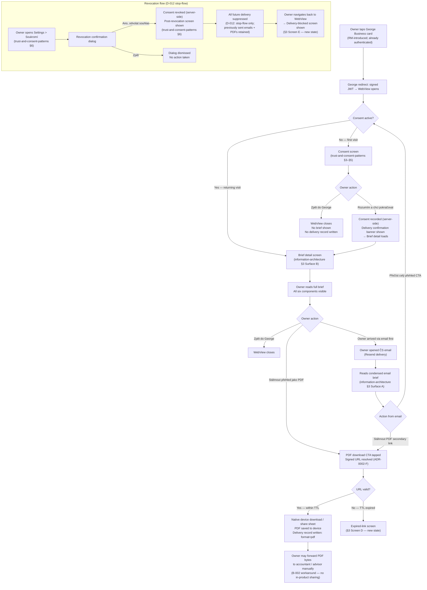

# Multi-Format Delivery — Design

*Owner: designer · Slug: multi-format-delivery · Last updated: 2026-04-20*

---

## 1. Upstream links

- Product doc: [docs/product/multi-format-delivery.md](../product/multi-format-delivery.md)
- PRD sections driving constraints: §7.1 (briefs as atomic value), §7.2 (verdicts not datasets), §7.3 (plain language), §7.4 (day-one proof of value, ≤ 60 s time-to-first-verdict), §7.5 (privacy as product), §7.7 (bank-native distribution), §9 (Multi-Format Delivery scope), §11 (George Business GTM)
- Information Architecture (authoritative for all per-surface rendering specs): [docs/design/information-architecture.md](information-architecture.md) — §§2/2b/3/4/5 are the canonical per-surface specs. This artifact does NOT repeat them.
- Trust and consent patterns (authoritative for consent and revocation UX): [docs/design/trust-and-consent-patterns.md](trust-and-consent-patterns.md) — §3/§4/§5/§6/§7 are the canonical consent screens. This artifact does NOT repeat them.
- Decisions in force: D-004 (Czech only), D-005 / B-001 (no cadence promise), D-007 (single opt-in), D-008 (consent before first brief view), D-009 / B-002 (no in-product sharing), D-010 (canonical lane identifiers), D-012 (revocation = stop-flow only), D-013 (Supabase + Vercel)
- Engineering: [docs/engineering/adr-0001-tech-stack.md](../engineering/adr-0001-tech-stack.md) (§E George redirect stub), [docs/engineering/adr-0002-brief-storage-and-delivery.md](../engineering/adr-0002-brief-storage-and-delivery.md) (§D versioning, §E synchronous pipeline, §F signed PDF URL)
- Open questions relevant at task start: OQ-008 (George Business iframe embedding), OQ-010 (@sparticuz/chromium compatibility), OQ-013 (owner first-name availability)

---

## 2. Primary flow

The canonical flow is the bank-referred path. Email and direct-web secondary paths branch from the same consent + brief-read states.

---

## 2b. Embedded variant (George Business WebView)

The WebView context is the primary delivery surface. All layout constraints are defined in [information-architecture.md §2b](information-architecture.md). The delivery-moment states described in this artifact inherit those constraints:

- Touch targets ≥ 44 px on all new interactive elements (delivery confirmation dismiss, expired-link retry, delivery-blocked "Zpět do George").
- No new browser tabs opened by any state in this artifact.
- "Zpět do George" link present in the footer of every new state screen.
- Breakpoints: 375 px minimum, 390 px primary, 768 px stretch; content max-width 680 px above 768 px.

Standalone / direct-web path: identical layout for delivery-moment states. The "Zpět do George" link is hidden on the direct-web path (no George session to return to); replace with no action (the owner uses the browser back button). This is the only structural delta between embedded and standalone for the states in this artifact.

---

## 3. Screen inventory

This section covers only delivery-moment UX states that [information-architecture.md](information-architecture.md) does not already own. Do not treat these rows as replacements for the IA screen inventory — append them mentally to IA §3.

| Screen | Purpose | Entry | Exit | Empty state | Error states |
|---|---|---|---|---|---|
| **A. Delivery confirmation banner** | Signal to the owner that a new brief is available on first WebView load after consent. Reinforces that delivery just happened (≠ stale content). | Immediately after consent is recorded and the brief detail screen loads for the first time (transition from consent screen → brief detail). | Banner auto-dismisses after 4 seconds or on owner swipe-to-dismiss; owner continues reading the brief. | Not applicable — banner only shown when a brief is actually present | If brief body fails to load after consent: banner is not shown; the brief detail network-error state (IA §3 Surface B) takes over |
| **B. Email footer — no unsubscribe link (Q-MFD-002 pending)** | Email footer copy that routes revocation to Settings > Soukromí rather than a one-click unsubscribe. Blocked pending Q-MFD-002 resolution. | Email footer, below the main brief body on every sent email | Owner taps "Spravovat nastavení přehledů" → deep-link to Settings > Soukromí in WebView (or direct-web equivalent) | Not applicable — footer is always present in the email template | If deep-link fails: owner lands on the WebView home; navigates manually to Settings |
| **C. Email footer — with unsubscribe link (Q-MFD-002 alternative)** | Standard one-click unsubscribe if legal review (Q-MFD-002) determines email-channel suppression must be separate from full consent revocation. | Email footer | Tap "Odhlásit se z přehledů" → Resend unsubscribe endpoint → one-click suppression of email channel only | Not applicable | Resend unsubscribe failure: owner receives a bounce or no visual confirmation (outside Strategy Radar surface; Resend handles) |
| **D. PDF expired-link screen** | Inform the owner that the signed PDF URL has expired (ADR-0002-F short TTL). Frame the file — not the link — as the artifact to share, per Q-MFD-005 resolution. | Owner (or a third party who received the link) opens a PDF download URL after TTL has elapsed | Tap "Zpět do George" → WebView home. No retry of the expired link — owner must return to the brief web view and tap "Stáhnout přehled jako PDF" again to get a fresh signed URL. | Not applicable — screen only appears on expired link | None — this screen is itself the error state |
| **E. Delivery-blocked screen (post-revocation)** | Prevent a revoked owner from accessing brief content via the WebView after revocation. Ties to the post-revocation screen already defined in trust-and-consent-patterns §6. | Owner with a revoked consent event attempts to load the brief web view (any subsequent visit after revocation) | Tap "Zpět do George" → WebView closes. No path to brief content from this screen. | Not applicable — screen is always fully populated | If consent-status check fails (network error): show generic error with retry; do NOT show brief content on failure — fail closed |

---

## 4. Component specs

Per the task brief: no new components. All rendering components are defined in [information-architecture.md §4](information-architecture.md). This section covers the delivery-moment states and how they interact with existing IA components.

### 4.1 DeliveryConfirmationBanner

**Not a new component.** This is the existing inline notification / toast pattern from the ČS design system, used with the props below. If the design system does not contain an inline notification / toast pattern, escalate — see §7.

**Purpose:** Acknowledge delivery of a new brief at the moment of first access; dismiss quickly to not obstruct the brief content.

| State | Description |
|---|---|
| Visible | Rendered at the top of the Brief detail screen (below the sticky BriefHeader, above the Opening summary). Single line of copy. Dismiss control (×) on the right. Auto-dismiss after 4 seconds. |
| Dismissed | Component removed from DOM; brief content fills normally |
| Reduced-motion | Auto-dismiss fires without fade animation; instant removal |

**Props needed (reusing existing notification component):** `message: string`, `autoDismissMs: number` (4000), `onDismiss: () => void`.

**Where used:** Brief detail screen (Surface B) on first load after consent. Not shown on subsequent visits.

**Touch target:** Dismiss control (×) minimum 44 × 44 px.

---

### 4.2 EmailFooter variants

**Not a new component.** These are copy variants of the existing email footer template block. The rendering is HTML + inline CSS (per IA §3 Surface A spec: no JS dependency).

**Variant B (pending Q-MFD-002 — no unsubscribe link):**
Settings-link approach: a single text link "Spravovat nastavení přehledů" that deep-links into Settings > Soukromí. This is the design-intent variant; it may or may not be legally sufficient — blocked on Q-MFD-002 resolution.

**Variant C (Q-MFD-002 alternative — one-click unsubscribe):**
Standard Resend-managed unsubscribe link rendered as a plain text link: "Odhlásit se z přehledů". This satisfies email-law requirements for channel-level suppression but creates a second revocation primitive — the legal and product implications are Q-MFD-002's scope.

**[BLOCKED — Q-MFD-002]** The email footer cannot be finalized until Q-MFD-002 (unsubscribe link vs. Settings-redirect) is resolved. Both variants are specced above. Implement neither until resolution.

---

### 4.3 PDFExpiredLinkScreen

**Not a new component.** Composed entirely from existing design-system primitives: ČS wordmark, heading (H1), body paragraph, primary button. No new pattern required.

**Purpose:** Present a human-readable explanation when a signed PDF URL has expired (ADR-0002-F). Frame the situation as "download the file, not the link" (Q-MFD-005 resolution direction).

| State | Description |
|---|---|
| Default | Heading + two-sentence body + "Zpět do George" button. Static; no loading state. |
| Standalone / direct-web | "Zpět do George" replaced by no footer action (browser back handles navigation). |

**Props needed:** none beyond static copy (see §5).

**Where used:** rendered when the PDF download URL returns a 403/410 or equivalent TTL-expired response, regardless of whether the request was made by the brief owner or a third party.

---

### 4.4 DeliveryBlockedScreen (post-revocation WebView guard)

**Not a new component.** This state reuses the post-revocation screen already fully specified in [trust-and-consent-patterns.md §6](trust-and-consent-patterns.md). No additional design work is required here — the existing screen handles both the "just revoked" case and the "returning after revocation" case.

**Design note:** The web view route that serves brief content must fail closed on consent-status check failure (network error when reading consent state). On failure, show the generic inline error with retry (IA §3 Surface B error state), not the brief body. Brief content must never render without a confirmed active consent event.

---

## 5. Copy drafts

All copy is Czech only (D-004). Formal register, vykání. Legal review required — flagged Q-TBD-003 (shared with IA and trust-and-consent-patterns). Local questions flagged Q-PD-MFD-NNN.

### Screen A — Delivery confirmation banner (first brief load after consent)

| Location | Copy |
|---|---|
| Banner message | "Váš sektorový přehled za {{měsíc}} {{rok}} je připraven." |
| Dismiss control accessible label | "Zavřít oznámení" |

*Design note: do not include "nový" ("new") — this implies cadence and may set a recurring expectation contrary to B-001. "Je připraven" states the fact without implying repetition.*

---

### Screen B / C — Email footer

**Variant B (no unsubscribe link — pending Q-MFD-002):**

| Location | Copy |
|---|---|
| Footer settings link | "Spravovat nastavení přehledů" |
| Footer privacy link | "Zásady ochrany osobních údajů" |
| Footer legal line | "Česká spořitelna, a.s. · Olbrachtova 1929/62, 140 00 Praha 4" |

**Variant C (with unsubscribe link — Q-MFD-002 alternative):**

| Location | Copy |
|---|---|
| Footer unsubscribe link | "Odhlásit se z přehledů" |
| Footer privacy link | "Zásady ochrany osobních údajů" |
| Footer legal line | "Česká spořitelna, a.s. · Olbrachtova 1929/62, 140 00 Praha 4" |

*Both variants are drafts. [BLOCKED — Q-MFD-002] Do not finalize either until legal review determines whether email-only channel suppression is required separately from consent revocation.*

---

### Screen D — PDF expired-link screen

| Location | Copy |
|---|---|
| Page heading | "Odkaz na PDF již není platný" |
| Body paragraph 1 | "Odkaz na stažení PDF přehledu je platný pouze po omezenou dobu a jeho platnost vypršela." |
| Body paragraph 2 | "Přihlaste se do aplikace Strategy Radar, otevřete přehled a stáhněte si soubor PDF přímo. Soubor pak můžete sdílet nebo archivovat, jak potřebujete." |
| Primary action | "Zpět do George" |
| Standalone-path action (no George session) | Not rendered — owner uses browser back button |

*Design note: the copy explicitly instructs the owner to download the file (not share the link). This is the Q-MFD-005 "file is the artifact" stance, framed as a helpful instruction rather than a technical restriction.*

---

### Email opening copy (delivery surface)

The email opening-summary copy is authored by ČS analysts per [information-architecture.md §5](information-architecture.md). The delivery feature owns only the structural wrapper copy:

| Location | Copy |
|---|---|
| Email subject line | "Váš sektorový přehled — {{měsíc}} {{rok}}" |
| Email pre-header | "Nový přehled pro obor {{sektorNázev}} je připraven." |
| Email opening line | "Dobrý den," (no name — pending OQ-013; owner first name not confirmed available at MVP) |
| Email intro line | "Přinášíme vám měsíční přehled pro váš obor." |
| Primary CTA button | "Přečíst celý přehled" |
| Secondary CTA link | "Stáhnout PDF" |

*These strings are already defined in IA §5 and are reproduced here only to confirm the delivery feature does not need to add or change them.*

---

### PDF download CTA (WebView footer — authoritative in IA)

| Location | Copy |
|---|---|
| PDF download button | "Stáhnout přehled jako PDF" |
| PDF unavailable state | "PDF není momentálně k dispozici." |

*Authoritative in IA §5; confirmed unchanged for multi-format delivery.*

---

## 6. Accessibility checklist

- [ ] Delivery confirmation banner (Screen A) has `role="status"` or `aria-live="polite"` so screen readers announce it without interrupting the owner reading the brief
- [ ] Banner dismiss control (×) has `aria-label="Zavřít oznámení"` — icon-only control, label required
- [ ] Banner auto-dismiss (4 s) is suppressed when the user has `prefers-reduced-motion` set; replace with persistent display until manually dismissed (motion-reduction applies to any timed transition)
- [ ] PDF expired-link screen (Screen D): keyboard focus on page load lands on the heading or the "Zpět do George" button, not on a non-interactive element
- [ ] "Zpět do George" button on Screen D is a `<button>` or `<a>` with visible focus state; minimum touch target 44 × 44 px
- [ ] Email footer links ("Spravovat nastavení přehledů" / "Odhlásit se z přehledů" / "Zásady ochrany osobních údajů") are rendered as `<a href>` anchors in plain HTML; no JavaScript required for activation
- [ ] PDF download CTA keyboard access: the "Stáhnout přehled jako PDF" button (IA §4.6 PDFDownloadCTA) is reachable by Tab from any point in the brief detail page; it must appear in the natural DOM order at the bottom of the page (not a floating overlay that breaks tab order)
- [ ] PDFDownloadCTA unavailable state ("PDF není momentálně k dispozici.") is rendered as `disabled` with `aria-disabled="true"` and an associated description; the disabled reason is announced by screen reader, not conveyed only by visual style
- [ ] Delivery-blocked screen (Screen E): reuses post-revocation screen from trust-and-consent-patterns §6 — accessibility already specified there; no additional items
- [ ] Color is not the sole signal for the delivery confirmation banner visibility (border or icon used alongside background color)
- [ ] Text contrast ≥ 4.5:1 (WCAG AA body) on banner message text and expired-link screen body; ≥ 3:1 on heading-level text
- [ ] All interactive elements across new delivery states are reachable by keyboard (Tab / Shift+Tab); no keyboard traps introduced

---

## 7. Design-system deltas (escalate if any)

No new design-system components are required. All delivery-moment states are composed from:

- Inline notification / toast pattern (delivery confirmation banner, Screen A) — assumed present in ČS design system per the existing escalation in [information-architecture.md §7](information-architecture.md) (OQ-006). If the inline notification / toast is confirmed absent, add it to OQ-006's scope; do not create a new component independently.
- Heading, body paragraph, primary button primitives (PDF expired-link screen, Screen D) — already referenced in IA and trust-and-consent-patterns.
- Email HTML template structure — no design-system component; rendered as plain HTML + inline CSS per IA §3 Surface A.
- Post-revocation screen (Screen E) — fully specified in trust-and-consent-patterns §6; no delta.

**If the inline notification / toast pattern (Screen A) is absent from the ČS design system:** mark Screen A as `[BLOCKED — Q-TBD-005 / OQ-006]`. The intent is a transient, auto-dismissing status message anchored above the brief opening summary. Props: `message: string`, `autoDismissMs: number`, `onDismiss: () => void`. States: visible / dismissed / reduced-motion (persistent). The feature is implementable without Screen A — the brief renders normally; first-visit acknowledgement is simply absent.

---

## 8. Open questions

All Q-PD-MFD-NNN IDs are local to this artifact. Orchestrator assigns final OQ-NNN IDs when merging into `docs/project/open-questions.md`.

| Local ID | Question | Blocking |
|---|---|---|
| Q-PD-MFD-001 | **Q-MFD-002 inheritance — unsubscribe link vs. Settings redirect in email footer.** The product doc flags Q-MFD-002 (legal review: is email-only channel suppression required separately from full consent revocation?). This design artifact provides both variants (Screen B and Screen C above) but cannot finalize the email footer until Q-MFD-002 is resolved. The email footer is `[BLOCKED — Q-MFD-002]`. | Email footer copy and template (§5 Screen B/C); production readiness of the email surface |
| Q-PD-MFD-002 | **Q-MFD-005 inheritance — expired PDF link: full landing page or minimal 403?** The product doc flags Q-MFD-005 for designer review. This artifact implements the "file is the artifact, not the link" stance as a full landing page (Screen D, §3 and §5). If engineering determines that a signed-URL 403 response should instead return a static HTML page served by the PDF storage layer (not the Next.js app), the copy strings in §5 Screen D apply unchanged but the route ownership shifts to the engineer. Confirm with engineer whether Screen D is a Next.js route or a storage-layer response page. | Screen D route ownership; does not block copy or layout |
| Q-PD-MFD-003 | **Delivery confirmation banner — first-visit detection signal.** Screen A (DeliveryConfirmationBanner) should appear only on the owner's first successful brief load after consent. The design assumes the server sets a flag or the client checks a session/local storage value to determine "first visit post-consent." If the engineering delivery-record write (US-5, ADR-0002-E) does not include a first-visit flag, the banner has no reliable trigger. Engineer must confirm the first-visit detection mechanism before Screen A can be implemented. | Screen A (§3); does not block any other screen |
| Q-PD-MFD-004 | **Delivery-blocked screen (Screen E) — fail-closed behaviour on consent-status network error.** This artifact specifies that a network error on the consent-status check must fail closed (show generic error with retry, never show brief content). The engineer must confirm this is implementable as a synchronous server-side check before the route renders, not a client-side fetch that could briefly flash brief content before the check returns. | Screen E (§3, §4.4); trust constraint — brief content must never render without confirmed active consent |

---

## Changelog

- 2026-04-20 — initial draft — designer
