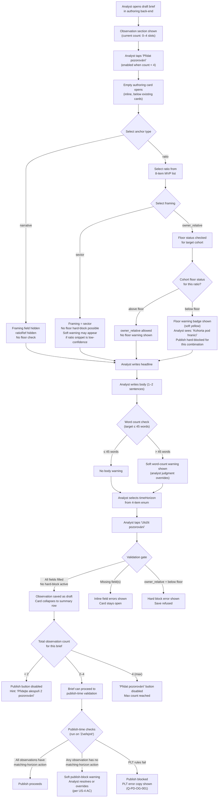

# Observation Generation — Design

*Owner: designer · Slug: observation-generation · Last updated: 2026-04-20*

---

## 1. Upstream links

- Product doc: [docs/product/observation-generation.md](../product/observation-generation.md)
- PRD sections driving constraints:
  - §8.1 — 2–4 observations per brief; "what this means for you" framing
  - §7.2 — Verdicts, not datasets: every headline is a conclusion
  - §7.3 — Plain language, no statistical notation
  - §7.4 — Proof of value on day one: first observation is the proof-of-insight slot
  - §7.5 — Privacy as product: observations stay in the brief lane only
  - §7.6 — Opportunity-flavored framing: no risk-surveillance language
- Decisions in force: D-003 (8 MVP ratios), D-004 (Czech only), D-006 (NACE grain), D-010 (lane identifiers), D-011 (four benchmark categories)
- Assumption in force: A-017 (below-floor suppression is silent to the owner; the analyst sees the warning, the owner sees nothing)
- IA reference: [docs/design/information-architecture.md §4.2](information-architecture.md#42-observationcard) — ObservationCard already specified. This artifact adds: the authoring card component, the complete authoring flow, the framing × anchor state matrix, and below-floor handling copy.

---

## 2. Primary flow — analyst authoring side

---

## 2b. Embedded variant (George Business WebView)

Not applicable — the authoring card is an analyst back-end surface, not an owner-facing WebView surface. Analysts access the authoring back-end via a standard desktop browser (not via George Business embedding). Owner-facing ObservationCard rendering is already specified in [information-architecture.md §4.2](information-architecture.md#42-observationcard); that component is rendered inside the George Business WebView per IA §2b.

---

## 3. Screen inventory

### 3a. Analyst authoring surface

| Screen | Purpose | Entry | Exit | Empty state | Error states |
|---|---|---|---|---|---|
| Observation authoring card — empty | Analyst creates a new observation from scratch | Taps "Přidat pozorování" in the draft brief | Taps "Uložit pozorování" (on success) or taps "Zrušit" (discard) | The card itself is the empty state — all fields blank, no content yet | Missing required field: inline red error per field. owner_relative + below-floor: hard-block banner (red). |
| Observation authoring card — filled (draft) | Shows a saved draft observation in collapsed summary form; analyst can expand to edit | Observation saved successfully | Taps card row to re-expand for editing; or brief moves to publish step | Not applicable — a filled card always has content | Soft warning badge if body exceeds 45 words; soft yellow floor warning if ratio snippet is low-confidence but framing = sector |
| Observation authoring card — validation error | Signals a missing or invalid field when analyst attempts to save | Taps "Uložit pozorování" with one or more empty required fields | Analyst corrects field and re-saves | Not applicable | One inline red error message per failing field (see §5 copy). Hard-block error banner for owner_relative + below-floor. |
| Brief observation section — count outside 2–4 (draft-safe) | Allows the analyst to save a draft brief with 0 or 1 observation; publish is gated | Draft brief with fewer than 2 observations | Analyst adds more observations | The section shows zero observation slots; a hint copy appears below the empty slot area | Not applicable — count outside 2–4 is a valid draft state, not an error |
| Brief observation section — publish-blocked | Publish gate fails because observation count < 2 or > 4, or observation-to-action pairing fails | Analyst taps "Zveřejnit" | Analyst resolves the blocking issue; re-taps "Zveřejnit" | Not applicable | Publish button disabled with inline hint when count < 2. Hard-block error banner at publish time if pairing check fails. Soft-block resolvable warning if PLT rules fail (see Q-PD-OG-001). |

### 3b. Owner surface — ObservationCard states (reference + floor-suppression addition)

The full ObservationCard spec lives in [information-architecture.md §4.2](information-architecture.md#42-observationcard). This section summarizes the existing states and adds the below-floor suppressed state that results from the `owner_relative + below-floor` authoring rule.

| State | Description | Source |
|---|---|---|
| Default | Headline (bold), body text (1–2 sentences), time-horizon pill badge | IA §4.2 |
| Loading | Skeleton: bold line + two body lines + pill placeholder | IA §4.2 |
| Error | Not applicable — static pre-authored content | IA §4.2 |
| **Below-floor suppressed (owner_relative + below-floor)** | The entire ObservationCard for this observation is **not rendered** in the owner's brief. The owner sees no gap, no placeholder, and no explanation. The remaining 1–3 observations fill the slot silently. This state is an authoring-time prevention (hard-block at save), not a runtime suppression — it cannot occur in a published brief. | A-017; product doc US-5; see note below |

**Note on below-floor suppression:** The hard-block at authoring time (see §2 flow node X) ensures that an `owner_relative + below-floor` observation never reaches a published brief. Therefore the ObservationCard itself never needs to render a suppressed state at runtime on the owner surface. The suppression is upstream. This is consistent with A-017: suppression is silent to the user, directed at the authoring gate. No new ObservationCard state is needed in the IA.

---

## 4. Component specs

### 4.1 ObservationAuthoringCard

**Purpose:** The analyst-facing input card that collects and validates all fields for a single observation before it is committed to the draft brief. Consumed by the monthly-briefing-generation analyst UI.

**States:**

| State | Description |
|---|---|
| Empty | All fields blank. Anchor type selector shown (radio: "Ukazatel" / "Narativní"). No other fields shown until anchor is selected. |
| Anchor = ratio, framing not yet selected | Ratio dropdown (8 items, canonical names from mvp-metric-list.md) shown. Framing radio (sector / owner_relative) shown. Floor status indicator hidden until framing selected. |
| Anchor = ratio, framing = sector | All fields visible: ratio dropdown, framing = sector (selected), headline input, body textarea, timeHorizon selector, body word-count indicator. No floor warning (sector-level observation is always safe). Soft low-confidence snippet warning may appear if the ratio's current snippet confidenceState is low-confidence or empty — advisory only, not a block. |
| Anchor = ratio, framing = owner_relative, above floor | All fields visible. No floor warning. Owner-relative framing allowed. |
| Anchor = ratio, framing = owner_relative, below floor | All fields visible. Floor warning badge (yellow) displayed inline below the framing selector. Save button disabled. Hard-block error banner at top of card: "Toto pozorování nelze uložit — viz vysvětlení níže." |
| Anchor = narrative | Ratio dropdown hidden. Framing field hidden. Headline, body, timeHorizon fields shown. No floor check. |
| Filled / saved (collapsed) | Card collapses to a single summary row: observation number, headline excerpt (≤ 60 chars), time-horizon pill, anchor type label, edit icon (pencil), delete icon (trash). Touch target on row ≥ 44 × 44 px. |
| Edit mode (re-expanded from collapsed) | Same as the relevant filled-anchor state above. All prior values pre-populated. |
| Validation error | Fields that failed validation show red border + inline error message below the field. Card stays open. Save button remains enabled so analyst can correct and retry. |
| Soft body-length warning | Body textarea border changes to amber. Warning copy appears below the textarea. Save is not blocked. |
| Loading / saving | Save button shows loading spinner. All fields disabled. |
| Disabled (max 4 reached) | "Přidat pozorování" button outside the card is disabled; card is not opened. |

**Props (authoring card):**

| Prop | Type | Notes |
|---|---|---|
| `observationId` | `string \| null` | null = new observation |
| `anchor` | `'ratio' \| 'narrative' \| null` | null = not yet selected |
| `ratioRef` | `RatioName \| null` | One of 8 canonical ratio names; null when anchor = narrative |
| `framing` | `'sector' \| 'owner_relative' \| null` | null when anchor = narrative or not yet selected |
| `floorStatus` | `'above' \| 'below' \| null` | null when anchor = narrative or ratioRef not yet selected; supplied by back-end per cohort |
| `snippetConfidenceState` | `'valid' \| 'low-confidence' \| 'empty' \| null` | For the soft advisory warning when anchor = ratio; null when not applicable |
| `headline` | `string` | Max 200 chars; must be a single sentence ending in a conclusion |
| `body` | `string` | Target ≤ 45 words; soft warning beyond; no hard limit |
| `timeHorizon` | `'Okamžitě' \| 'Do 3 měsíců' \| 'Do 12 měsíců' \| 'Více než rok' \| null` | enum; null = not yet selected |
| `onSave` | `(observation: ObservationDraft) => void` | Callback on successful validation + save |
| `onDiscard` | `() => void` | Callback on "Zrušit" |
| `briefObservationCount` | `number` | Current count for this brief (0–4); used to disable "Přidat" button |

**Where used:** Monthly Briefing Generation analyst UI, inside the observation section of the draft brief authoring screen.

**Design-system dependency:** Requires a dropdown/select component, a radio-group component, a textarea, an inline error pattern, a warning badge/banner pattern, and a pill badge. All assumed present in the shared component library (see OQ-006 in open-questions.md). If any are absent, see §7.

---

### 4.2 ObservationSectionHeader (authoring)

**Purpose:** The section-level affordance above the stack of ObservationAuthoringCards; shows current count, enables adding a new observation, and displays count-gate status.

**States:**

| State | Description |
|---|---|
| Default (0–3 cards, publishing not attempted) | Section heading "Pozorování" + count badge (e.g., "2 ze 4"). "Přidat pozorování" button enabled. |
| Max reached (4 cards) | "Přidat pozorování" button disabled. Tooltip/hint: "Maximální počet pozorování byl dosažen." |
| Below minimum (0–1 cards, publish attempted) | Inline hint below section heading: "Přidejte alespoň 2 pozorování před zveřejněním." Publish button in the brief header is disabled. |
| Publish-blocked (count valid but pairing check fails) | Publish-time error banner appears above this section at publish attempt (see §5 copy). Count badge unchanged. |

**Props:** `currentCount: number`, `maxCount: 4`, `minCount: 2`, `publishAttempted: boolean`, `onAddClick: () => void`.

---

### 4.3 FloorStatusIndicator

**Purpose:** Inline authoring-surface affordance that exposes the floor status for a selected ratio + target cohort combination. Visible only when anchor = ratio and framing = owner_relative.

**States:**

| State | Description |
|---|---|
| Above floor | Small green badge: "Kohorta nad hranicí" ({{cohortLabel}}). No action required. |
| Below floor | Amber warning badge: "Kohorta pod hranicí" ({{cohortLabel}}). Hard-block message appears below: save is refused for this framing + cohort combination. |
| Loading | Skeleton badge while floor status is being fetched. |
| Unknown / not applicable | Hidden — only rendered when anchor = ratio and framing = owner_relative. |

**Props:** `floorStatus: 'above' \| 'below' \| 'loading' \| null`, `cohortLabel: string`.

**Note:** If the priority-cohort list is not yet frozen (OG-Q-01 / Q-PD-OG-002), this component cannot display a cohort-specific label and shows a generic fallback: "Kohorta: data se načítají." Mark `[BLOCKED — Q-PD-OG-002]` in engineering implementation until OG-Q-01 resolves.

---

## 5. Copy drafts

All copy is Czech only (D-004). Formal register, vykání. Legal review required before production (see OQ-005 in open-questions.md).

### Authoring card — field labels

| Location | Label copy |
|---|---|
| Anchor type selector label | "Typ pozorování" |
| Anchor = ratio option | "Ukazatel (navázáno na finanční ukazatel)" |
| Anchor = narrative option | "Narativní (sektorový trend bez ukazatele)" |
| Ratio dropdown label | "Finanční ukazatel" |
| Framing radio label | "Rámování pozorování" |
| Framing = sector option | "Sektorová úroveň — platí pro celý obor" |
| Framing = owner_relative option | "Pozice firmy — porovnání s kohortou" |
| Headline field label | "Hlavní závěr (nadpis)" |
| Headline field hint | "Jedna věta vyjadřující závěr. Neklaďte otázky. Nevkládejte holá čísla bez srovnání." |
| Body field label | "Popis (1–2 věty)" |
| Body field hint | "Doporučený rozsah: do 45 slov. Analytický komentář může délku překročit." |
| Body word-count indicator | "{{wordCount}} slov" |
| Time-horizon selector label | "Časový horizont" |
| Time-horizon options | "Okamžitě" / "Do 3 měsíců" / "Do 12 měsíců" / "Více než rok" |
| Save button | "Uložit pozorování" |
| Discard button | "Zrušit" |
| Edit icon aria-label | "Upravit pozorování {{number}}" |
| Delete icon aria-label | "Smazat pozorování {{number}}" |

### Authoring card — soft warnings (non-blocking)

| Trigger | Copy |
|---|---|
| Body exceeds 45 words | "Doporučený rozsah byl překročen ({{wordCount}} slov). Přehled doporučuje do 45 slov. Pozorování lze uložit i tak." |
| anchor = ratio, snippet confidenceState = low-confidence | "Upozornění: Graf tohoto ukazatele je označen jako nízká spolehlivost. Pozorování bude majiteli zobrazeno, ale srovnávací přehled tohoto ukazatele bude potlačen nebo degradován." |
| anchor = ratio, snippet confidenceState = empty | "Upozornění: Pro tento ukazatel nejsou v aktuálním přehledu dostupná data. Pozorování bude majiteli zobrazeno, srovnávací snipet nebude." |

### Authoring card — hard-block errors

| Trigger | Copy |
|---|---|
| anchor = ratio, framing = owner_relative, floorStatus = below | "Toto pozorování nelze uložit. Rámování 'Pozice firmy' vyžaduje, aby kohorta ({{cohortLabel}}) splňovala minimální počet firem pro statistickou platnost. Tato kohorta momentálně podmínku nesplňuje. Změňte rámování na 'Sektorová úroveň', nebo toto pozorování zrušte." |

### Authoring card — field-level validation errors

| Field | Trigger | Copy |
|---|---|---|
| Anchor type | Not selected at save | "Zvolte typ pozorování." |
| Ratio | anchor = ratio, no ratio selected | "Vyberte finanční ukazatel." |
| Framing | anchor = ratio, framing not selected | "Zvolte rámování pozorování." |
| Headline | Empty at save | "Nadpis je povinný." |
| Headline | Exceeds 200 chars | "Nadpis je příliš dlouhý (max. 200 znaků)." |
| Body | Empty at save | "Popis je povinný." |
| Time horizon | Not selected at save | "Vyberte časový horizont." |

### ObservationSectionHeader — count-gate copy

| Trigger | Copy |
|---|---|
| Count < 2, publish attempted | "Přidejte alespoň 2 pozorování před zveřejněním. Aktuálně máte {{count}}." |
| Count > 4 (defensive; should not appear — UI blocks at 4) | "Maximální počet pozorování (4) byl překročen. Odstraňte jedno pozorování." |
| Count in [2,4], publish button tooltip | "Přehled splňuje podmínky pro zveřejnění ({{count}} pozorování)." |
| Max count reached, "Přidat" button tooltip | "Maximální počet pozorování byl dosažen." |

### Publish-time warnings and blocks

| Trigger | Copy |
|---|---|
| Observation-to-action pairing check fails (US-4) — soft block | "Pozorování č. {{n}} (Časový horizont: {{timeHorizon}}) nemá odpovídající doporučený krok. Přidejte krok se stejným časovým horizontem, nebo upravte pozorování. Přehled lze zveřejnit až po vyřešení." |
| PLT rule check fails at publish — block (Q-PD-OG-001) | "[BLOCKED — Q-PD-OG-001] Copy placeholder: závisí na výstupu funkce Překlad do srozumitelného jazyka." |

### FloorStatusIndicator copy

| State | Copy |
|---|---|
| Above floor | "Kohorta nad hranicí — srovnání platné ({{cohortLabel}})" |
| Below floor | "Kohorta pod hranicí — {{cohortLabel}} má nedostatečný počet firem pro srovnání na úrovni pozice firmy." |
| Loading | "Načítám stav kohorty…" |

---

## 6. Accessibility checklist — authoring card

The authoring surface is a desktop analyst tool, not a mobile WebView. WCAG AA is the target. Touch-target rule (44 px) applies to the collapsed summary row action icons (edit, delete) which may be used on a tablet.

- [ ] All interactive elements (anchor selector, ratio dropdown, framing radio, headline input, body textarea, time-horizon selector, save button, discard button) reachable by keyboard in logical tab order
- [ ] Focus state visible with sufficient contrast (≥ 3:1 against background) on all interactive elements
- [ ] Color is never the only signal: floor status indicator uses both color (amber / green) and text label; validation errors use both red border and text message
- [ ] Text contrast ≥ WCAG AA: body text (4.5:1), field labels (4.5:1), warning badge text on amber background must meet 4.5:1 — verify against design-system token (Q-PD-OG-003)
- [ ] Screen-reader labels on icon-only controls: edit icon aria-label = "Upravit pozorování {{number}}"; delete icon aria-label = "Smazat pozorování {{number}}"
- [ ] Form fields have associated `<label>` elements (not placeholder-only); error messages are associated via `aria-describedby`
- [ ] Hard-block error banner has `role="alert"` so screen readers announce it without focus move
- [ ] Soft warning messages have `role="status"` (polite, not assertive) so they do not interrupt in-progress input
- [ ] Radio groups (anchor type, framing) use `<fieldset>` + `<legend>`
- [ ] Dropdown / select for ratio and time-horizon is a native `<select>` or ARIA-compliant custom listbox with keyboard navigation
- [ ] Loading / saving state: save button announces "Ukládám…" to screen readers via `aria-live` or button text change
- [ ] Motion: any card expand/collapse animation respects `prefers-reduced-motion` (reduce to instant show/hide)
- [ ] Collapsed summary row: entire row is keyboard-focusable; Enter/Space opens edit mode
- [ ] Delete action: requires confirmation (confirmation dialog or destructive inline pattern) — no silent delete; confirmation dialog focus is trapped while open

---

## 7. Design-system deltas (escalate if any)

The ObservationAuthoringCard, ObservationSectionHeader, and FloorStatusIndicator are **analyst back-end components**, not George Business WebView components. They are not subject to the George Business design-system dependency (OQ-006).

However, these components still depend on a shared component library for the analyst authoring back-end UI. The following primitives are required:

| Primitive | Purpose | Status |
|---|---|---|
| Dropdown / select | Ratio selector, time-horizon selector | Assumed available in back-end UI toolkit — not confirmed |
| Radio group with fieldset | Anchor type, framing | Assumed available — not confirmed |
| Textarea with word-count indicator | Body field | Word-count indicator sub-component may not exist as a standard primitive |
| Inline error message pattern | Field-level validation | Assumed available — not confirmed |
| Warning badge (amber) | Floor status, low-confidence snippet advisory | May differ from the pill badge in the owner surface |
| Hard-block error banner (red, role=alert) | owner_relative + below-floor block | Assumed available — not confirmed |
| Confirmation dialog | Delete observation | Assumed available — not confirmed |

**Escalation:** The analyst authoring back-end UI toolkit has not been specified in any engineering artifact. Until `docs/engineering/observation-generation.md` (or a Monthly Briefing Generation engineering doc) names the back-end UI component library, these requirements are **unverified**. Logged as Q-PD-OG-003.

Any component from the above list that is not available in the confirmed toolkit must be escalated before implementation. Do not invent a component.

---

## 8. Open questions

| Local ID | Question | Blocks |
|---|---|---|
| Q-PD-OG-001 | The Plain-Language Translation feature PRD (`docs/product/plain-language-translation.md`) is not yet drafted (Track A sibling). This design assumes PLT rules run at publish time and surface an analyst-facing error when triggered, but the exact error copy and the specific rules it enforces are unknown. The publish-blocked PLT copy in §5 is marked `[BLOCKED — Q-PD-OG-001]`. Resolves when PLT PRD lands. | §5 PLT publish-block copy; §2 flow node AD |
| Q-PD-OG-002 | The priority-cohort list (product doc OG-Q-01) is not yet frozen. The FloorStatusIndicator component in §4.3 requires a `cohortLabel` per ratio per cohort. Until the list is confirmed by PM + analyst + data-engineer, the component cannot display a specific cohort name and falls back to generic loading copy. Resolves when OG-Q-01 is closed. | §4.3 FloorStatusIndicator props; §3a FloorStatusIndicator loading state; §5 floor-status copy with {{cohortLabel}} placeholder |
| Q-PD-OG-003 | The analyst authoring back-end UI toolkit has not been specified in any engineering artifact. The word-count indicator sub-component, the amber warning badge, and the hard-block error banner (role=alert) may not exist as standard primitives in that toolkit. Design-system delta status (§7) cannot be confirmed until `docs/engineering/monthly-briefing-generation.md` or `docs/engineering/observation-generation.md` names the toolkit. Blocks §6 contrast verification for amber warning badge token. | §7 design-system deltas; §6 accessibility checklist (amber badge contrast item) |
| Q-PD-OG-004 | Observation ordering semantics (product doc OG-Q-03): is order analyst-authored (drag-to-reorder) or inferred by a rule? The authoring card spec in §4.1 labels observations by number ("Pozorování č. {{n}}") and the collapsed summary row uses "observation number." If drag-to-reorder is confirmed, the collapsed summary row must include a drag handle (new interactive element, keyboard-accessible, needs design-system delta check). If order is inferred, the number display is read-only. Resolves when OG-Q-03 is decided. | §4.1 ObservationAuthoringCard collapsed state; §6 accessibility checklist (drag handle) |
| Q-PD-OG-005 | Observation-to-action pairing check (US-4 AC): "strict equality" vs "nearer-than" (product doc OG-Q-02). The publish-time warning copy in §5 uses the strict-equality framing. If the decision shifts to nearer-than, the copy must be revised. Resolves when OG-Q-02 is decided by designer + analyst. | §5 publish-time pairing block copy |

---

## Changelog

- 2026-04-20 — initial draft — designer
