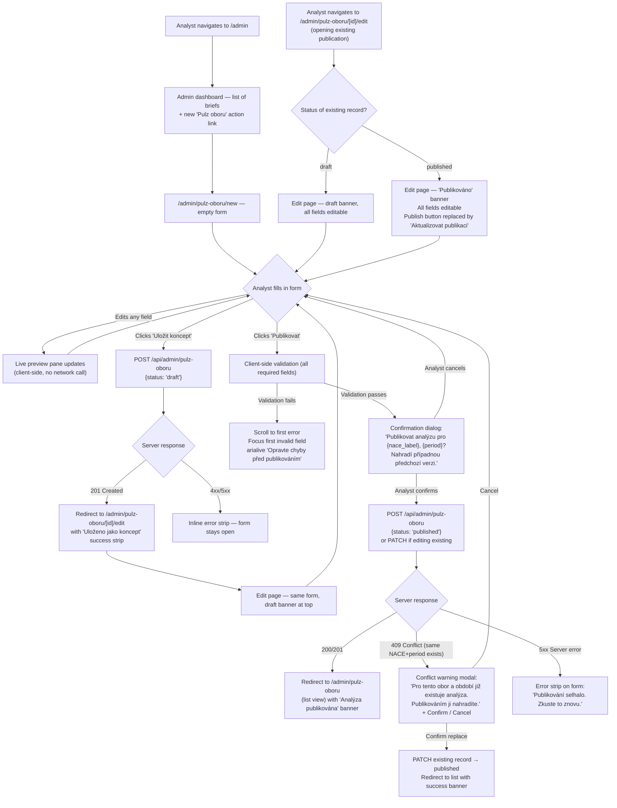

# Pulz oboru — Admin Upload Flow Design

*Owner: designer · Slug: pulz-oboru-admin · Last updated: 2026-04-28*

---

## 1. Upstream links

- Product doc: [docs/product/pulz-oboru.md](../product/pulz-oboru.md) — canonical content data contract at §4.3; resolved decisions §10.
- Owner-facing spec: [docs/design/pulz-oboru.md](pulz-oboru.md) — the surface this form feeds; data contract implied there is confirmed by the PM doc.
- PRD sections driving constraints: §7.3 (plain language), §7.5 (privacy as product / brief lane only), §7.6 (opportunity-flavored framing), §7.7 (bank-native trust transfer).
- Privacy architecture: [docs/data/privacy-architecture.md](../data/privacy-architecture.md) §2 — this form writes to the `brief` lane only (`brief_db`). No `user_contributed`, `rm_visible`, or `credit_risk` lane is read or written. Confirmed: analyst-authored content is architect-separated from all per-owner data.
- Token set: [docs/design/dashboard-v0-2/layout.md §5](dashboard-v0-2/layout.md) — reused verbatim.
- Decisions in force: D-010 (canonical lane identifiers), D-019 ("Analýzy" vocabulary), D-026/D-027 (Track C PoC; NACE 31 + 49 first).
- Build plan phase: v0.3 Track C (analysis pipeline), branch `trial-v0-3-analyzy`.
- OQs this spec addresses: OQ-077 (admin upload flow), OQ-078 (alt-text contract).

---

## 1b. Page purpose and relationship to existing admin pages

This page enables ČS sector analysts to author and publish a **Pulz oboru** analysis object: three chart tiles (each with an image, mandatory alt text, one-sentence verdict, and optional source caption), a 3–6 sentence summary, an optional full-publication PDF, and 1–3 time-horizon-tagged actions, all assigned to a NACE division and publication period. Submitting the form creates a record in `brief_db` that the owner-facing Pulz oboru section at `/` reads.

**Relationship to `admin/publications/new` (the existing publication-upload page).** The existing page is a pipeline trigger: the analyst drops a PDF/DOCX and the system generates an AI draft brief, which the analyst then edits. The Pulz oboru upload form is structurally different: the analyst authors all fields manually (the Track C n8n pipeline may pre-populate a draft, but the analyst reviews and edits before publishing — see §8 OQ on draft pre-population). The two pages serve different authoring modes and should be **sibling pages** under `/admin/`:

```
/admin/publications/new       — existing: AI-assisted brief draft from a document
/admin/pulz-oboru/new         — new: manual Pulz oboru authoring + publish
/admin/pulz-oboru/[id]/edit   — new: edit an existing Pulz oboru publication
```

**Reusable parts from the existing admin surface.** The NACE picker (a `<select>` populated from `NACE_SECTORS`) and the file upload widget (drag-to-upload area with size + format validation) are direct reuses. The admin header band (`#1a1a1a` background, Czech copy, "← Zpět" link), form card container (white, `border: 1px solid #e0e0e0`, `border-radius: 8px`, `padding: 24px`), submit button style, error alert style, and status strip are all reused verbatim from the existing admin component pattern.

**Why not extend `admin/publications/new`.** The Pulz oboru authoring surface has a structurally different form shape: three chart-tile builder blocks, a summary textarea, action authoring, and a draft-preview pane. Merging these into the existing pipeline-trigger form would make that page carry two unrelated modes (AI-assisted draft vs. manual Pulz oboru authoring) with a complex conditional layout. A sibling page is cleaner, avoids conditional rendering complexity, and keeps the existing upload flow unchanged.

---

## 2. Design decision record — form shape

### Single-page form vs. multi-step wizard

**Decision: single-page form, all fields visible.**

Rationale: The analyst is a technical internal user (ČS sector analyst) who arrives with all the material already prepared — the publication is in hand, three charts have been selected, verdicts drafted. A wizard forces them to commit sections before seeing the whole before they can review the assembled output holistically. A single-page layout:

- Allows parallel review as they fill in the form (the analyst can scan the whole structure before submitting).
- Permits free-order filling (an analyst may write actions first while chart copy is still being refined).
- Reduces round-trips through "next / back" states that add friction without adding value for a technical user.
- Is consistent with the existing `admin/publications/new` page, which is also a single-page form.

The one structural concession to length is a **sticky preview pane** (desktop layout: two-column split; mobile: accordion below the form) that shows a live preview of the rendered Pulz oboru section as the analyst fills in the fields. This gives the visual-review benefit of a wizard step without requiring navigation.

**Density is acceptable** because: (a) the analyst is a power user authoring infrequently (roughly monthly per NACE); (b) the form has a clear top-to-bottom reading order that mirrors the rendered section (NACE/period → tiles → summary → PDF → actions); (c) the three chart-tile blocks are visually grouped with a clear tile-builder container per tile, so the page does not read as an undifferentiated field dump.

### Route location

**Decision: `/admin/pulz-oboru/new` (sibling to `admin/publications/new`) — see §1b.**

---

## 2b. Primary flow



---

## 2c. Embedded variant (George Business WebView)

Not applicable — the admin upload form is an internal analyst tool served on the bank network. It is not embedded in George Business and is not accessed by owners. No WebView constraints apply.

---

## 3. Screen inventory

| Screen | Purpose | Entry | Exit | Empty state | Error states |
|---|---|---|---|---|---|
| `/admin/pulz-oboru/new` — Empty form | Analyst authors a new Pulz oboru analysis from scratch | Link from admin dashboard; direct navigation | Save as draft → edit page; Publish → list with success banner; Cancel → admin dashboard | Form fields all blank; preview pane shows placeholder layout with grey skeleton tiles | Network failure on submit → inline error strip; validation errors → inline field errors with scroll-to-first |
| `/admin/pulz-oboru/[id]/edit` — Draft in progress | Analyst resumes editing a saved draft | Redirect after save-as-draft; direct link from admin list | Publish → list with success banner; delete draft → confirm modal → list | Not applicable — existing record; fields pre-filled | Same as above; 404 if record not found → redirect to list with "Analýza nenalezena" banner |
| `/admin/pulz-oboru/[id]/edit` — Edit existing published | Analyst updates a previously published analysis | Admin list → "Upravit" link | "Aktualizovat publikaci" → same NACE+period replace flow → list with success banner | Not applicable | Same as draft; if the new submission fails, the previously published version remains live |
| Confirmation dialog — Publish | Forces analyst to confirm NACE+period before publish; warns of replace if prior record exists | Clicking "Publikovat" or "Aktualizovat publikaci" after client validation passes | Confirm → publish; Cancel → back to form | Not applicable | Not applicable — dialog itself cannot error; network error after confirm shows on form |
| Conflict warning modal | Shown when a 409 is returned: a published record for the same NACE+period already exists | Server 409 response | Confirm replace → PATCH; Cancel → back to form | Not applicable | Not applicable |
| `/admin/pulz-oboru` — List view | Dashboard of all Pulz oboru publications (all NACEs, all periods) | Admin dashboard link; redirect after publish | Edit → edit page; New → new form | "Zatím žádné publikace Pulz oboru." + link to /admin/pulz-oboru/new | Network error loading list → inline error strip with retry |
| Footer AI disclaimer | Mandatory policy disclosure | Bottom of every admin screen | Not applicable | Not applicable | Not applicable |

---

## 4. Component specs

### 4.1 Admin page shell (reused from existing admin pattern)

**Purpose.** Consistent header band + content container for all Pulz oboru admin pages.

**Visual spec.** Identical to existing admin pages:
- Header: `background: #1a1a1a`, `color: #fff`, `padding: 16px 24px`, flex row with page title and "← Zpět" back link.
- Content container: `maxWidth: 900px` (wider than the existing 640 px single-form pages because the Pulz oboru page uses a two-column layout on desktop — form left, preview right). `margin: 0 auto`, `padding: 40px 24px`.
- Page background: `#f5f5f5`.
- Font: `system-ui, sans-serif` (matching existing admin pages — Inter is the GDS font for the owner-facing surface; admin pages use system-ui per the existing pattern; no change here).

**States.** Default only (admin is not animated).

---

### 4.2 Form layout — two-column split (desktop) / single column (mobile)

**Purpose.** On desktop (≥ 900 px), the left column holds the form and the right column holds the live preview. On mobile (< 900 px), the preview collapses to an accordion below the form.

**Visual spec.**

```
Desktop (≥ 900 px):
┌─────────────────────────────────┬───────────────────────┐
│  Form column (560 px max-width) │  Preview pane (340 px)│
│                                 │  position: sticky     │
│                                 │  top: 24 px           │
└─────────────────────────────────┴───────────────────────┘

Mobile (< 900 px):
┌──────────────────────────────────────────────────────┐
│  Form (full width)                                   │
├──────────────────────────────────────────────────────┤
│  [Zobrazit náhled ▾]  ← accordion trigger            │
│  (Preview — collapsed by default)                    │
└──────────────────────────────────────────────────────┘
```

- Gap between columns: `24px`.
- Preview pane is `position: sticky; top: 24px` so it stays in view as the analyst scrolls the form.
- On mobile, the accordion header is a `<button>` styled as a section row; touch target ≥ 44 px.

---

### 4.3 NacePeriodBlock — publication identity fields

**Purpose.** The first form group. Establishes the unique key `(nace_division, publication_period)` that identifies this Pulz oboru analysis and determines whether a replace-conflict can occur.

**Fields.**

| Field | Input type | Label | Hint | Required |
|---|---|---|---|---|
| `nace_division` | `<select>` populated from `NACE_SECTORS` | "Obor (NACE divize)" | "Vyberte 2místnou divizi CZ-NACE, které se analýza týká." | required |
| `publication_period` | `<input type="text">` | "Období analýzy" | "Např. '2. čtvrtletí 2026'. Tento text se zobrazí majitelům firem — pište česky." | required |

**States.**

| State | Appearance |
|---|---|
| Default | Both fields empty; select shows "— Vyberte obor —" placeholder |
| Filled | Selected NACE shows code + name; period shows analyst input |
| Validation error (NACE) | Red border `1px solid #c00`; error message below; `aria-describedby` linked |
| Validation error (period) | Same pattern |
| Disabled (form in-flight) | Both fields `disabled`; `opacity: 0.6` |

**Visual spec.** Same `<select>` and `<input>` style as `admin/publications/new` — `padding: 8px 10px`, `border: 1px solid #d0d0d0`, `border-radius: 4px`, `width: 100%`, `fontSize: 14px`.

**Props (preview pane consumption).** When filled: `{ nace_label: string, publication_period: string }` — preview pane renders the publication-date subline.

---

### 4.4 ChartTileBuilder — ×3

**Purpose.** Three repeated form groups, each authoring one ChartTile. Each group is visually contained in a card with a tile number badge. The three builders are displayed sequentially (not tabbed — the analyst needs to see all three to assess visual coherence).

**Layout per tile builder.**

```
┌──────────────────────────────────────────────────────┐
│  Tile 1   [grey tile-number badge]                   │
├──────────────────────────────────────────────────────┤
│  Výrok (one-sentence verdict) *                       │
│  [textarea, max 1 sentence, 200 chars soft cap]       │
│  Hint: "Jeden výrok. Např.: 'E-commerce roste o 18 %  │
│  ročně, zatímco kamenné prodejny stagnují.'"          │
│                                                       │
│  Graf (PNG nebo SVG, max 2 MB) *                      │
│  [file upload zone]                                   │
│  [thumbnail preview when uploaded]                    │
│                                                       │
│  Popis grafu pro čtečky obrazovky *                   │
│  [textarea, min 30 chars, max 300 chars]              │
│  Hint: "Popište, co graf ukazuje — ne 'Graf tržeb',   │
│  ale 'Sloupcový graf tržeb odvětví v mld. Kč,         │
│  2019–2024, s vrcholem v roce 2022.'"                 │
│  [character counter: XX / 300]                        │
│                                                       │
│  Zdroj (zobrazí se pod grafem)                        │
│  [input text, optional unless ČS data]                │
│  Hint: "Povinné, pokud graf vychází z dat ČS.         │
│  Např. 'Zdroj: data České spořitelny; vlastní         │
│  zpracování'"                                         │
└──────────────────────────────────────────────────────┘
```

**States per tile builder.**

| State | Appearance |
|---|---|
| Empty | All fields blank; upload zone shows dashed border + upload icon (text character, ↑) + instruction copy |
| Image uploading | Upload zone shows progress indicator (spinner character, no animation library); "Nahrávám…" text |
| Image uploaded | Upload zone replaced by thumbnail + filename + "Změnit" link |
| Image error (size) | Upload zone error state: red border, error text below |
| Image error (format) | Same |
| Image error (network) | Red border on upload zone; "Nahrávání selhalo. Zkuste to znovu." |
| Alt-text empty on publish attempt | Red border on alt-text textarea; error message |
| Alt-text too short (< 30 chars) | Yellow-border warning (not error — shown on blur, not on keystroke): "Popis je příliš krátký — čtečky obrazovky přečtou jen tuto větu místo obsahu grafu." |
| Alt-text looks generic (contains "graf" alone as the entire value, no other content) | Inline warning below field: "Popis musí říkat, co graf zobrazuje — ne jen 'graf'." Client-side check on blur. |
| Verdict too long (> 1 sentence detected heuristically — more than one `.` or `?` or `!`) | Yellow-border warning: "Výrok by měl být jedna věta — majitelé firem ho čtou ve dvou sekundách." |
| Source caption empty when verdict / alt text contains "ČS" or "spořitelna" (heuristic) | Yellow-border warning on source field: "Pokud graf vychází z dat České spořitelny, uveďte zdroj." |
| Disabled (form in-flight) | All fields disabled, opacity 0.6 |

**Props (preview pane).** `{ verdict, imageUrl, altText, caption }` per tile — preview renders ChartTile from `docs/design/pulz-oboru.md §4.2`.

**Accessibility note for alt-text field.** The label "Popis grafu pro čtečky obrazovky" is explicit about purpose. The hint copy names an example. The character counter is `aria-live="polite"` so screen-reader users hear updates without interruption. The field has `minlength="30"` enforced server-side (see §5).

---

### 4.5 SummaryTextareaBlock

**Purpose.** Authors the `summary_text` field — the 3–6 sentence plain-Czech synthesis block that appears below the chart tiles on the owner-facing section.

**Fields.**

| Field | Input type | Label | Hint | Required |
|---|---|---|---|---|
| `summary_text` | `<textarea>`, `rows="6"` | "Shrnutí" | "3–6 vět. Formální čeština, vykání. Žádné statistické zkratky. Vyjadřujte závěry, ne čísla. Příklad: 'Tržby odvětví se stabilizovaly na 49 mld. Kč, ale ziskovost zůstává pod úrovní roku 2021.'" | required |

**States.**

| State | Appearance |
|---|---|
| Default | Empty textarea |
| Filled | Analyst copy; sentence counter below: "X vět" (counted by `.` + `?` + `!` heuristic) |
| Too short (< 3 sentences on blur) | Yellow warning: "Shrnutí by mělo mít alespoň 3 věty." |
| Too long (> 6 sentences on blur) | Yellow warning: "Shrnutí by mělo mít nejvýše 6 vět — delší text majitelé přeskočí." |
| Validation error on publish (empty) | Red border; error message |
| Disabled | `disabled`; `opacity: 0.6` |

**Plain-language guardrail hint.** The textarea hint includes "Vyjadřujte závěry, ne čísla" — baking the "verdicts not datasets" principle (PRD §7.2) directly into the authoring hint copy. This is the closest the form can get to enforcing the principle without a semantic parser.

---

### 4.6 PdfUploadBlock

**Purpose.** Optional PDF attachment — the `pdf_url` and `pdf_source_label` fields.

**Fields.**

| Field | Input type | Label | Hint | Required |
|---|---|---|---|---|
| PDF file | File upload zone (PDF only, max 20 MB) | "Celá analýza (PDF, nepovinné)" | "Nahrajte úplnou publikaci. Pokud PDF nepřiložíte, odkaz ke stažení se majitelům nezobrazí." | optional |
| `pdf_source_label` | `<input type="text">` | "Označení zdroje PDF" | "Zobrazí se pod odkazem ke stažení. Výchozí: 'Ekonomické a strategické analýzy České spořitelny'." placeholder: "Ekonomické a strategické analýzy České spořitelny" | required when PDF is attached; hidden when not |

**States.**

| State | Appearance |
|---|---|
| Default (no PDF) | Upload zone dashed border; source label field hidden |
| PDF selected | Upload zone: thumbnail-area (grey, shows filename + size) + "Odstranit" link; source label field appears below |
| PDF uploading | Spinner + "Nahrávám PDF…" |
| PDF uploaded | Filename + size + "Změnit" link; source label field visible and pre-filled with default |
| PDF format error (not PDF) | Red border on zone; "Podporujeme jen formát PDF." |
| PDF too large (> 20 MB) | Red border; "Soubor přesahuje 20 MB." |
| Network error | Red border; "Nahrávání selhalo. Zkuste to znovu." |
| Source label empty when PDF present (on publish) | Red border on source label; error message |

---

### 4.7 ActionAuthoringBlock

**Purpose.** Authors 1–3 `Action` records — the action box that appears below the PDF link on the owner-facing section. Reuses the `Action` shape from `docs/product/pulz-oboru.md §4.3` (same as brief-detail-page orphan actions).

**Layout.**

```
┌──────────────────────────────────────────────────────┐
│  Doporučené kroky (1–3)                              │
│                                                       │
│  Krok 1:  [Časový horizont: <select>] *              │
│           [Text akce <textarea>]        *            │
│                                                       │
│  [+ Přidat krok]   (disabled when 3 actions exist)  │
└──────────────────────────────────────────────────────┘
```

**Per-action fields.**

| Field | Input type | Label | Hint | Required |
|---|---|---|---|---|
| `time_horizon` | `<select>` | "Časový horizont" | Options: Okamžitě / Do 3 měsíců / Do 12 měsíců / Více než rok (frozen per D-015) | required |
| `action_text` | `<textarea>`, `rows="3"` | "Text akce" | "Pište jako příležitost, ne jako varování. Příklad: 'Zkontrolujte, zda vaše firma nabízí přímý prodej online.' — ne 'Pokud nezačnete prodávat online, ztratíte zákazníky.'" | required |
| Remove button | `<button type="button">` | "× Odebrat" | — | — |

**States.**

| State | Appearance |
|---|---|
| One action (minimum, default) | One action block; "Odebrat" button hidden (cannot have 0 actions after adding one — see below) |
| Two or three actions | Each block has a visible "× Odebrat" link |
| Three actions | "+ Přidat krok" button disabled; hint: "Maximálně 3 kroky." |
| Zero actions (before any are added) | Block shows only the "+ Přidat krok" button; note: zero actions is permitted in the data contract (action box omitted at render); however, a warning appears: "Bez kroků se sekce 'Doporučené kroky' nezobrazí." |
| Validation error — action_text empty on publish | Red border on textarea; error message |
| Validation error — time_horizon not selected | Red border on select; error message |
| Disabled (form in-flight) | All fields and buttons disabled |

**Opportunity-framing guardrail.** The textarea hint directly quotes the principle: "Pište jako příležitost, ne jako varování." This embeds PRD §7.6 at the point of authoring.

---

### 4.8 LivePreviewPane

**Purpose.** Shows the analyst a client-side rendering of how the Pulz oboru section will appear to owners, updating as they fill in the form. No network call required — the preview consumes form state directly.

**Layout.**

```
┌──────────────────────────────────────────────────────┐
│  Náhled — jak uvidí majitelé firem                   │
│  ─────────────────────────────────────────────────── │
│  [Rendered Pulz oboru section — read-only replica]   │
│  (Uses the same component spec as pulz-oboru.md §4)  │
│  Tiles with placeholder grey boxes when images       │
│  are not yet uploaded                                │
└──────────────────────────────────────────────────────┘
```

- Container: white card, `border: 1px solid #e0e0e0`, `border-radius: 8px`, `padding: 16px`. Label "Náhled — jak uvidí majitelé firem" in `#888`, 13 px, above the border.
- The preview renders all four blocks in the order they appear to owners: publication-date subline → tile row → summary → PDF link (if PDF attached) → action box (if actions authored).
- Chart images: when no image is uploaded, a grey placeholder `div` (height 120 px, `background: #f0f0f0`, `border-radius: 4px`) shows with centered text "Graf bude zde" in `#aaa`. When uploaded, renders the actual image.
- Verdict text: renders from the verdict textarea in real time.
- The preview is `aria-hidden="true"` in its entirety (it is a visual aid for the analyst, not a content surface for screen readers; the form fields themselves are the authoritative input).
- On mobile, the preview is in an accordion. The accordion toggle button announces "Náhled — rozbalit" and "Náhled — sbalit" to screen readers.

**States.**

| State | Appearance |
|---|---|
| Empty form | Grey skeleton layout — 3 placeholder tile boxes, 3 skeleton text lines |
| Partially filled | Verdicts and text update live; image placeholders remain until upload completes |
| Fully filled | Complete rendered Pulz oboru section |

**No "save" or "publish" actions in the preview.** The preview is read-only. The analyst uses the form's own action buttons.

---

### 4.9 DraftStatusBanner

**Purpose.** Shown at the top of the edit page when the analyst is working on a saved draft.

**Visual spec.**

```
┌──────────────────────────────────────────────────────────────┐
│  Koncept — neuložené změny budou ztraceny při zavření stránky│
└──────────────────────────────────────────────────────────────┘
```

- Background: `#e8f4ff`, border: `1px solid #b3d4f5`, `border-radius: 6px`, `padding: 10px 14px`.
- Text: 13 px, `#1a73e8`.
- For a **published** record being edited: `background: #e6f4ea`, border: `#b7dfbe`, text `#1e7e34`, copy: "Publikováno — změny se projeví po kliknutí na 'Aktualizovat publikaci'."
- `role="status"` so screen readers announce it once on page load.

---

### 4.10 PublishActionRow

**Purpose.** The sticky footer row of the form containing the primary and secondary actions.

**Layout.**

```
[Uložit koncept]   [Publikovat]   Zrušit
```

- "Publikovat" / "Aktualizovat publikaci": primary button — `background: #1a1a1a`, `color: #fff`, `padding: 12px 24px`, `border-radius: 4px`. Disabled when any required field is empty (client-side gate; full validation runs on click).
- "Uložit koncept": secondary button — `background: transparent`, `border: 1px solid #d0d0d0`, `color: #1a1a1a`, same padding.
- "Zrušit": text link, `color: #666`, `text-decoration: underline`.
- Touch targets: all ≥ 44 px height.
- On mobile: stacked vertically; "Publikovat" first (primary action at top).

**States.**

| State | Appearance |
|---|---|
| Default | Both buttons enabled (client-side: publish disabled until at least NACE + period + 3 tiles minimally filled) |
| Form in-flight | Both buttons disabled; spinner on active button |
| Error | Both buttons re-enabled; error strip above row |

---

## 5. Form validation rules

| Field | Client-side check | When triggered | Server-side check | Error message (Czech) |
|---|---|---|---|---|
| `nace_division` | Non-empty | On submit | Must be valid CZ-NACE 2-digit code in the NACE_SECTORS list | "Vyberte prosím obor NACE." |
| `publication_period` | Non-empty | On submit + on blur | Non-empty string, max 100 chars | "Zadejte prosím období analýzy (např. '2. čtvrtletí 2026')." |
| `chart_tiles` count | Exactly 3 tiles must have at least verdict + image + alt text filled | On submit | Array length = 3; each element has `verdict`, `image_url`, `alt_text` | "Vyplňte prosím všechny tři grafy — každý potřebuje výrok, obrázek a popis pro čtečky obrazovky." |
| `chart_tiles[i].verdict` | Non-empty; soft warning if > 1 sentence (heuristic: > 1 terminal punctuation mark) | Non-empty on submit; sentence count on blur | Non-empty; max 500 chars | "Výrok nesmí být prázdný." |
| `chart_tiles[i].image_url` | File selected + upload completed (no pending upload) | On submit | URL non-empty; image accessible (HEAD check) | "Nahrajte prosím graf." |
| `chart_tiles[i].alt_text` | Non-empty; min 30 chars; must not equal "graf" (case-insensitive, trimmed) or any string consisting only of the word "graf" with no other meaningful content (regex: `/^\s*graf\.?\s*$/i`) | Min-length warning on blur; empty error on submit | Non-empty; min 30 chars server-side; must not match `/^\s*graf\.?\s*$/i` | (empty) "Popis grafu pro čtečky obrazovky je povinný." / (too short) "Popis je příliš krátký — napište alespoň 30 znaků." / (generic) "Popis musí říkat, co graf zobrazuje — ne jen 'graf'." |
| `chart_tiles[i].caption` | If the verdict or alt_text contains "česká spořitelna" or "cs data" or "kartová data" (case-insensitive), yellow warning if caption empty | On blur of verdict / alt_text | If `uses_cs_internal_data` flag is set server-side (engineer to confirm flag availability — see §8 OQ), caption required | "Pokud graf vychází z dat České spořitelny, uveďte zdroj (např. 'Zdroj: data České spořitelny; vlastní zpracování')." |
| `summary_text` | Non-empty; soft warning < 3 sentences / > 6 sentences (on blur) | Non-empty on submit; sentence count on blur | Non-empty; max 2000 chars | "Shrnutí je povinné." |
| `pdf_url` | If PDF selected, upload must be completed before submit | On submit | If present: URL non-empty, MIME type is application/pdf | (upload pending) "Počkejte prosím, dokud se PDF nenahraje." / (format) "Podporujeme jen formát PDF." / (size) "Soubor přesahuje 20 MB." |
| `pdf_source_label` | Required when PDF file is attached | On submit (conditional) | Required when `pdf_url` is non-empty | "Zadejte prosím označení zdroje PDF." |
| `actions[i].time_horizon` | Non-empty (if action row exists) | On submit | Enum value from frozen list | "Vyberte prosím časový horizont." |
| `actions[i].action_text` | Non-empty (if action row exists) | On submit | Non-empty; max 600 chars | "Text akce nesmí být prázdný." |
| `(nace_division, publication_period)` uniqueness | Client-side: if editing existing record, warn if period label matches a known published period for the same NACE (non-blocking warning) | On period field blur (if NACE already selected) | On publish: check for existing `status='published'` record with same `(nace_division, publication_period)`; if found, return 409 | 409 triggers conflict modal (§2 flow); copy: "Pro tento obor a období již existuje publikovaná analýza. Publikováním ji nahradíte." |

**Client-side vs. server-side philosophy.** Client-side checks run on blur (warnings) and on publish-click (blocking errors). Server-side checks run on every write operation (draft save and publish). The alt-text "no generic placeholder" rule runs on both sides: client catches the obvious `"graf"` case; server enforces the 30-char floor independently. This layered approach handles copy-paste flows and direct API access.

---

## 6. Copy drafts (Czech, formal register)

All strings in formal Czech. Admin copy matches the existing admin surface: Czech throughout (D-004), formal register (not vykání toward the analyst — analyst is internal staff; formal register is "vyberte", "zadejte", "nahrajte" imperative forms, not "vyberte prosím, pane" vykání). The analyst interface matches the existing admin pages which use formal Czech imperatives, not the owner-facing vykání.

### 6.1 Page headings and navigation

| Location | String | Notes |
|---|---|---|
| Browser `<title>` (new) | `Nová analýza Pulz oboru — Strategy Radar Admin` | — |
| Browser `<title>` (edit) | `Upravit analýzu Pulz oboru — Strategy Radar Admin` | — |
| Header band title (new) | `Strategy Radar — Nová analýza Pulz oboru` | Matches header pattern of existing admin pages |
| Header band title (edit) | `Strategy Radar — Upravit analýzu Pulz oboru` | — |
| Back link | `← Zpět na přehledy` | Matches existing admin pages |
| Page H1 (new) | `Nová analýza Pulz oboru` | — |
| Page H1 (edit) | `Upravit analýzu Pulz oboru` | — |
| Page subtitle (new) | `Vyplňte tři grafy, shrnutí a doporučené kroky. Analýza se po publikování zobrazí majitelům firem ve správném oboru.` | Sets expectations without jargon |
| Admin dashboard link label | `Nová analýza Pulz oboru` | Button on admin dashboard, next to existing "Nový přehled" |
| Admin list heading | `Analýzy Pulz oboru` | H1 on `/admin/pulz-oboru` list page |

### 6.2 NacePeriodBlock labels and hints

| Location | String |
|---|---|
| NACE select label | `Obor (NACE divize)` |
| NACE select hint | `Vyberte 2místnou divizi CZ-NACE, které se analýza týká.` |
| NACE select placeholder option | `— Vyberte obor —` |
| Period input label | `Období analýzy` |
| Period input hint | `Např. '2. čtvrtletí 2026'. Tento text se zobrazí majitelům firem — pište česky.` |
| Period input placeholder | `2. čtvrtletí 2026` |

### 6.3 ChartTileBuilder labels and hints

| Location | String | Note |
|---|---|---|
| Tile group heading | `Graf {n}` (`Graf 1`, `Graf 2`, `Graf 3`) | — |
| Verdict label | `Výrok` | — |
| Verdict hint | `Jeden výrok, ne číslo bez kontextu. Příklad: 'E-commerce roste o 18 % ročně, zatímco kamenné prodejny stagnují.'` | PRD §7.2 baked in |
| Verdict character count | `{n} / 200 znaků` | Soft cap signpost |
| Image upload label | `Graf (PNG nebo SVG, max 2 MB)` | — |
| Image upload zone instruction | `Přetáhněte soubor nebo klikněte pro výběr` | — |
| Image uploading | `Nahrávám…` | — |
| Image uploaded state | `{filename} ({size} MB) — Změnit` | — |
| Image error — wrong format | `Podporujeme PNG a SVG. Jiné formáty nejsou povoleny.` | — |
| Image error — too large | `Soubor přesahuje 2 MB. Použijte menší nebo optimalizovaný obrázek.` | — |
| Image error — network | `Nahrávání selhalo. Zkontrolujte připojení a zkuste to znovu.` | — |
| Alt text label | `Popis grafu pro čtečky obrazovky` | Explicit about purpose |
| Alt text hint | `Popište, co graf ukazuje — ne 'Graf tržeb', ale 'Sloupcový graf tržeb odvětví výroby nábytku v mld. Kč, 2019–2024, s vrcholem v roce 2022.' Minimálně 30 znaků.` | OQ-078 enforcement |
| Alt text character counter | `{n} / 300` | `aria-live="polite"` |
| Alt text warning — too short | `Popis je příliš krátký — napište alespoň 30 znaků.` | Yellow warning on blur |
| Alt text warning — generic | `Popis musí říkat, co graf zobrazuje — ne jen 'graf'.` | Yellow warning on blur |
| Source caption label | `Zdroj (zobrazí se pod grafem)` | — |
| Source caption hint | `Nepovinné — povinné, pokud graf vychází z dat České spořitelny. Příklad: 'Zdroj: data České spořitelny; vlastní zpracování'.` | Q-PO-004 enforcement |
| Source caption ČS-data warning | `Pokud graf vychází z dat České spořitelny, uveďte zdroj.` | Yellow warning |

### 6.4 SummaryTextareaBlock labels and hints

| Location | String |
|---|---|
| Summary label | `Shrnutí` |
| Summary hint | `3–6 vět. Formální čeština. Vyjadřujte závěry, ne čísla bez kontextu. Příklad: 'Tržby odvětví se stabilizovaly na 49 mld. Kč, ale ziskovost zůstává pod úrovní roku 2021.'` |
| Sentence counter | `Přibližně {n} vět` |
| Warning — too short | `Shrnutí by mělo mít alespoň 3 věty.` |
| Warning — too long | `Shrnutí by mělo mít nejvýše 6 vět — delší text majitelé přeskočí.` |

### 6.5 PdfUploadBlock labels and hints

| Location | String |
|---|---|
| PDF upload label | `Celá analýza (PDF, nepovinné)` |
| PDF upload hint | `Nahrajte úplnou publikaci. Pokud PDF nepřiložíte, odkaz ke stažení se majitelům nezobrazí — sekce Pulz oboru se přesto zobrazí.` |
| PDF upload zone instruction | `Přetáhněte PDF nebo klikněte pro výběr (max 20 MB)` |
| PDF uploaded state | `{filename} ({size} MB) — Odstranit` |
| PDF source label | `Označení zdroje PDF` |
| PDF source hint | `Zobrazí se pod odkazem ke stažení. Výchozí text: 'Ekonomické a strategické analýzy České spořitelny'.` |
| PDF source placeholder | `Ekonomické a strategické analýzy České spořitelny` |

### 6.6 ActionAuthoringBlock labels and hints

| Location | String |
|---|---|
| Block heading | `Doporučené kroky (1–3)` |
| Time horizon label | `Časový horizont` |
| Time horizon options | `Okamžitě`, `Do 3 měsíců`, `Do 12 měsíců`, `Více než rok` |
| Action text label | `Text akce` |
| Action text hint | `Pište jako příležitost, ne jako varování. Příklad: 'Zkontrolujte, zda vaše firma nabízí přímý prodej online.' — ne 'Pokud nezačnete prodávat online, ztratíte zákazníky.'` |
| Remove action button | `× Odebrat krok` |
| Add action button | `+ Přidat krok` |
| Add action disabled hint | `Maximálně 3 kroky.` |
| Zero actions warning | `Bez kroků se sekce 'Doporučené kroky' majitelům nezobrazí.` |

### 6.7 Action buttons and status

| Location | String |
|---|---|
| Save draft button | `Uložit koncept` |
| Publish button (new) | `Publikovat` |
| Update button (existing published) | `Aktualizovat publikaci` |
| Cancel link | `Zrušit` |
| Draft status banner | `Koncept — neuložené změny budou ztraceny při zavření stránky.` |
| Published status banner | `Publikováno — změny se projeví po kliknutí na 'Aktualizovat publikaci'.` |
| Publish confirmation dialog heading | `Publikovat analýzu?` |
| Publish confirmation dialog body | `Analýza pro obor {nace_label} ({period}) bude zveřejněna a zobrazí se majitelům firem v tomto oboru.` |
| Publish confirmation — replace warning (when prior record exists) | `Pro tento obor a období již existuje publikovaná analýza. Publikováním ji nahradíte.` |
| Confirm publish button | `Publikovat` |
| Cancel publish button | `Zrušit` |
| Success banner after publish | `Analýza Pulz oboru publikována pro obor {nace_label}, {period}.` |
| Error strip — publish failed | `Publikování selhalo. Zkontrolujte připojení a zkuste to znovu.` |
| Error strip — validation failed | `Opravte chyby ve formuláři před publikováním.` |
| Conflict modal heading | `Analýza pro toto období již existuje` |
| Conflict modal body | `Pro obor {nace_label} a období {period} již existuje publikovaná analýza. Pokud budete pokračovat, stávající verze bude nahrazena novou.` |
| Conflict confirm button | `Nahradit a publikovat` |
| Conflict cancel button | `Zrušit` |

### 6.8 Preview pane

| Location | String |
|---|---|
| Preview pane label | `Náhled — jak uvidí majitelé firem` |
| Image placeholder | `Graf bude zde` |
| Mobile accordion trigger (closed) | `Zobrazit náhled ▾` |
| Mobile accordion trigger (open) | `Skrýt náhled ▴` |

### 6.9 AI disclaimer (mandatory every screen)

| Location | String | Style |
|---|---|---|
| Bottom of every admin Pulz oboru screen | `Tento prototyp byl vygenerován pomocí AI.` | Centered, `#9E9E9E`, 13 px, 24 px vertical padding |

---

## 7. Accessibility checklist

- [ ] **Focus order** follows the visual top-to-bottom left-to-right reading order of the form: NACE picker → period input → [Tile 1: verdict → image upload → alt text → source] → [Tile 2: same] → [Tile 3: same] → summary → PDF upload → PDF source label → [Action 1: horizon → text] → [Action 2 if present] → [Action 3 if present] → Save draft → Publish → Cancel. Preview pane is `aria-hidden="true"` and removed from tab order entirely.
- [ ] **Error announcement**: when the publish button is clicked and validation fails, focus moves to the first invalid field; `aria-live="assertive"` region at the top of the form announces "Opravte chyby ve formuláři před publikováním." Screen readers do not miss the error summary.
- [ ] **Inline error association**: every field with a validation error has `aria-describedby` pointing to its error message element. Error elements have `role="alert"` when dynamically injected.
- [ ] **Form fields have associated `<label>` elements**: every input, textarea, and select has an explicit `<label htmlFor="...">` — not implicit wrapping labels, which have inconsistent screen-reader support.
- [ ] **Alt-text field purpose is explicit in the label**: "Popis grafu pro čtečky obrazovky" names the purpose. A screen-reader user filling this field understands immediately why they are providing this text.
- [ ] **Alt-text character counter is live**: `aria-live="polite"` on the counter element. Counter updates are non-disruptive — "polite" fires after the user pauses, not on every keystroke.
- [ ] **Alt-text min-length guidance**: the hint copy names the 30-character floor and provides a concrete example. A screen-reader user does not need to see the visual warning to understand the requirement — it is in the permanent hint.
- [ ] **Warning vs error distinction**: yellow-border warnings (too-short alt text, sentence count) do not prevent submission and are labelled with `role="status"` (not `role="alert"`). Red-border errors (empty required fields) use `role="alert"`. Screen readers distinguish the urgency level.
- [ ] **File upload zones are keyboard-operable**: the `<input type="file">` is focusable and activatable via Enter/Space. The visible drop zone `<div>` is `role="button"` with `tabindex="0"` and a keyboard handler (`Enter`/`Space` → triggers the file input click). `aria-label="Graf hochladen — Datei auswählen"` — [CORRECTION: Czech] `aria-label="Nahrát graf — vyberte soubor"`.
- [ ] **Thumbnail preview state is announced**: when an image is successfully uploaded, an `aria-live="polite"` region announces "{filename} nahrán." Screen-reader users who cannot see the thumbnail know the upload succeeded.
- [ ] **Confirmation dialog is a modal**: the publish confirmation uses `role="dialog"`, `aria-modal="true"`, `aria-labelledby` pointing to the dialog heading, and focus is trapped inside the dialog while open. Escape key dismisses. Focus returns to the publish button on dismiss.
- [ ] **Conflict modal**: same pattern as confirmation dialog.
- [ ] **Color is not the only signal**: yellow warnings have text content (the warning message) independent of the border color. Red errors have text content + `role="alert"`. The draft/published status banner uses text ("Koncept" / "Publikováno") in addition to background color.
- [ ] **Text contrast ≥ WCAG AA**: form labels (`#1a1a1a`) on white = 17.8:1. Hint text (`#888`) at 13 px — same root issue as OQ-080 in the owner-facing spec. Fallback: hints use `#666` (5.74:1) if audit fails. Engineer to measure during implementation (self-monitoring; carries forward as the same known issue).
- [ ] **Touch targets ≥ 44 px**: all buttons, the remove/add action links, the file upload zones, the mobile accordion trigger, the cancel link. The cancel link is a `<button type="button">` styled as a link, not an `<a>`, so it has a programmatic role.
- [ ] **`prefers-reduced-motion`**: the file-upload spinner uses a CSS `animation` — `@media (prefers-reduced-motion: reduce)` disables it. No other motion on this form.
- [ ] **Fieldset / legend for repeating groups**: each ChartTileBuilder block is wrapped in a `<fieldset>` with `<legend>Graf {n}</legend>`. Each action block is similarly wrapped: `<fieldset><legend>Krok {n}</legend></fieldset>`. This groups related fields semantically for screen readers.
- [ ] **Select placeholder is not selectable as a value**: the NACE select's "— Vyberte obor —" option has `value=""` and `disabled selected hidden` attributes so it cannot be reselected after a value is chosen, and cannot be submitted as a value.
- [ ] **Sticky preview accordion on mobile**: the accordion trigger has `aria-expanded="true/false"` and `aria-controls="{preview-panel-id}"`.

---

## 8. Design-system deltas (escalate if any)

The following items reuse existing patterns from the admin surface and the GDS token set:

- Form card container, header band, button styles, select/input styles, error alert style, status strip — all reused verbatim from `admin/publications/new`.
- NACE `<select>` populated from `NACE_SECTORS` — same component/data as existing admin pages.
- Token set — `docs/design/dashboard-v0-2/layout.md §5` — all tokens reused.
- File upload input — `<input type="file">` — native HTML, same as `admin/publications/new`.
- Confirmation dialog / conflict modal — native `<dialog>` element or a role="dialog" div. Native `<dialog>` is well-supported in current browsers; **engineer to confirm** whether the existing admin surface has a dialog/modal pattern or whether this is new. Logged as Q-TBD-POAL-001 below.

**New patterns that may constitute design-system additions:**

1. **Two-column form + sticky preview layout.** The existing admin pages are all single-column max-640 px forms. A two-column layout (form + preview) at 900 px max-width is new. However, this is a CSS Grid / Flexbox layout choice — no new component required. **Not escalated** — implementation is pure layout; no new component.

2. **File upload drop zone.** The existing `admin/publications/new` page uses a native `<input type="file">` without a styled drop zone. The Pulz oboru form specifies a visually styled drop zone (dashed border, drag-over state). This is a new visual pattern. **Escalated as Q-TBD-POAL-002** — engineer must decide whether to build a minimal styled wrapper or reuse a third-party drop zone. Logged below.

3. **`<fieldset>` + `<legend>` grouping for repeating blocks.** Used for tile builders and action blocks. Not a new visual component — it is a semantic HTML wrapper. **Not escalated.**

4. **Character counter (live, `aria-live`).** New UI pattern on this admin surface. Implementation is a small React state update — no new external component needed. **Not escalated.**

---

## 9. Open questions

These are raised by this spec and should be lifted into `docs/project/open-questions.md` by the orchestrator with `OQ-NNN` IDs.

| Local ID | Question | Blocking | Routing |
|---|---|---|---|
| Q-TBD-POAL-001 | **Dialog/modal pattern in admin.** The existing admin pages have no confirmation dialogs or modal overlays. The Pulz oboru publish flow needs a confirmation dialog and a conflict modal. Is there an existing modal pattern in the codebase (e.g., a shared `<dialog>` component), or will the engineer build a minimal one? If a new component is needed, it must be escalated per Rule 7. | Publish flow implementation. | EN to confirm; if new component needed, designer + engineer escalate. |
| Q-TBD-POAL-002 | **File upload drop zone component.** The styled drag-drop zone is a new visual pattern on the admin surface. The engineer must confirm whether to build a minimal CSS-only drop zone (reuses `<input type="file">` with visual wrapper) or introduce a library (e.g., `react-dropzone`). If a library is introduced, it must be escalated per Rule 7 (new dependency). | Chart and PDF upload implementation. | EN to decide during Phase 3.2.C implementation. |
| Q-TBD-POAL-003 | **Draft auto-save vs. manual save.** This spec designs "Uložit koncept" as a manual action (analyst clicks the button). An auto-save on change (e.g., debounced every 30 seconds) would reduce data loss risk. However, auto-save creates a save-state management complexity (dirty tracking, optimistic saves, conflict resolution if the server is unavailable). **Decision: manual save only at MVP.** The DraftStatusBanner warns "neuložené změny budou ztraceny." If the orchestrator or PM disagrees, this is a PM-scoped decision. Flagged for confirmation. | Form state management engineering. | PM to confirm or override. |
| Q-TBD-POAL-004 | **Draft pre-population from Track C n8n pipeline.** The PM doc (§4.8) notes the Track C automation pipeline may generate a draft Pulz oboru from a publication. This spec assumes the analyst starts with an empty form or opens an existing record. If the n8n pipeline generates a pre-populated draft, the admin edit page (`/admin/pulz-oboru/[id]/edit`) serves as the review-and-edit surface — no additional design is needed for that path. However, the data contract for the pre-populated draft (which fields are populated, which are left blank, how the analyst is notified) is not yet designed. Flagged for the Track C orchestration spec. | Track C pipeline spec (OQ-068 context). | EN + PM (Track C pipeline spec). |
| Q-TBD-POAL-005 | ~~**`data_source_is_cs` flag on chart tiles.**~~ **Resolved.** The canonical schema field is `uses_cs_internal_data` (boolean on the chart tile record). DE confirmed the field exists in `docs/data/analyses-schema.md`. The upload form checkbox copy "Graf vychází z dat České spořitelny" maps to this field. Server-side caption-mandatory enforcement is therefore implementable. *Resolved at v0.3 admin-flow + schema gate (2026-04-28). DE confirmed the canonical schema field is `uses_cs_internal_data`. See `docs/data/analyses-schema.md`.* | Resolved — no longer blocking. | Closed. |
| Q-TBD-POAL-006 | **List page (`/admin/pulz-oboru`) design.** The spec defines the list page exists but does not fully spec it. Required columns: NACE label, period, status (draft / published), published_at, edit link. This is a straightforward table — reuses the admin dashboard table pattern. If the engineer needs a full design spec for this page, raise as a follow-up designer task. Otherwise the engineer can implement it from the admin dashboard pattern with the columns listed here. | Engineering implementation completeness. | EN to implement from this description; escalate to PD if needed. |
| Q-TBD-POAL-007 | **Image format constraints for SVG.** The spec allows PNG and SVG for chart images. SVG files may contain embedded scripts (XSS risk in a `` tag if served inline). The engineer must confirm whether SVGs are served via an `` tag (safe — scripts are inert) or embedded inline (unsafe). If inline, restrict to PNG only and update this spec. | Security / engineering. | EN to decide during implementation. |
| Q-TBD-POAL-008 | **Coordination with `/DE` on analyses table schema.** `/DE` is designing the `analyses` table schema in parallel (per OQ-077 routing). This form's component specs imply the following fields that must exist in that schema: `nace_division`, `nace_label_czech`, `publication_period`, `published_at`, `status` (draft/published), `chart_tiles` (array of 3 records with `image_url`, `alt_text`, `verdict`, `caption`, and optionally `uses_cs_internal_data`), `summary_text`, `pdf_url`, `pdf_source_label`, `actions` (array of 1–3 records with `action_text`, `time_horizon`). Any deviation from this shape by DE must surface to designer for form revision. Flag this as a contract-alignment check at the Phase 3.2 engineering start gate. | Data contract alignment. | DE + EN sync before 3.2.C implementation. |

---

## Changelog

- 2026-04-28 — initial draft. Commissioned by orchestrator as follow-up to `docs/design/pulz-oboru.md` and `docs/product/pulz-oboru.md`. Closes OQ-077 (admin upload flow) and OQ-078 (alt-text input contract). Route decision: `/admin/pulz-oboru/new` as sibling to `admin/publications/new` (not an extension). Form shape decision: single-page with live preview pane. Eight open questions raised (Q-TBD-POAL-001..008). Privacy lane confirmed: `brief` only. — designer
- 2026-04-28 — Renamed `data_source_is_cs` → `uses_cs_internal_data` to match DE canonical schema (`docs/data/analyses-schema.md`). Closes Q-TBD-POAL-005. 4 occurrences updated: line 429 (validation table), Q-TBD-POAL-005 (marked Resolved), Q-TBD-POAL-008 (field list). — designer
