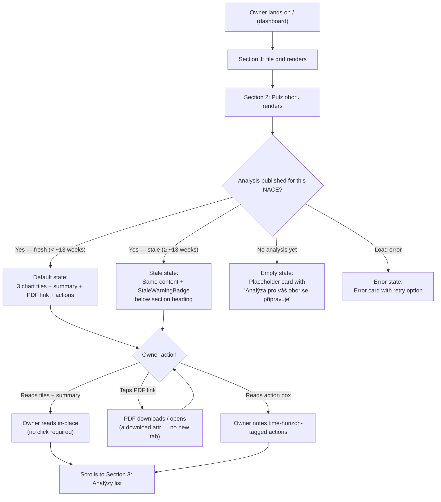

# Pulz oboru — Design

*Owner: designer · Slug: pulz-oboru · Last updated: 2026-04-28*

---

## 1. Upstream links

- Product doc: no `docs/product/pulz-oboru.md` exists yet — this design spec was commissioned directly by the orchestrator with a confirmed structure. A PM product doc should follow for full traceability. Logged as Q-TBD-PO-001.
- PRD sections driving constraints: §7.1 (day-one proof of value), §7.2 (verdicts not datasets), §7.3 (plain language), §7.4 (proof of value before anything else), §7.5 (privacy as product), §7.6 (opportunity-flavored), §7.7 (bank-native distribution).
- Token set: [docs/design/dashboard-v0-2/layout.md §5](dashboard-v0-2/layout.md) — reused verbatim.
- Action-box pattern: [docs/design/brief-page-v0-2.md §4.2–4.3](brief-page-v0-2.md) — paired observation+action card and orphan action card patterns reused verbatim.
- Content source read for copy drafts: `PRD/publications/furniture-2026-Q2.txt` (CZ-NACE 31 furniture sector analysis).
- Decisions in force: D-018 (header wordmark), D-019 ("Analýzy" vocabulary), D-020 (hybrid publication placement, "Sektorová analýza" label), D-011 (four canonical categories), D-015 (frozen metric set).
- Build plan phase: v0.3 Track C (analysis pipeline), branch `trial-v0-3-analyzy`.

---

## 1b. Section purpose

### Relationship to dashboard tiles

The dashboard tile grid (§ "Srovnání s vaším oborem") answers "how does my firm measure up against peers on 8 financial ratios?" — it is a *peer-position* surface reading from the `user_contributed` and cohort lanes. **Pulz oboru** answers a different question: "what is happening in my sector right now, and what should I do about it?" — it is a *sector-intelligence* surface reading from analyst-authored content in the `brief` lane. The two surfaces are complementary: tiles tell you where you stand; Pulz oboru tells you what the ground is doing.

### Relationship to the brief detail page

The brief detail page (`/brief/[id]`) renders one fully-authored brief — a structured document with an opener, observation+action pairs, and optional orphan actions. **Pulz oboru** is the *embedded brief surface* on the dashboard: it surfaces the most recently published ČS sector analysis for the owner's NACE division, distilled into three analyst-selected chart tiles + a summary text block + a PDF link + an action box. Pulz oboru IS a brief surface — it earns its MVP place by being the day-one proof of sector intelligence (PRD §7.4). An owner who has not yet read any full brief gets the key signal immediately on the dashboard.

### Relationship to the three ČS business goals

- **G1 Engagement** — Pulz oboru is the primary reason to return monthly: the section updates when a new analysis ships. Every update is a reason to re-engage.
- **G2 Data depth and cadence** — The section surfaces sector-specific findings that contextualize the owner's own ratios. An owner who sees that e-commerce is growing at 17 % YoY may immediately want to update their own channel-mix data — creating a natural give-to-get opening (Increment 3+; do not build the prompt here).
- **G3 RM lead signals** — An owner who engages with a Pulz oboru action (e.g., "Prověřte vaši e-commerce strategii") is exhibiting a sector-related strategic intent signal. If OQ-075 (client data injection) and the RM signal surface are ever activated, this is a high-quality input. Nothing in this MVP surface routes data to RMs.

---

## 2. IA decision — where Pulz oboru lives

**Decision: Pulz oboru is a third section on the dashboard at `/`, placed below the benchmark tile grid and above the briefs list.**

```
┌──────────────────────────────────────────────────────────────┐
│  HEADER BAND                                                 │
├──────────────────────────────────────────────────────────────┤
│  Section 1 — "Vaše pozice v kohortě" (tile grid, 8 tiles)   │
├──────────────────────────────────────────────────────────────┤
│  Section 2 — "Pulz oboru"  ← NEW                            │
├──────────────────────────────────────────────────────────────┤
│  Section 3 — "Analýzy" (brief list)                         │
└──────────────────────────────────────────────────────────────┘
```

**Rationale against alternatives:**

- *Separate top-level route (`/pulz-oboru`)* — rejected. Creates a navigation step before the owner sees anything. Violates day-one proof of value (PRD §7.4). A new route also requires a navigation element we deliberately omitted from the PoC header.
- *Tab on the dashboard* — rejected. Tabs hide content from first view and require a UI component not in the current design system kit for this surface (would require escalation). The orchestrator has confirmed no new components without justification.
- *Below the cohort tiles, above the briefs list* — accepted. The owner lands, orients on their own position (tiles), immediately sees what is happening in their sector (Pulz oboru), then drills into past analyses (briefs list). Reading order matches strategic context: me → sector → history. Pulz oboru bridges tiles and briefs, preventing the briefs list from feeling disconnected from the metric surface.

**Placement within the page also avoids a "wall of scroll" problem** — Pulz oboru is positioned at the natural pause between two different information types (own ratios vs. sector narratives), so it functions as a section-separator as well as a content surface.

---

## 2a. Who picks the three tile charts

**Decision: The ČS analyst picks the three charts at upload time.**

Strong default confirmed. The analyst selects three data series from the underlying publication that best represent the current state of the sector for an SME operator. For furniture-2026-Q2 these would be: (1) revenue and profit trend (shows sector trajectory), (2) POS vs. e-commerce dynamics (shows the structural channel shift), (3) domestic production share in consumption (shows competitive context for local producers).

**Rule-based per NACE would be simpler to implement but inferior** because:
- The most relevant chart varies by what happened in the period, not by NACE alone. A quarter dominated by an energy-price shock needs different tiles than one dominated by a demand shift.
- The analyst already reads the full publication before uploading; the marginal cost of selecting three charts is low.
- Rule-based selection would produce generic outputs that undermine the "verdict not dataset" principle.

**This decision is design-confirmed; it must be reflected in the admin upload flow** (out of scope for this spec per the brief — logged as Q-TBD-PO-002 for the admin-side upload design).

---

## 2b. Primary flow



---

## 2b. Embedded variant (George Business WebView)

The Pulz oboru section is part of the dashboard at `/`, which is embedded in George Business as a WebView (pending OQ-008 full contract). Section-specific constraints:

- **Chart tiles** — charts are rendered as static images generated server-side from analyst-uploaded data. No interactive chart library is used at MVP (would require a new dependency — see §7). Chart images must have descriptive `alt` text (§6 accessibility).
- **PDF link** — the "Stáhnout celou analýzu (PDF)" link uses `<a download>` attribute or is routed as a blob download. No new browser tab. If the George WebView intercepts download events, the engineer must confirm handling per OQ-008.
- **Touch targets** — all interactive elements in this section: PDF link (min-height 44 px), action pills if tappable. Action-box items are read-only at MVP per brief-page-v0-2 pattern.
- **No horizontal scroll** — the 3-tile row collapses to a single column at ≤ 600 px (see §3 mobile layout).
- **Animation** — none. No carousel, no auto-scroll, no entrance animation. Consistent with `prefers-reduced-motion` posture.

---

## 3. Screen inventory

| Screen | Purpose | Entry | Exit | Empty state | Error states |
|---|---|---|---|---|---|
| Pulz oboru — default | Shows the three analyst-selected chart tiles, summary text, PDF link, and action box for the most recent published analysis for the owner's NACE | Dashboard at `/` scrolls to this section on page load | Stays on page; PDF link triggers download; owner continues scrolling | See row below | Network / data-fetch error → Error card (see error state row) |
| Pulz oboru — empty | No analysis has been published yet for the owner's NACE division | Dashboard at `/` | Same (no interaction possible) | Single card: heading "Pulz oboru", empty-state copy (§5), no tiles, no PDF link, no actions | Same error card if the fetch itself errors |
| Pulz oboru — stale | Analysis exists but `published_at` is more than ~13 weeks ago (~1 quarter) | Dashboard at `/` | Same as default | Not applicable — stale state already has content | Same error card |
| Pulz oboru — error | Data fetch for analysis failed | Dashboard at `/` | "Zkusit znovu" refreshes only the Pulz oboru section; owner can continue scrolling | Not applicable | This is itself the error state |
| Footer AI disclaimer | Mandatory policy disclosure | Bottom of every screen | Not applicable | Not applicable | Not applicable |

### Stale threshold reasoning

The example publication filename `furniture-2026-Q2` implies quarterly cadence. A threshold of **~13 weeks (91 days)** from `published_at` triggers the stale warning. This covers one full missed publication cycle with a small buffer. If the analyst publishes monthly, the threshold never triggers; it only fires if a NACE has been skipped for a full quarter.

### Mobile layout — 3-tile row

| Viewport | Tile layout | Gap |
|---|---|---|
| ≤ 600 px | 1 column (stacked) | 12 px |
| 601–1024 px | 3 columns | 16 px |
| > 1024 px | 3 columns | 20 px |

The 3-tile row does not follow the 4-column tile-grid from Section 1. Pulz oboru tiles are wider (max 3 per row, not 4) because each tile carries a chart image + a verdict sentence — more horizontal breathing room is needed to preserve legibility.

---

## 4. Component specs

### 4.1 PulzOboru section wrapper

**Purpose.** Contains all four blocks of the Pulz oboru section with a consistent heading and visual separation from adjacent sections.

**Visual container.**

```
[32 px margin-top from tile grid container — matches existing between-section divider]
[1 px horizontal rule, --color-border-subtle (#e0e0e0), aria-hidden="true"]
[24 px padding-top]
<h2>Pulz oboru</h2>  ← --text-heading, 18 px / 700, --color-ink-primary
[optional stale badge — see 4.1b]
[optional publication-date subline — see §5]
[block 1: 3-tile row]
[block 2: summary text block]
[block 3: PDF link]
[block 4: action box]
[32 px margin-bottom before Section 3 "Analýzy"]
```

**States.**

| State | Difference from default |
|---|---|
| Default | All four blocks visible |
| Stale | StaleWarningBadge (4.1b) appears between `<h2>` and publication-date subline |
| Empty | Only heading + empty-state card rendered; blocks 1–4 omitted |
| Error | Only heading + error card rendered; blocks 1–4 omitted |
| Loading | Skeleton tiles (3× tile skeleton) + skeleton text block; `aria-busy="true"` on the wrapper |

---

### 4.1b StaleWarningBadge

**Purpose.** Signals to the owner that the displayed analysis is older than one quarter. Does not hide content — the owner still sees the data — but calibrates their trust.

**Visual spec.**

```
┌──────────────────────────────────────────────────────────────┐
│  ⚠  Tato analýza pochází z {month year}. Aktuálnější data   │
│     zatím nejsou k dispozici.                                │
└──────────────────────────────────────────────────────────────┘
```

- Container: `border: 1px solid #E65100` (amber — same amber used for druhá čtvrtina, already in token set via GDS), `border-radius: 6px`, `padding: 10px 14px`, `background: rgba(230, 81, 0, 0.06)`.
- Icon: warning triangle (⚠ U+26A0, rendered as text character, `aria-hidden="true"`). No new icon dependency.
- Text: `--text-body` (15 px / 400), `--color-ink-primary (#1a1a1a)`. The `{month year}` is the Czech-formatted `published_at` of the analysis (e.g., "leden 2026").
- Margin-bottom: `--space-m (12 px)` before the publication-date subline.
- **Color is not the only signal** — the icon and text both carry the warning independently of the amber border.

**Props:** `publishedAt: Date` — the component formats the date.

**Degraded / empty / error state.** Not applicable — this component is only rendered in the stale state.

---

### 4.2 ChartTile (Pulz oboru chart tile)

**Purpose.** Renders one analyst-selected chart as a static image plus a one-sentence verdict. Verdict leads; chart supports. The chart is a visual proof for the verdict, never a standalone data dump.

**Layout.**

```
┌─────────────────────────────────────────────────────────────┐
│  [Verdict sentence — always visible]                        │
│  ─────────────────────────────────────────────────────────  │
│  [Chart image — static, generated server-side]              │
│  [Chart label / caption — analyst-provided, 1 line]         │
└─────────────────────────────────────────────────────────────┘
```

- Container: `background: --color-surface-card (#fafafa)`, `border: 1px solid --color-border-subtle (#e0e0e0)`, `border-radius: 8px`, `padding: 16px`.
- Verdict text: `--text-subheading` (15 px / 600), `--color-ink-primary`, rendered above the chart. Max 1 sentence; hard constraint.
- Divider: `1px solid --color-border-inner (#f0f0f0)`, `margin: 12px 0`.
- Chart image: `` with descriptive `alt` text (analyst-provided at upload time — see Q-TBD-PO-003 for the alt-text input contract). `width: 100%`, `height: auto`, `max-height: 180px`, `object-fit: contain`.
- Caption: `--text-caption` (12 px / 400), `--color-ink-muted (#888)`. Source attribution if relevant (e.g., "Zdroj: ČS kartová data").

**States.**

| State | Appearance |
|---|---|
| Default | Verdict + divider + chart image + caption |
| Loading | Skeleton: `height: 180px`, `background: #f0f0f0`, `border-radius: 4px`; verdict replaced with skeleton text line |
| Image load error | Chart image slot replaced with a muted placeholder: "Graf není k dispozici." in `--color-ink-muted`; verdict still renders |
| No chart data (analyst omitted) | Entire tile not rendered; 3-tile grid becomes 2-tile or 1-tile row without reflow gaps. Analyst must provide all three charts — if any are missing, the grid degrades gracefully to fewer tiles. |

**Cohort minimum / low-confidence states.** Chart tiles in Pulz oboru display sector-aggregate data from the analyst's publication, not per-owner cohort percentiles. There is no cohort minimum constraint on these tiles — they show macro/sector data, not peer-comparison data. However, if a chart is based on ČS internal transaction data (e.g., the POS vs. e-commerce dynamics chart), the analyst must label it clearly with a source attribution. No blur or warning badge for these tiles — the data is sector-level aggregate, not per-owner inference. Logged as Q-TBD-PO-004 for PM confirmation on the data-source transparency requirement.

**Props:** `verdict: string`, `chartImageUrl: string`, `chartAltText: string`, `caption?: string`.

**Touch target.** The tile is read-only (not interactive). No tap target needed. It carries `role="region"` with `aria-label` equal to the verdict text (see §6).

---

### 4.3 SummaryTextBlock

**Purpose.** 3–6 sentences of plain-Czech synthesis. The owner's key takeaways without opening the PDF. Analyst-authored at upload time. No interactive elements.

**Visual spec.**

- Container: no border, no background card. Rendered as a standard `<p>` block within the section, visually equivalent to brief body text.
- Text: `--text-body` (15–16 px / 400 / line-height 1.6), `--color-ink-primary (#1a1a1a)`.
- Margin-top: `--space-l (16 px)` after the tile row.
- Margin-bottom: `--space-m (12 px)` before the PDF link.
- No heading needed — the `<h2>Pulz oboru</h2>` above already frames this text.
- Max length: soft cap of 6 sentences enforced at analyst authoring time (admin-side concern, out of scope here).

**States.**

| State | Appearance |
|---|---|
| Default | Body text as above |
| Loading | 3 skeleton text lines at varying widths |
| Missing (analyst omitted) | Block omitted silently — no placeholder. The section still renders with tiles + PDF + actions. |

---

### 4.4 PdfLink

**Purpose.** A single, clearly-labelled secondary-weight link to the full analysis PDF. Not the primary call-to-action — the tiles and summary carry the value; the PDF is a deep-dive reference.

**Visual spec.**

```
┌───────────────────────────────────────────────────────┐
│  ↓  Stáhnout celou analýzu (PDF)                      │
│     {source_label} · {publication_period}             │
└───────────────────────────────────────────────────────┘
```

- Element: `<a href="{pdfUrl}" download>` — no new browser tab; no clipboard access.
- Icon: ↓ (U+2193, rendered as text character, `aria-hidden="true"`). No new icon dependency.
- Primary label text: `--text-body` (15 px / 400), `--color-ink-tertiary (#666)`. Secondary visual weight — lower contrast than the verdict text, clearly a support action.
- Source/period subline: `--text-caption` (12 px / 400), `--color-ink-muted (#888)`.
- Underline: `text-decoration: underline` on the link — distinguishable without relying on colour alone (see §6).
- Touch target: min-height 44 px (the entire link block, not just the text).
- Margin-bottom: `--space-l (16 px)` before the action box.
- **Focus state:** `3px solid --color-focus-ring (#1a1a1a)`, `2px offset` — consistent with existing link focus.
- **Hover state:** `--color-ink-primary (#1a1a1a)` — slightly stronger on hover to acknowledge the interaction.

**States.**

| State | Appearance |
|---|---|
| Default | As above |
| Hover | `--color-ink-primary` text |
| Focus | Focus ring as spec'd |
| Missing (no PDF attached) | Block omitted — no "PDF not available" message. If analyst did not attach a PDF, the section renders without this block. Logged as Q-TBD-PO-005 for analyst UX gate on whether a PDF is mandatory. |

---

### 4.5 ActionBox (reused from brief-page-v0-2)

**Purpose.** 1–3 specific, time-horizon-tagged actions the owner can take in response to the sector synthesis. This is the same artifact pattern as the brief detail page's orphan-action cards (§4.3 of `docs/design/brief-page-v0-2.md`). The Pulz oboru context re-uses it without modification.

**Why the orphan-action card pattern, not the paired card pattern.** In the brief detail page, paired cards connect an observation headline to its action. In Pulz oboru, the tiles and summary text carry the observations — the action box is a standalone "what to do" block, which maps directly to the orphan-action card shape. No new component.

**Visual spec (verbatim from brief-page-v0-2.md §4.3).**

```
<h3>Doporučené kroky</h3>  ← --text-subheading, rendered below the PDF link
┌─────────────────────────────────────────────────────────┐
│  [Action time-horizon pill]                              │
│  Action body text                                        │
└─────────────────────────────────────────────────────────┘
[12 px gap]
┌─────────────────────────────────────────────────────────┐
│  [Action time-horizon pill]                              │
│  Action body text                                        │
└─────────────────────────────────────────────────────────┘
```

- Container per card: `border: 1px solid --color-border-subtle (#e0e0e0)`, `border-radius: 6px`, `padding: 14px 16px`, `background: --color-surface-card (#fafafa)`.
- Spacing between cards: `--space-m (12 px)`.
- Section heading: `<h3>Doporučené kroky</h3>` — `--text-subheading` (15 px / 600), `--color-ink-primary`. This is an `<h3>` because it sits under the `<h2>Pulz oboru</h2>` section heading.
- Time-horizon pill: existing `TimeHorizonPill` component (v0.1), unchanged.
- Action text: `--text-body` (15 px / 400), `--color-ink-primary`.
- **Opportunity-flavored only.** Actions must never read as risk warnings. Any action that could be interpreted as "you are at risk" is an authoring error, not a design-system responsibility. The analyst is responsible for framing; the design pattern does not impose framing checks. Noted for RM-signal alignment (PRD §7.6).

**States.**

| State | Appearance |
|---|---|
| Default (1–3 actions) | Cards as above |
| Empty (no actions authored) | `<h3>` and cards omitted — section renders without the block. No placeholder. |
| Loading | Skeleton: 2 card skeletons with skeleton pill + text line |

**Heading level note.** The `<h3>` here introduces a sub-heading within the Pulz oboru section. The heading hierarchy on the dashboard page becomes:

- `<h1>` — "Česká Spořitelna · Strategy Radar" (wordmark, per dashboard-v0-2/layout.md §6)
- `<h2>` — "Vaše pozice v kohortě" (Section 1)
- `<h2>` — "Pulz oboru" (Section 2)
  - `<h3>` — "Doporučené kroky" (action box within Section 2)
- `<h2>` — "Analýzy" (Section 3)

No heading levels are skipped.

---

### 4.6 EmptyStateCard

**Purpose.** Shown when no analysis has been published yet for the owner's NACE division. Must not be a blank space — the card holds a placeholder that sets expectations without anxiety.

**Visual spec.**

```
┌──────────────────────────────────────────────────────────────┐
│  Analýza pro váš obor se připravuje                          │
│                                                              │
│  Jakmile analytici České spořitelny vydají přehled pro váš   │
│  sektor, zobrazí se zde.                                     │
└──────────────────────────────────────────────────────────────┘
```

- Container: `border: 1px dashed --color-border-subtle (#e0e0e0)`, `border-radius: 8px`, `padding: 24px`, `background: --color-surface-page (#ffffff)`.
- Dashed border distinguishes "not yet available" from "error" (solid border). This is the same degraded-state pattern the tile grid uses for below-floor data.
- Heading within card: `--text-subheading` (15 px / 600), `--color-ink-secondary (#444)`.
- Body: `--text-body` (15 px / 400), `--color-ink-muted (#888)`.
- No action, no button, no "notify me" CTA at MVP — that is a give-to-get prompt and is out of scope per CLAUDE.md guardrail. Logged as Q-TBD-PO-006.

**States.**

| State | Appearance |
|---|---|
| Default (no analysis) | Dashed-border card as above |
| Error (fetch failed) | Solid-border card with error copy + "Zkusit znovu" link (see ErrorCard below) |

---

### 4.7 ErrorCard

**Purpose.** Shown when the data fetch for the Pulz oboru section fails.

**Visual spec.**

```
┌──────────────────────────────────────────────────────────────┐
│  Informace o vašem oboru se nepodařilo načíst.               │
│                                                              │
│  Zkusit znovu                                                │
└──────────────────────────────────────────────────────────────┘
```

- Container: `border: 1px solid --color-border-subtle (#e0e0e0)`, `border-radius: 8px`, `padding: 24px`, `background: --color-surface-page (#ffffff)`.
- Solid border distinguishes from the dashed EmptyStateCard.
- Body text: `--text-body` (15 px / 400), `--color-ink-muted (#888)`.
- "Zkusit znovu": `<button>` styled as a text link. `--color-ink-tertiary (#666)`, `text-decoration: underline`. Triggers a re-fetch of the Pulz oboru data only (not a full page reload). Touch target: min-height 44 px.

---

## 5. Copy drafts

All strings in formal Czech, vykání register. Placeholders in `{curly-braces}`. English parentheticals only where explicitly requested — none here.

### 5.1 Section heading and metadata

| Location | String | Notes |
|---|---|---|
| Section heading (`<h2>`) | `Pulz oboru` | Plain noun phrase. Intentionally understated — the content carries the weight, not the label. |
| Publication-date subline (below heading, before stale badge if present) | `Analýza pro {nace_label} · {publication_period}` | Example: "Analýza pro Výrobu nábytku · 2. čtvrtletí 2026". `{nace_label}` is the Czech NACE division name. `{publication_period}` is analyst-authored (e.g., "Q2 2026" formatted as "2. čtvrtletí 2026"). |

### 5.2 Stale warning badge copy

| Location | String |
|---|---|
| Stale badge body | `Tato analýza pochází z {month_year}. Aktuálnější data zatím nejsou k dispozici.` |
| `{month_year}` format | Czech month name + year, lower-case — e.g. `ledna 2026` (genitive case after "z"). |

### 5.3 Chart tile verdicts — furniture examples (CZ-NACE 31)

These are concrete draft verdicts synthesized from `furniture-2026-Q2.txt`. An analyst authoring a new analysis replaces these with their own verdicts.

| Tile | Verdict |
|---|---|
| Tile 1 — Tržby a zisk | `Tržby odvětví se po propadu v roce 2023 stabilizovaly na 49 mld. Kč, ale ziskovost zůstává pod úrovní roku 2021.` |
| Tile 2 — POS vs. e-commerce | `E-commerce roste dvouciferným tempem (18 % v roce 2025), zatímco kamenné prodejny stagnují — zákazníci online nakupují dražší kusy.` |
| Tile 3 — Podíl tuzemské výroby na spotřebě | `Čeští výrobci tvoří jen 31 % domácí spotřeby nábytku a jejich tržní podíl dále klesá.` |

Chart labels (analyst-authored source attribution):

| Tile | Caption |
|---|---|
| Tile 1 | `Zdroj: MPO, Panorama zpracovatelského průmyslu` |
| Tile 2 | `Zdroj: data České spořitelny; vlastní zpracování` |
| Tile 3 | `Zdroj: Asociace českých nábytkářů; vlastní zpracování` |

### 5.4 Summary text block — furniture example (4 sentences)

Drafted from `furniture-2026-Q2.txt`. Plain Czech, no analyst hedging.

> Výroba nábytku v Česku se po rekordním roce 2022 vrátila na stabilnější úroveň — tržby odvětví loni dosáhly necelých 50 mld. Kč a mírně rostou. Klíčovým trendem je rychlý přesun zákazníků do online kanálů: e-commerce roste ročním tempem přes 17 %, zatímco kamenné prodejny téměř stagnují, a průměrná online objednávka je zhruba dvakrát dražší než nákup v prodejně. Zároveň čeští výrobci pokrývají jen asi třetinu domácí spotřeby nábytku, přičemž jejich podíl rok od roku mírně klesá ve prospěch dováženého zboží. Pro firmy v oboru to znamená tlak na marže i na nalezení vlastní pozice mezi levnějšími dovozci a velkými retailery.

### 5.5 PDF link

| Location | String |
|---|---|
| PDF link label | `Stáhnout celou analýzu (PDF)` |
| Source/period subline | `{source_label} · {publication_period}` — e.g. `Ekonomické a strategické analýzy České spořitelny · 2. čtvrtletí 2026` |

### 5.6 Action box heading and action examples — furniture

| Location | String |
|---|---|
| Action box heading (`<h3>`) | `Doporučené kroky` |

Action card examples (time-horizon-tagged), drafted from the publication:

| Time horizon | Action text |
|---|---|
| Krátkodobě (0–3 měsíce) | `Zkontrolujte, zda vaše firma nabízí přímý prodej online — e-commerce roste o 18 % ročně a zákazníci přes internet nakupují průměrně za 5 100 Kč vs. 2 500 Kč v kamenné prodejně.` |
| Střednědobě (3–12 měsíců) | `Zmapujte, která část vašich tržeb pochází od zahraničních zákazníků nebo exportu — vývoz tvoří 73 % hodnoty výroby oboru a je primárním odbytem pro větší výrobce.` |
| Dlouhodobě (1–3 roky) | `Zvažte, zda je vaše produktová nabídka diferencovaná od levnějšího dováženého zboží — domácí výrobci tvoří jen 31 % spotřeby, a ten podíl klesá.` |

### 5.7 Empty-state copy

| Location | String |
|---|---|
| EmptyStateCard heading | `Analýza pro váš obor se připravuje` |
| EmptyStateCard body | `Jakmile analytici České spořitelny vydají přehled pro váš sektor, zobrazí se zde.` |

### 5.8 Error-state copy

| Location | String |
|---|---|
| ErrorCard body | `Informace o vašem oboru se nepodařilo načíst.` |
| ErrorCard action | `Zkusit znovu` |

### 5.9 AI disclaimer (mandatory, every screen)

| Location | String | Style |
|---|---|---|
| Bottom of every screen, after Section 3 "Analýzy" | `Tento prototyp byl vygenerován pomocí AI.` | Centered, `--color-ink-muted (#888)`, 13 px, 24 px vertical padding |

---

## 6. Accessibility checklist

- [ ] **Heading hierarchy**: `<h1>` wordmark → `<h2>Pulz oboru</h2>` → `<h3>Doporučené kroky</h3>`. No levels skipped. Sits correctly between `<h2>Vaše pozice v kohortě</h2>` and `<h2>Analýzy</h2>`.
- [ ] **Chart alt text**: each `` carrying a chart must have `alt="{analyst-provided description of what the chart shows}"`. The analyst provides this at upload time — the alt text must be a substantive description (e.g., "Sloupcový graf tržeb a zisku odvětví výroby nábytku v mld. Kč, 2009–2024, s vrcholem v roce 2022"), not a generic "graf". This is a data-input requirement on the admin upload form (Q-TBD-PO-003).
- [ ] **Verdict text readable without the chart**: the verdict sentence is always visible above the chart. An owner using a screen reader or with images disabled receives the verdict as text; the chart is supplementary.
- [ ] **Color is not the only signal**: the StaleWarningBadge uses a warning-triangle character (⚠) and text copy in addition to the amber border. The EmptyStateCard uses dashed vs. solid border to distinguish from the ErrorCard — this is a shape signal, not colour-only. PDF link uses underline in addition to colour.
- [ ] **Text contrast ≥ WCAG AA**: `--color-ink-primary (#1a1a1a)` on `--color-surface-card (#fafafa)` = 17.8:1 (passes). `--color-ink-muted (#888)` on `#ffffff` = 3.54:1 — borderline AA for body text at 15 px (WCAG AA requires 4.5:1 for normal text). The `--color-ink-muted` is only used for chart captions and empty-state subtext; if audit fails, shift captions to `--color-ink-tertiary (#666)` = 5.74:1. Flagged for engineer measurement — Q-TBD-PO-007.
- [ ] **Focus order**: DOM order is section heading → stale badge (if present) → tile 1 → tile 2 → tile 3 → summary text → PDF link → action card 1 → action card 2 → action card 3. Tiles are `role="region"` with `aria-label="{verdict text}"` (non-interactive, no tab stop needed). PDF link and "Zkusit znovu" button have tab stops.
- [ ] **PDF link distinguishable**: underline + colour change on hover; `aria-label="Stáhnout celou analýzu ve formátu PDF"` on the `<a>` element for screen readers (the icon character ↓ is `aria-hidden`).
- [ ] **All interactive elements keyboard-reachable**: PDF link (Tab), "Zkusit znovu" button (Tab + Enter/Space). No other interactive elements in the section at MVP.
- [ ] **Touch targets ≥ 44 px**: PDF link block (min-height 44 px), "Zkusit znovu" button (min-height 44 px). Read-only tiles do not need touch targets.
- [ ] **Screen-reader labels on icon-only controls**: the ↓ icon on the PDF link and ⚠ on the stale badge are both `aria-hidden="true"` — their meaning is carried by adjacent text.
- [ ] **No form fields in this section** at MVP. "Form fields have associated labels" not applicable.
- [ ] **Motion**: no animation in this section. Loading skeletons use a background-color only (no pulse animation), consistent with `prefers-reduced-motion`.
- [ ] **`aria-busy`**: the section wrapper has `aria-busy="true"` while loading; removed when content renders.
- [ ] **Role for chart tiles**: `role="region"` with `aria-label="{verdict text}"` on each tile container. This groups the verdict + chart + caption as a named region for screen reader navigation.

---

## 7. Design-system deltas (escalate if any)

**No new design-system components are introduced.** Every element in this spec is composed from:

- Existing tokens from `docs/design/dashboard-v0-2/layout.md §5` — reused verbatim.
- The orphan-action card shape from `docs/design/brief-page-v0-2.md §4.3` — reused verbatim.
- The existing `TimeHorizonPill` component (v0.1) — unchanged.
- Native HTML elements (`<h2>`, `<h3>`, `<p>`, ``, `<a download>`, `<button>`, `<hr>`).
- CSS Grid for the 3-tile row (same pattern as the 4-tile dashboard grid, narrower).
- Text characters for icons (↓, ⚠) — no icon library.

**One potential new dependency flagged and rejected.** A chart-rendering library (e.g., Recharts, Chart.js) would be needed to render interactive charts from raw data in the browser. This is rejected at MVP because: (a) it would be a new dependency requiring escalation; (b) interactive charts add complexity without adding verdict-quality insight; (c) the publication already includes charts as image assets in the .docx/.pdf. **Decision taken here: charts render as static `` elements, with the image URL pointing to a server-generated or analyst-uploaded PNG/SVG.** The engineer must confirm that the admin upload flow can receive and store chart images per NACE+period (Q-TBD-PO-002 scope).

**No entries in `docs/project/open-questions.md` required for design-system reasons.** All escalation items are product/data scope questions (listed in §8).

---

## 8. Open questions

These are raised by this design spec and must be lifted into `docs/project/open-questions.md` by the orchestrator with assigned `OQ-NNN` IDs.

| Local ID | Question | Blocking |
|---|---|---|
| Q-TBD-PO-001 | **No PM product doc exists for Pulz oboru.** This design spec was commissioned directly by the orchestrator. A `docs/product/pulz-oboru.md` should be authored by the PM to define acceptance criteria, user stories, and the data contract between analyst-uploaded content and the display layer. Until it exists, the design spec's content model (verdict text, chart image URL, chart alt text, summary text, PDF URL, action texts) is the de-facto contract — the PM must confirm or revise it. | PM track (non-blocking for design; blocking for engineer implementation start). |
| Q-TBD-PO-002 | **Admin-side upload flow for Pulz oboru content.** The orchestrator explicitly deferred the admin surface to a follow-up spec. Before the Pulz oboru section can render real data, the analyst must have a way to: (a) upload 3 chart images with alt text, (b) write a verdict per chart, (c) write a summary text block, (d) attach a PDF, (e) write 1–3 actions with time-horizon tags, (f) assign the analysis to a NACE division and publication period, (g) publish. None of this is designed here. Blocking for: engineer implementation of any data pipeline feeding Pulz oboru. | Engineering implementation gate. |
| Q-TBD-PO-003 | **Chart alt-text input contract.** Screen-reader accessibility requires substantive alt text per chart image (see §6). The analyst provides this at upload time. The admin upload form must include a mandatory alt-text field per chart. If alt text is not enforced as mandatory, blind/low-vision users receive no chart information. Blocking for: accessibility certification of the Pulz oboru section. | Admin upload form design (Q-TBD-PO-002 scope) + accessibility gate. |
| Q-TBD-PO-004 | **Data-source transparency requirement for ČS transaction-based charts.** Tile 2 (POS vs. e-commerce) in the furniture example is derived from ČS card-transaction data. The publication includes a disclaimer ("Zdroj: data České spořitelny; vlastní zpracování"). Must this source attribution appear in the chart caption in the Pulz oboru tile? And does ČS legal require a specific form of attribution when transaction-aggregate data is displayed to an SME owner? PM + legal to confirm. | Copy production readiness for charts using internal ČS data. |
| Q-TBD-PO-005 | **Is a PDF attachment mandatory for publication?** The PdfLink component is omitted if no PDF is attached (§4.4). An analyst might publish a synthesis without a PDF (e.g., the publication is not yet approved for external distribution). The admin upload form must either make PDF mandatory or design the "no PDF" case gracefully. PM to confirm whether a Pulz oboru publication without a PDF is a valid state. | Admin upload form design + PdfLink render logic. |
| Q-TBD-PO-006 | **"Notify me" CTA in the empty state.** The empty-state card currently has no action. A "Upozorněte mě, až analýza vyjde" CTA would be a give-to-get prompt — email or push notification capture. This is explicitly out of scope at MVP per CLAUDE.md guardrail (Increment 3+). Logged here so it is not accidentally re-introduced by an engineer reading the spec. Reopen trigger: Increment 3 Additional Customer Information Gatherer planning. | Deferred — Increment 3+. |
| Q-TBD-PO-007 | **`--color-ink-muted (#888)` contrast at 15 px normal weight.** Used for chart captions and empty-state subtext in this spec. WCAG AA requires 4.5:1 for normal text. `#888` on `#ffffff` = 3.54:1 — fails. Same issue flagged in `brief-page-v0-2.md` OQ Q-TBD-BPV-002 for 12 px. At 15 px the situation is marginally better but still fails. Fallback: shift to `--color-ink-tertiary (#666)` = 5.74:1 for all `--color-ink-muted` usages at normal weight in this section. Engineer to apply during implementation and confirm final contrast values. | Accessibility gate. |
| Q-TBD-PO-008 | **Stale threshold confirmation.** This spec proposes 13 weeks (91 days) as the stale threshold, derived from the quarterly publication cadence implied by the example filename. If publication cadence is confirmed as monthly (e.g., `furniture-2026-04`), the threshold should tighten to ~5–6 weeks. PM to confirm intended cadence and whether the threshold should be configurable per NACE (some sectors may publish less frequently). | StaleWarningBadge render logic. |
| Q-TBD-PO-009 | **Cross-NACE Pulz oboru display.** The current spec assumes a single Pulz oboru section per owner showing the analysis for their NACE division. If an owner operates in multiple NACE divisions (registered under one IČO with multiple activities), which NACE is used? The dashboard currently uses a single NACE (per the demo-owner profile D-023). The Pulz oboru section inherits this constraint. If multi-NACE becomes a requirement, the section must support multiple Pulz oboru blocks — but this is a post-MVP concern. Reopen trigger: multi-NACE owner profile support. | Deferred — inherits NACE resolution from owner profile. |

---

## Changelog

- 2026-04-28 — initial draft. Commissioned by orchestrator on branch `trial-v0-3-analyzy`. Content sourced from `PRD/publications/furniture-2026-Q2.txt`. All tokens reused from `dashboard-v0-2/layout.md`. Action-box pattern reused from `brief-page-v0-2.md`. IA decision: third section on dashboard between tiles and brief list. Chart tiles: analyst-selected at upload time. Nine open questions raised. — designer
