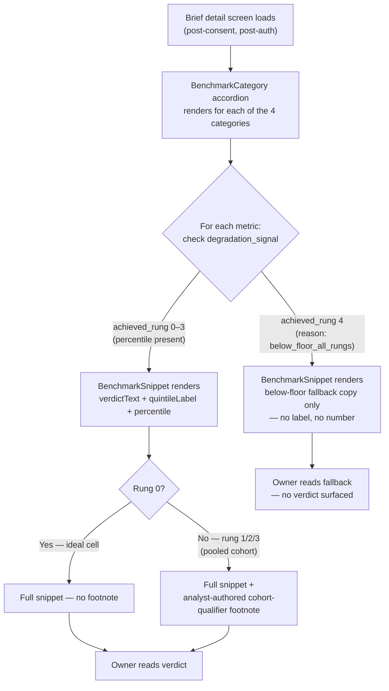

# Quartile Position Display — Design

*Owner: designer · Slug: quartile-position-display · Last updated: 2026-04-27*

---

## 1. Upstream links

- Product doc: [docs/product/quartile-position-display.md](../product/quartile-position-display.md)
- PRD sections driving constraints:
  - §7.2 Verdicts, not datasets — both label and percentile must be present together or the snippet must not render
  - §7.3 Plain language — no statistical notation, no Q1/Q2/Q3/Q4 codes, Czech only per D-004
  - §7.4 Proof of value before anything else — snippet renders on the first brief an owner sees; no configuration required
  - §7.7 Bank-native distribution — quartile label is identical across email teaser, web view, and PDF
  - §8.2 Peer Position Engine (minimal, MVP) — the engine whose output this feature renders; embedded in briefs, not standalone
- Decisions in force: D-001 (hand-assigned cohorts), D-003 (8 MVP ratios), D-004 (Czech only), D-006 (NACE grain; size/region via snippet), D-011 (canonical benchmark categories), D-012 (revocation = stop future flow only); quintile colour scheme approved by orchestrator 2026-04-27
- Data upstream: [docs/data/cohort-math.md](../data/cohort-math.md) §4 (five-rung degradation ladder), §5.1 (working-capital-cycle sign inversion), §6 (percentile + quintile computation, Q1–Q5 mapping via `percentileToQuintile()`)
- Design upstream: [docs/design/information-architecture.md](information-architecture.md) §4.3 BenchmarkSnippet — component this feature's output populates; §4.4 BenchmarkCategory — container
- Backlog items respected: B-001 (no cadence promise), B-002 (no in-product sharing)

---

## 2. Primary flow

This feature has no independent user flow. The quartile verdict renders passively inside the BenchmarkSnippet component (IA §4.3), which is itself a child of the BenchmarkCategory accordion (IA §4.4), within the "Srovnávací přehled" block (Component 4) of the brief. The entry path is the full brief-reading flow defined in [docs/design/information-architecture.md](information-architecture.md) §6. No screen navigation is triggered by reading a snippet.

---

## 2b. Embedded variant (George Business WebView)

The BenchmarkSnippet renders inside the BenchmarkCategory accordion within the brief web view. The WebView embedding constraints from IA §2b apply directly:

- Single-column layout; snippet content does not scroll horizontally.
- Touch target for the accordion expand/collapse control: minimum 44 × 44 px (the full category-label row is the tap target, not a chevron icon alone).
- The quartile label + percentile read as a single inline phrase inside the verdict sentence — no separate interactive element, no tooltip, no tap-to-reveal. The owner reads the verdict as plain text.
- Footnotes for rung-1/2/3 (cohort qualifier) render as a smaller-type line directly below the verdict sentence, within the same snippet card. They do not open a modal.
- PDF download from within the brief does not affect snippet rendering.

No structural difference from the standalone web view beyond the above touch-target and single-column constraints already inherited from IA §2b.

---

## 3. Screen inventory

The quartile verdict appears within the Brief detail screen (IA §3 Surface B). The table below extends the IA §3 screen inventory specifically for the BenchmarkSnippet's rendering states. It does not repeat the full screen — only the snippet-level states relevant to this feature.

| State | What renders | Entry condition | Exit / next state | Empty state detail | Error / edge states |
|---|---|---|---|---|---|
| **Rung 0 — full verdict** | Metric name · quintile label (e.g., "Vedoucí pozice") · integer percentile (e.g., "82. percentil") · analyst-authored verdict sentence · no footnote · accent stripe in quintile colour | `achieved_rung: 0` in `degradation_signal` payload; percentile mapped to Q1–Q5 via `percentileToQuintile()` | Owner scrolls past; no state change | Not applicable — data present | If `quintileLabel` or `percentile` field is null despite rung 0 signal: snippet degrades to error/empty state copy (see Error row below) — never renders a half-verdict |
| **Rung 1 — region pooled** | Same as rung 0 · plus one-line cohort-qualifier footnote (analyst-authored, Czech, vykání) indicating cohort is Czech-wide at the owner's size band, not regional | `achieved_rung: 1` | Owner scrolls past | Not applicable | Same null-field guard as rung 0 |
| **Rung 2 — size pooled** | Same as rung 0 · plus one-line footnote indicating cohort spans all sizes within the owner's region | `achieved_rung: 2` | Owner scrolls past | Not applicable | Same null-field guard |
| **Rung 3 — sector-wide** | Same as rung 0 · plus one-line footnote indicating cohort is all firms in this sector across Czechia | `achieved_rung: 3` | Owner scrolls past | Not applicable | Same null-field guard |
| **Rung 4 — below floor (fallback)** | Below-floor fallback copy verbatim (see §5); no quintile label; no percentile number anywhere — not in visible text, not in alt text, not in data attributes, not in PDF; accent stripe colour: `#455A64` (nodata) | `achieved_rung: 4, reason: "below_floor_all_rungs"` | Owner scrolls past; no number revealed anywhere | This row is the empty state for below-floor | Must not show any numeric content; if render layer receives a percentile value alongside rung-4 signal, it must ignore it |
| **Working-capital-cycle inversion (rung 0–3)** | Identical to the corresponding rung state above — quintile label and percentile are already correctly assigned upstream by cohort-math §5.1 (short cycle maps to high percentile = "Vedoucí pozice" or "Nadprůměr"); no copy change in the render layer | `metric: "working_capital_cycle"` with any rung 0–3 | Owner scrolls past | Not applicable | Visual direction cue (see §4 BenchmarkSnippet spec — `metricDirection` prop) is rendered only for analyst reference in the authoring back-end; the owner-facing snippet carries no "lower = better" annotation |
| **Low-confidence signal (rung 1–3 with small N)** | Same as the achieved-rung state above; no additional visual blur or warning badge in the web/PDF owner-facing view — the cohort-qualifier footnote carries the plain-language qualification | Rung 1–3 with `n_used` above the floor but indicating a pooled cohort | Owner scrolls past | Not applicable | IA §4.3 named a "low-confidence" blur/warning-badge state; that state maps to rung 4 in this feature's contract (below floor = blur/omit). Rungs 1–3 cleared the floor and are valid — they are not "low-confidence" in the WCAG or statistical sense; their qualification lives in the analyst-authored footnote |
| **Error — render-time validation failure** | Snippet falls back to empty-state copy: "Tento ukazatel není pro váš sektor v tomto měsíci k dispozici." (IA §5) — identical to the IA empty state | Render layer receives a rung-0/1/2/3 signal but `quintileLabel` or `percentile` is null | Owner scrolls past | This row is the error-induced empty state | Logged silently; not shown to owner; analyst's publish-validator should have blocked this at source (US-3 AC) |

---

## 4. Component specs

This section extends IA §4.3 BenchmarkSnippet with the full state matrix for quartile-position rendering. It does not modify the IA artifact. All props listed here are additions to or refinements of those already named in IA §4.3.

### 4.1 BenchmarkSnippet — extended state matrix

**Purpose:** Renders one benchmark metric as a one-sentence verdict inside its category group. The quartile label + percentile together form the verdict core; the analyst authors the surrounding sentence around them.

**Full state matrix:**

| State | `confidenceState` prop | `quintileLabel` | `percentile` | `accentColour` | `rungFootnote` | Visible to owner |
|---|---|---|---|---|---|---|
| Rung 0 — ideal | `valid` | one of the five canonical labels | integer 1–99 | per table in §4.2 | null | verdictText containing label + percentile; no footnote; accent stripe in `accentColour` |
| Rung 1 — region pooled | `valid` | canonical label | integer 1–99 | per §4.2 | analyst-authored string (≤ 1 sentence, Czech, vykání) | verdictText + footnote below; accent stripe |
| Rung 2 — size pooled | `valid` | canonical label | integer 1–99 | per §4.2 | analyst-authored string | verdictText + footnote below; accent stripe |
| Rung 3 — sector-wide | `valid` | canonical label | integer 1–99 | per §4.2 | analyst-authored string | verdictText + footnote below; accent stripe |
| Rung 4 — below floor | `below-floor` | null (must not be rendered) | null (must not be rendered) | `#455A64` | null | below-floor fallback copy only (§5); nodata accent stripe |
| Render-time error | `empty` | null | null | none | null | IA §5 empty-metric copy; no accent stripe |

**`confidenceState` enum values (extends IA §4.3):**

The IA defined: `valid` | `low-confidence` | `empty`. This feature clarifies the mapping:

- `valid` — rung 0, 1, 2, or 3: the floor was cleared; a quintile + percentile are present. The cohort qualifier (footnote) distinguishes rungs within this state.
- `below-floor` — rung 4: replaces `low-confidence` from the IA draft for precision. The IA's "low-confidence / below floor" description maps to this value. `low-confidence` should not be used — it implies a number exists but has uncertainty; rung 4 means no number is emitted at all.
- `empty` — no data for this metric this month (distinct from floor suppression).

**Additional props for quintile rendering (extend IA §4.3):**

| Prop | Type | Required | Notes |
|---|---|---|---|
| `quintileLabel` | `"Vedoucí pozice" \| "Nadprůměr" \| "Průměr" \| "Podprůměr" \| "Výrazný podprůměr" \| null` | Yes | null when `confidenceState` is `below-floor` or `empty`; must be one of the five frozen strings when `valid`; derived from `percentile` via `percentileToQuintile()` |
| `percentile` | `integer 1–99 \| null` | Yes | null when `confidenceState` is `below-floor` or `empty`; integer (cohort-math returns one decimal; render layer rounds to nearest integer) |
| `accentColour` | `string (hex) \| null` | Yes | GDS token hex value per §4.2 quintile colour table; `#455A64` for below-floor; null for render-time error; drives accent stripe + badge background |
| `verdictText` | `string \| null` | Yes | Analyst-authored; must contain the `quintileLabel` substring and the rendered percentile string (e.g., "82. percentil"); validated at publish |
| `rungFootnote` | `string \| null` | No | Analyst-authored; null for rung 0; required for rungs 1–3; not shown for rung 4 |
| `rungFootnoteId` | `string \| null` | No | Accessibility: links the footnote text to its reference mark via `aria-describedby`; null when `rungFootnote` is null |
| `metricId` | one of the 8 D-003 metric IDs | Yes | Drives category assignment (D-011); not rendered to owner |

### 4.2 Quintile colour mapping

Colour is derived from `percentile` via `percentileToQuintile()`. The render layer reads `accentColour` — it does not recompute the quintile itself. Both the left accent stripe on the metric tile card and the label badge use this colour.

| Quintile | Percentile range | `quintileLabel` | `accentColour` (hex) | GDS description |
|---|---|---|---|---|
| Q5 | 80–100. p. | Vedoucí pozice | `#1565C0` | Primary blue |
| Q4 | 60–79. p. | Nadprůměr | `#2E7D32` | Green |
| Q3 | 40–59. p. | Průměr | `#E65100` | Amber |
| Q2 | 20–39. p. | Podprůměr | `#BF360C` | Dark amber |
| Q1 | 0–19. p. | Výrazný podprůměr | `#C62828` | Red |
| — | nodata / below floor | — | `#455A64` | Dark blue-gray |

**Colour accessibility rule:** Colour is not the sole signal. The `quintileLabel` text string (e.g., "Průměr") must always accompany the accent colour. No quintile-only colour patch without the text label. See §6 accessibility checklist.

**States (interaction):**

| State | Description |
|---|---|
| Default | verdictText visible; rungFootnote (if present) visible below in smaller type |
| Loading | Skeleton: one metric-label line + one verdict-sentence line + optional footnote line placeholder |
| Error / empty | IA §5 empty-metric copy; no metric-name shown |
| Below-floor | Below-floor fallback copy (§5); no metric name, no label, no number |

**Footnote rendering:**

The rung-qualifier footnote appears as a separate visual line below the verdict sentence, typeset at one size smaller than the verdict text (e.g., 12 px / 0.75 rem if body is 16 px). It is not a numbered footnote in the web view (inline is preferred per OQ-QPD-003); the PDF surface decision is logged as Q-PD-QPD-003 below.

**Working-capital-cycle inversion — no render-layer change:**

Cohort-math §5.1 handles the inversion upstream. The component consumes `quintileLabel` and `accentColour` from the already-correct `degradation_signal` payload (short cycle = high percentile = "Vedoucí pozice" or "Nadprůměr" as appropriate) and renders them without special-casing. No visual direction indicator or annotation appears on the owner-facing snippet. The authoring back-end (US-3 implementation) displays a `metricDirection` cue ("kratší cyklus = lepší") adjacent to the read-only `quintileLabel` field so analysts cannot write a contradicting sentence — this is an engineer-owned authoring constraint, not a user-facing visual element.

**Email surface rule (carried from IA §4.3):**

When `confidenceState !== 'valid'`, the email surface omits this snippet entirely. It does not render the below-floor fallback copy or the empty-metric copy in the email body.

---

## 5. Copy drafts

All copy is Czech only (D-004). Formal register, vykání. Legal review required before production (OQ-005 scope).

### 5.1 Canonical quintile labels — verbatim, frozen

These are the only five permitted values of the `quintileLabel` prop. Derived from `percentile` via `percentileToQuintile()`. No paraphrase, no abbreviation, no English equivalent, no statistical code (Q1–Q5) reaches the owner.

| `quintileLabel` value | cohort-math tier | Percentile range | When used |
|---|---|---|---|
| **Vedoucí pozice** | Q5 | 80–100. p. | Firma je v nejlepší pětině kohorty pro tento ukazatel |
| **Nadprůměr** | Q4 | 60–79. p. | Firma je ve druhé nejlepší pětině (nadprůměrné výsledky) |
| **Průměr** | Q3 | 40–59. p. | Firma je ve středové pětině kohorty (průměrné výsledky) |
| **Podprůměr** | Q2 | 20–39. p. | Firma je ve druhé nejhorší pětině (podprůměrné výsledky) |
| **Výrazný podprůměr** | Q1 | 0–19. p. | Firma je v nejhorší pětině kohorty pro tento ukazatel |

### 5.2 Percentile integer rendering

The percentile renders as an ordinal number followed by the word "percentil" in Czech, with a Czech ordinal stop before "percentil":

**Format: `{n}. percentil`** — for example, "82. percentil", "34. percentil", "7. percentil".

Rationale for this order: Czech ordinal convention places the numeral before the noun it modifies; the period after the numeral marks it as an ordinal ("82." = "osmdesátý druhý"). Reading left-to-right, "82. percentil" parses naturally — the number qualifies "percentil", which is the noun. The reverse ("percentil 82") is grammatically tolerated but reads as a label ("percentile: 82"), not as a value embedded in a sentence. Ordinal-first is consistent with the "quartile label first, percentile second" order mandate (product doc §3 US-1 AC).

### 5.3 Verdict sentence structure (template — not frozen copy)

The analyst authors the full `verdictText`. The template below is guidance for the authoring back-end's example tooltip; it is not editable by the owner.

Template pattern: "Vaše \<metric name in nominative\> vás řadí do kategorie **\<quintileLabel\>** ve vašem oboru — \<percentile integer\>. percentil."

Example (rung 0, Q5, gross margin): "Vaše hrubá marže vás řadí do kategorie **Vedoucí pozice** ve vašem oboru — 82. percentil."

Example (rung 0, Q3, gross margin): "Vaše hrubá marže vás řadí do kategorie **Průměr** ve vašem oboru — 48. percentil."

Example (rung 1, Q4, labor cost ratio): "Vaše náklady na pracovní sílu vás řadí do kategorie **Nadprůměr** firem vaší velikosti v Česku — 68. percentil."

Example (rung 3, Q1, ROCE): "Váš ROCE vás řadí do kategorie **Výrazný podprůměr** firem ve vašem oboru v Česku — 12. percentil."

The quintile label must appear **before** the percentile in the sentence. The publish validator checks for both substrings; it does not enforce the ordering rule structurally (that is an authoring-guidance obligation, not a regex gate — flagged as Q-PD-QPD-004).

### 5.4 Rung-qualifier footnote patterns (guidance — not frozen)

Analyst-authored per brief; the authoring back-end provides these as suggested starting points. Final copy is analyst's responsibility.

| Rung | Suggested footnote pattern |
|---|---|
| 1 (region pooled) | "Srovnání zahrnuje firmy vaší velikosti v celém Česku — váš kraj má zatím málo srovnatelných firem." |
| 2 (size pooled) | "Srovnání zahrnuje firmy různých velikostí ve vašem kraji — vaše velikostní skupina má zatím málo srovnatelných firem." |
| 3 (sector-wide) | "Srovnání zahrnuje firmy ve vašem oboru napříč celým Českem." |

### 5.5 Below-floor fallback copy — verbatim, frozen

Rendered in the snippet slot when `confidenceState === 'below-floor'` (rung 4). No other content renders alongside this string.

> "Tento ukazatel zatím nemůžeme spolehlivě porovnat — k dispozici je málo srovnatelných firem v kohortě."

This string is frozen. It must not be paraphrased by the analyst or altered by the render layer. Any change requires a new PDR. Legal review is required before production (OQ-QPD-002 / OQ-005 scope).

### 5.6 Screen-reader combined label

For accessibility (§6), the screen reader must read the quintile label and percentile together in a single phrase. The `aria-label` on the verdict sentence element (or the element containing `quintileLabel` + `percentile`) must be constructed as:

**Pattern: `"{quintileLabel}, {n}. percentil"`**

Examples:
- "Vedoucí pozice, 82. percentil"
- "Výrazný podprůměr, 12. percentil"
- "Průměr, 48. percentil"

The screen reader must not read the percentile integer alone at any point. If the `verdictText` field is used as the accessible label (because it contains both substrings), that is acceptable — provided the label does not also double-announce the values from sibling elements. The engineer must ensure no duplicate announcement.

---

## 6. Accessibility checklist

- [x] All interactive elements reachable by keyboard — the BenchmarkSnippet is read-only text; no interactive elements within it beyond the BenchmarkCategory accordion toggle (owned by IA §4.4)
- [x] Focus states visible with sufficient contrast — accordion toggle (BenchmarkCategory) carries focus ring per IA §4.4; snippet itself is non-interactive
- [x] Color is never the only signal — quintile colour (accent stripe + badge) is present at MVP. Colour is always accompanied by the `quintileLabel` text string (e.g., "Průměr"). No quintile tile renders with colour alone and no label. This rule is enforced at the component level: `quintileLabel` is required when `accentColour` is non-null. Previously deferred Q-PD-QPD-005 is now resolved by this spec — no separate tracking needed.
- [x] Text contrast ≥ WCAG AA (4.5:1 body, 3:1 large) — `verdictText` is body text; footnote is smaller type and must still meet 4.5:1 (it is not "large text" at 12 px); below-floor fallback copy is body text
- [x] Screen-reader labels on icon-only controls — no icon-only controls inside the snippet; the BenchmarkCategory accordion chevron (icon-only) carries an `aria-label` per IA §4.4
- [x] Form fields have associated labels and error descriptions — no form fields in the owner-facing snippet; analyst authoring back-end form fields are an engineer-owned concern (US-3)
- [x] Motion respects prefers-reduced-motion — accordion expand/collapse animation must respect `prefers-reduced-motion`; no animation within the snippet itself
- [x] Screen reader reads quintile label + percentile together — `aria-label` on verdict element constructed as "{quintileLabel}, {n}. percentil" per §5.6; percentile integer must not be readable in isolation
- [x] Below-floor fallback copy is readable by screen reader — the fallback string is plain text; no suppression via `aria-hidden`; the metric name is omitted from the fallback to avoid implying a suppressed number exists
- [x] Rung-qualifier footnote linked to verdict via `aria-describedby` — `rungFootnoteId` prop enables this link; engineer must set the `id` on the footnote element and the `aria-describedby` on the verdict element

---

## 7. Design-system deltas (escalate if any)

No new components are introduced by this feature. The BenchmarkSnippet (IA §4.3) and BenchmarkCategory (IA §4.4) components already exist in the IA spec. This feature adds props and state values to BenchmarkSnippet — those are implementation refinements, not new components.

The `confidenceState` enum value `below-floor` is a refinement of the IA's `low-confidence` value (the IA described them as the same state in §4.3). The engineer should confirm whether the IA's `low-confidence` string is used anywhere in existing code; if so, it should be aliased or replaced with `below-floor` for precision. This is an engineering alignment task, not a new design-system dependency.

**Colour tokens** — the six hex values in §4.2 (`#1565C0`, `#2E7D32`, `#E65100`, `#BF360C`, `#C62828`, `#455A64`) are all already present in the GDS variables file (`lib/sass/_variables.scss`). No new colour tokens are introduced. The `accentColour` prop accepts a hex string at the component level; it does not introduce a new GDS token.

**`quartileLabel` → `quintileLabel` rename** — existing code references to `quartileLabel` in `src/components/dashboard/MetricTile.tsx` must be updated by the engineer to `quintileLabel`. The prop contract changes (four values → five values; new frozen strings). This is a breaking change to the existing prop interface and requires the engineer to update the component, callers, and any seed data or test fixtures that reference the old labels. Logged as Q-TBD below.

**Escalation status:** None. No new components, tokens, or icon sets required. The rename is an engineering alignment task.

The ČS design system availability question (OQ-006) remains open and continues to block implementation — not escalated here, already tracked.

---

## 8. Open questions

These are raised by the designer; the orchestrator assigns final `OQ-NNN` IDs when merging into `docs/project/open-questions.md`.

| Local ID | Question | Blocking |
|---|---|---|
| Q-PD-QPD-001 | Do the new quintile labels ("Výrazný podprůměr" for Q1, "Podprůměr" for Q2) read to Czech SME owners as accurate-and-neutral, or as harsh enough to disengage at the bottom two snippets? Colour (red/dark-amber) compounds the sharpness of the label. Proposed resolution: qualitative review during MVP trial window. Designer may propose softer alternatives before first brief ships if trust-and-consent-patterns review flags it; any label change requires a new PDR and matching update to `percentileToQuintile()`. Original question sourced from product doc OQ-QPD-001; scope widened to cover two new labels at 2026-04-27 update. | Does not block MVP; reopen at post-trial review |
| Q-PD-QPD-002 | Legal review of the below-floor fallback copy string ("Tento ukazatel zatím nemůžeme spolehlivě porovnat…") — is the "spolehlivě" claim defensible without a named methodology reference? Sibling to OQ-005 (brief-surface copy legal review). Sourced from product doc OQ-QPD-002. | Blocks production readiness, not MVP design |
| Q-PD-QPD-003 | Should the PDF surface render the rung-1/2/3 cohort-qualifier footnote as a proper numbered footnote (at page bottom) or as an inline parenthetical directly below the verdict sentence? PM's verdict-first principle favors inline (the verdict stays intact; a page-bottom footnote risks the owner reading the quintile label without the qualifier). Designer recommendation: inline, as specified in §4.1. Confirm with PM before PDF implementation. Sourced from product doc OQ-QPD-003. | Blocks PDF layout implementation |
| Q-PD-QPD-004 | The publish validator checks that `verdictText` contains both the `quintileLabel` substring and the percentile string, but does not structurally enforce that the quintile label appears before the percentile in the sentence. Is a substring-ordering check in the publish validator warranted, or is authoring guidance sufficient? Owner: engineer (implementation) + PM (constraint). | Does not block design; blocks authoring-back-end implementation |
| Q-TBD | Breaking prop rename: `quartileLabel` (4 values) → `quintileLabel` (5 values) in `MetricTile.tsx` and all callers. Engineer must update the component, callers, seed data, and test fixtures. Confirm scope of change (does `percentileToQuintile()` already return the new label strings, or does it return an internal enum that the component must map to the frozen Czech strings in §5.1?). Owner: engineer. | Blocks implementation of quintile colour scheme |

---

## Changelog

- 2026-04-20 — initial draft — designer. Full BenchmarkSnippet state matrix (rungs 0–4 + working-capital-cycle inversion + render-time error), percentile integer formatting decision ("82. percentil" ordinal-first), screen-reader combined label pattern, below-floor fallback copy verbatim, four canonical quartile labels verbatim, rung-qualifier footnote patterns (guidance), accessibility checklist including screen-reader combined-label rule and footnote `aria-describedby` requirement, and `confidenceState` enum clarification (`below-floor` replacing `low-confidence` for rung-4 precision).
- 2026-04-27 — quintile colour scheme migration — designer. Orchestrátor schválil přechod z kvartilového (4 barvy) na quintilové (5 barev) barevné schéma odvozené z percentilu přes `percentileToQuintile()`. Změny: (1) `quartileLabel` přejmenován na `quintileLabel`, čtyři frozen values nahrazeny pěti novými (§5.1); (2) nová sekce §4.2 — quintile colour table (Q5 `#1565C0` / Q4 `#2E7D32` / Q3 `#E65100` / Q2 `#BF360C` / Q1 `#C62828` / nodata `#455A64`); (3) nový `accentColour` prop pro accent stripe + badge; (4) §3 screen inventory aktualizován — accent stripe colour sloupec, nodata stripe pro rung 4; (5) §4.1 state matrix rozšířena o `accentColour` sloupec; (6) §5.3 verdict sentence vzory aktualizovány na nové labely; (7) §5.6 screen-reader pattern aktualizován; (8) §6 accessibility checklist — bod o barvě aktualizován (barva nyní v MVP, vždy doprovázena labelem); (9) §7 design-system deltas — breaking prop rename eskalován jako Q-TBD; (10) Q-PD-QPD-001 rozšířen na dva nové labely (Q1+Q2); Q-PD-QPD-005 uzavřen (constraint nyní platí v MVP).
