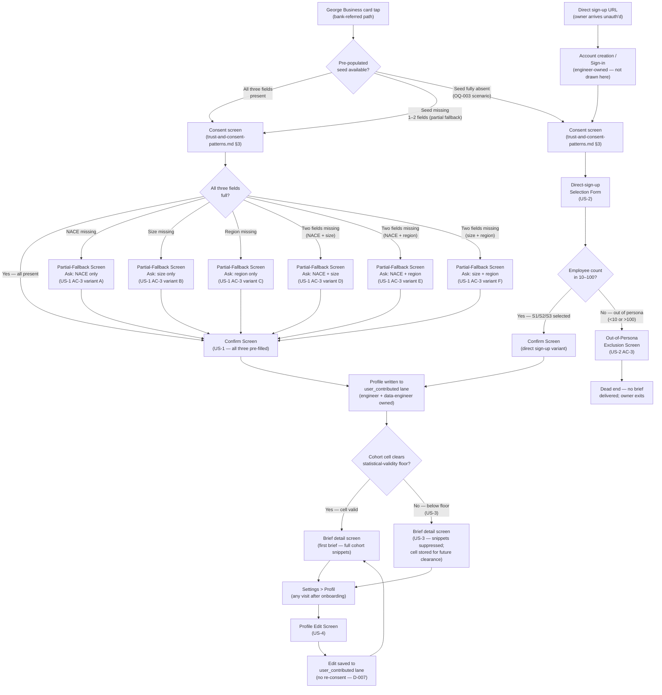

# Sector Profile Configuration — Design

*Owner: designer · Slug: sector-profile-configuration · Last updated: 2026-04-20*

---

## 1. Upstream link

- Product doc: [docs/product/sector-profile-configuration.md](../product/sector-profile-configuration.md)
- PRD sections driving constraints: §3 (personas — Exposed Owner, Bank-Referred Passive Adopter), §7.4 (proof of value before configuration), §7.5 (privacy as product), §9 (MVP feature list), §10 (cohort segmentation), §11 (George Business GTM)
- Decisions in force: D-001 (hand-assigned cohorts), D-002 (no RM lane at MVP), D-004 (Czech only), D-006 (brief grain = NACE only), D-007 (single opt-in), D-008 (consent gate before first brief), D-010 (lane identifiers), D-012 (stop-flow-only revocation), D-013 (Supabase Postgres)
- Consent gate authority: [docs/design/trust-and-consent-patterns.md](trust-and-consent-patterns.md) — the consent screen spec is owned there. This artifact positions and hands off to it; it does not redefine it.
- IA onboarding flow authority: [docs/design/information-architecture.md](information-architecture.md) §6 — the bank-referred brief-view path is drawn there. This artifact extends it for the sector-profile steps and the direct-sign-up entry path.

---

## 2. Primary flow

The flow below extends the bank-referred path in `information-architecture.md` §6 at the point marked "Consent screen loads". It adds: the direct-sign-up entry, the partial-fallback branch (US-1 AC-3), out-of-persona exclusion (US-2 AC-3), and the post-onboarding profile-edit path (US-4).



---

## 2b. Embedded variant (George Business WebView)

All screens in this artifact are rendered inside the George Business WebView — the full-screen WebView panel described in `information-architecture.md` §2b. The following adjustments apply:

- **Navigation**: no Strategy Radar top-level nav bar. The WebView back gesture handles navigation between screens (partial-fallback → confirm, etc.). A "Zpět do George" text link appears in the footer of the confirm screen and the out-of-persona screen.
- **Layout**: single-column, mobile-first, 375 px minimum width. All touch targets ≥ 44 × 44 px.
- **Picker controls**: rendered as native-style select or full-screen modal lists — no new browser tab, no clipboard interaction.
- **Direct sign-up path**: opens in the standalone web browser (not in the George WebView). Layout is identical to the WebView variant at 375 px; the "Zpět do George" link is replaced by the product's own logo/home link. See Q-PD-SPC-001.

The consent screen for both paths is the full-screen overlay specified in `trust-and-consent-patterns.md` §3. Profile-configuration screens follow immediately after the consent screen clears.

---

## 3. Screen inventory

| Screen | Purpose | Entry | Exit | Empty state | Error states |
|---|---|---|---|---|---|
| **Consent screen** | Single opt-in before any data is written | First WebView launch (bank-referred) or first direct-sign-up form load | Owner confirms → Confirm Screen (bank-referred) or Selection Form (direct); owner taps "Zpět do George" → WebView closes | Not applicable — always fully rendered | See `trust-and-consent-patterns.md` §5 |
| **Confirm Screen (bank-referred, all fields)** | Owner reviews three pre-filled fields and confirms or corrects | Post-consent, all three seed fields present | Primary "Potvrdit a pokračovat" → Profile written → Brief | Not applicable — all fields guaranteed pre-filled at entry | Seed fields unreadable: show inline error per field ("Nepodařilo se načíst tuto hodnotu — vyberte prosím ručně"); field becomes editable — see US-1 AC-3 |
| **Partial-Fallback Screen (variant A — NACE missing)** | Collect only NACE; size and region shown pre-filled, read-only | Post-consent, seed has size + region but not NACE | Primary "Pokračovat" (enabled once NACE selected) → Confirm Screen | SectorPicker shows full NACE list; no pre-selection | SectorPicker load failure: "Nepodařilo se načíst seznam oborů. Zkuste to prosím znovu." with retry |
| **Partial-Fallback Screen (variant B — size missing)** | Collect only size band; NACE and region shown pre-filled, read-only | Post-consent, seed has NACE + region but not size | Primary "Pokračovat" (enabled once size selected) → Confirm Screen | SizeBandPicker shows all three bands; no pre-selection | Not applicable — static list, no load failure |
| **Partial-Fallback Screen (variant C — region missing)** | Collect only region; NACE and size shown pre-filled, read-only | Post-consent, seed has NACE + size but not region | Primary "Pokračovat" (enabled once region selected) → Confirm Screen | RegionPicker shows all eight NUTS 2 regions; no pre-selection | Not applicable — static list, no load failure |
| **Partial-Fallback Screen (variant D — NACE + size missing)** | Collect NACE and size; region shown pre-filled, read-only | Post-consent, seed has region only | Primary "Pokračovat" (enabled once both selected) → Confirm Screen | Both pickers show full lists; no pre-selection | SectorPicker load failure as variant A |
| **Partial-Fallback Screen (variant E — NACE + region missing)** | Collect NACE and region; size shown pre-filled, read-only | Post-consent, seed has size only | Primary "Pokračovat" (enabled once both selected) → Confirm Screen | Both pickers show full lists; no pre-selection | SectorPicker load failure as variant A |
| **Partial-Fallback Screen (variant F — size + region missing)** | Collect size and region; NACE shown pre-filled, read-only | Post-consent, seed has NACE only | Primary "Pokračovat" (enabled once both selected) → Confirm Screen | Both pickers show full lists; no pre-selection | Not applicable — static lists, no load failure |
| **Selection Form (direct sign-up)** | Owner selects all three fields from scratch | Post-consent, direct sign-up path | Primary "Pokračovat" (enabled once all three selected) → Confirm Screen (direct variant); size out of 10–100 range → Out-of-Persona Screen | All three pickers show full lists; no pre-selection | SectorPicker load failure as variant A |
| **Confirm Screen (direct sign-up variant)** | Owner reviews three self-selected fields; may edit before confirming | Selection Form complete | Primary "Potvrdit a pokračovat" → Profile written → Brief | Not applicable — all three fields always set at entry | None — all values are already held in client state; no server call on this screen before confirm tap |
| **Out-of-Persona Exclusion Screen** | Inform owner that the product serves 10–100 employee firms only | Selection Form: size band selection resolves to <10 or >100 | No forward path — "Zpět" returns to Selection Form; "Zpět do George" exits WebView | Not applicable | Not applicable |
| **Profile Edit Screen (US-4)** | Owner edits one or more of the three profile fields after first brief | Settings > Profil | Primary "Uložit změny" → edit written to `user_contributed` lane → brief view; secondary "Zrušit" → returns to Settings without saving | Not applicable — all three fields always have current values at entry | Server write failure: "Změny se nepodařilo uložit. Zkuste to prosím znovu." with retry; field values remain as edited (do not reset) |

---

## 4. Component specs

### 4.1 SectorPicker (NACE)

**Purpose:** Lets the owner select their NACE 2-digit division. Structured to accommodate a future per-division 3-digit override sub-list (OQ-018), which at MVP is an empty set — no second level is shown.

**Interaction model:** Tapping the field opens a full-screen modal list (not an HTML `<select>` dropdown — the native select dropdown is unusable on mobile for lists of ~21 NACE divisions). The modal shows a search/filter input at the top and a scrollable list of NACE division labels below.

**States:**

| State | Description |
|---|---|
| Default (unselected) | Shows placeholder text "Vyberte obor podnikání"; no selection highlighted |
| Open (modal) | Full-screen overlay: search input (autofocused) at top; scrollable list of NACE 2-digit division labels (Czech); each row = division code + Czech name (e.g., "46 — Velkoobchod") |
| Search active | List filters in real time as owner types; if no matches: "Žádný obor neodpovídá vašemu hledání." |
| Selected | Field shows the chosen division label (code + name); no modal open |
| Pre-filled / read-only | Shown in Confirm Screen and partial-fallback screens for a field that came from the seed; visually distinct from an editable field (muted/outlined style); labelled with "Předvyplněno ze záznamu vaší banky" (see §5 copy) |
| Loading (list) | Modal opens; spinner shown while list loads from server; if load fails: inline error + retry button |
| Error (load failure) | "Nepodařilo se načíst seznam oborů. Zkuste to prosím znovu." with retry — modal stays open |
| Disabled | Not used at MVP |

**Props needed:** `value: NACECode | null`, `readOnly: boolean`, `onChange: (code: NACECode) => void`, `loading: boolean`, `error: string | null`.

**3-digit override stub:** The component accepts an optional `overrideOptions: NACESubCode[]` prop. At MVP this array is always empty; when OQ-018 is resolved the prop is populated for qualifying divisions. When non-empty, selecting a parent division reveals a secondary sub-list within the same modal. This is a structural hook — do not build the sub-list UI at MVP. See Q-PD-SPC-002.

**Used in:** Partial-Fallback variants A, D, E, F (editable); Confirm Screens (read-only with edit affordance); Selection Form (editable); Profile Edit Screen (editable).

**Design-system note:** The full-screen modal list is a new pattern not confirmed in the ČS George Business component library. Logged as Q-PD-SPC-003.

---

### 4.2 SizeBandPicker

**Purpose:** Lets the owner select one of the three employee size bands (S1: 10–24, S2: 25–49, S3: 50–100) or declare they are outside 10–100 (out-of-persona).

**Interaction model:** Segmented button group (three options: "10–24", "25–49", "50–100") plus a fourth text option "Méně než 10 / více než 100 zaměstnanců" rendered as a text link below the group. The three band buttons are the primary interactive surface; the out-of-persona link is secondary to avoid accidentally routing owners to the exclusion screen.

**States:**

| State | Description |
|---|---|
| Default (unselected) | All three band buttons in unselected style; out-of-persona link visible |
| Selected | One band button is in selected/active style; other two unselected |
| Pre-filled / read-only | Shown as a read-only chip or badge with the selected band label and "Předvyplněno ze záznamu vaší banky" label; no interactive buttons visible |
| Out-of-persona triggered | Owner taps the out-of-persona link → routes to Out-of-Persona Exclusion Screen; this is a navigation action, not a form-field state |

**Props needed:** `value: 'S1' | 'S2' | 'S3' | null`, `readOnly: boolean`, `onChange: (band: 'S1' | 'S2' | 'S3') => void`, `onOutOfPersona: () => void`.

**Touch target:** Each band button ≥ 44 × 44 px. Segmented group spans full width of the form column.

**Used in:** Partial-Fallback variants B, D, F; Confirm Screens (read-only with edit affordance); Selection Form; Profile Edit Screen.

---

### 4.3 RegionPicker

**Purpose:** Lets the owner select one of the eight Czech NUTS 2 regions.

**Interaction model:** Vertically stacked radio-button list (eight items). On mobile, a full-screen modal list (same pattern as SectorPicker) may be used if the eight items overflow the viewport without scrolling; for the direct-sign-up form where all three pickers are stacked, the radio list is the preferred default to avoid three modal layers. See Q-PD-SPC-004.

**States:**

| State | Description |
|---|---|
| Default (unselected) | All eight regions shown; none selected |
| Selected | One region highlighted (radio selected style) |
| Pre-filled / read-only | Read-only badge showing the selected region name and "Předvyplněno ze záznamu vaší banky" label |

**Canonical region names (Czech):** Praha · Střední Čechy · Jihozápad · Severozápad · Severovýchod · Jihovýchod · Střední Morava · Moravskoslezsko (per cohort-math.md §2.3)

**Props needed:** `value: NUTSRegion | null`, `readOnly: boolean`, `onChange: (region: NUTSRegion) => void`.

**Touch target:** Each region row ≥ 44 × 44 px (tappable row, not just the radio button).

**Used in:** Partial-Fallback variants C, D, E, F; Confirm Screens (read-only with edit affordance); Selection Form; Profile Edit Screen.

---

### 4.4 ConfirmPanel

**Purpose:** Displays the three fields (NACE, size, region) in their current state — either pre-filled and read-only, or self-selected and read-only — and surfaces the primary confirm action. Also provides an inline "Upravit" (Edit) affordance per field, which re-opens the relevant picker inline.

**Layout:**

```
┌──────────────────────────────────────────────┐
│  Zkontrolujte údaje vaší firmy               │  ← Screen heading (H1)
│                                              │
│  Tyto informace nám pomáhají zařadit vás     │  ← Sub-heading / explanation
│  do správné skupiny firem pro srovnání.      │
│  Žádné jiné údaje nepotřebujeme.             │
│                                              │
│  ┌────────────────────────────────────────┐  │
│  │ Obor podnikání                         │  │  ← Field row
│  │ 46 — Velkoobchod          [Upravit]   │  │
│  │ Předvyplněno ze záznamu vaší banky     │  │  ← Seed-origin label (if bank-referred)
│  └────────────────────────────────────────┘  │
│  ┌────────────────────────────────────────┐  │
│  │ Počet zaměstnanců                      │  │
│  │ 25–49                     [Upravit]   │  │
│  │ Předvyplněno ze záznamu vaší banky     │  │
│  └────────────────────────────────────────┘  │
│  ┌────────────────────────────────────────┐  │
│  │ Kraj / region                          │  │
│  │ Praha                     [Upravit]   │  │
│  │ Předvyplněno ze záznamu vaší banky     │  │
│  └────────────────────────────────────────┘  │
│                                              │
│  ┌────────────────────────────────────────┐  │
│  │  Potvrdit a pokračovat                 │  │  ← Primary button (sticky footer)
│  └────────────────────────────────────────┘  │
│                                              │
│  [Zpět do George]                            │  ← Exit link
└──────────────────────────────────────────────┘
```

**States:**

| State | Description |
|---|---|
| Default | All three fields displayed with current values; primary button enabled |
| Field being edited | Relevant picker opens inline or as a modal; primary button remains visible but scrolled below |
| Submitting | Primary button shows loading indicator; text hidden; all "Upravit" links disabled |
| Submit error | Button returns to default; inline error above button: "Nepodařilo se uložit váš profil. Zkuste to prosím znovu." |
| Success | Screen navigates to brief; no success state shown on this screen |

**"Předvyplněno" label:** Shown only for fields that arrived from the pre-populated seed (`user_ingest_prepopulated` source). Fields that were self-selected in a partial-fallback step do not show this label.

**Props needed:** `nace: NACEValue`, `sizeBand: SizeBandValue`, `region: NUTSRegion`, `seedFields: ('nace' | 'size' | 'region')[]` (which fields came from seed — drives label visibility), `onConfirm: () => void`, `submitting: boolean`, `error: string | null`.

**Used in:** Confirm Screen (bank-referred, all fields); Confirm Screen (direct sign-up variant); after all partial-fallback variants.

---

### 4.5 PartialFallbackPanel

**Purpose:** Displays pre-filled read-only fields alongside editable pickers for only the missing fields. Communicates to the owner why some fields are pre-filled and why they are being asked to fill in the rest.

**Layout (example — NACE missing, variant A):**

```
┌──────────────────────────────────────────────┐
│  Potřebujeme doplnit jeden údaj              │  ← Screen heading (H1)
│                                              │
│  Část informací jsme našli v záznamu vaší    │  ← Explanation paragraph
│  banky. Doplňte prosím zbývající údaj.       │
│                                              │
│  ┌────────────────────────────────────────┐  │
│  │ Počet zaměstnanců                      │  │  ← Read-only pre-filled row
│  │ 25–49                                  │  │
│  │ Předvyplněno ze záznamu vaší banky     │  │
│  └────────────────────────────────────────┘  │
│  ┌────────────────────────────────────────┐  │
│  │ Kraj / region                          │  │  ← Read-only pre-filled row
│  │ Praha                                  │  │
│  │ Předvyplněno ze záznamu vaší banky     │  │
│  └────────────────────────────────────────┘  │
│                                              │
│  Obor podnikání                              │  ← Editable picker (missing field)
│  [SectorPicker — unselected]                │
│                                              │
│  ┌────────────────────────────────────────┐  │
│  │  Pokračovat                            │  │  ← Primary button (disabled until field filled)
│  └────────────────────────────────────────┘  │
└──────────────────────────────────────────────┘
```

**Heading variants by missing-field count:**
- One field missing: "Potřebujeme doplnit jeden údaj"
- Two fields missing: "Potřebujeme doplnit dva údaje"

**States:**

| State | Description |
|---|---|
| Default | Read-only rows visible; editable picker(s) unselected; primary button disabled |
| Picker filled (one) | Primary button enabled (one missing field) or still disabled (two missing fields, only one filled) |
| All missing fields filled | Primary button enabled |
| Submitting | Not applicable — this screen does not write; it passes values to Confirm Screen |

**Props needed:** `prefilledFields: { nace?: NACEValue; sizeBand?: SizeBandValue; region?: NUTSRegion }`, `missingFields: ('nace' | 'size' | 'region')[]`, `onNext: (collected: Partial<ProfileFields>) => void`.

**Used in:** All six partial-fallback variants (A–F).

---

### 4.6 OutOfPersonaPanel

**Purpose:** Informs the owner in plain language that Strategy Radar currently serves 10–100 employee firms, and that the owner's declared size is outside this range. Does not gate on region or NACE — size is the only exclusion criterion at MVP.

**States:**

| State | Description |
|---|---|
| Default | Heading + explanation + two exit actions |

No loading, error, or empty states — this screen is always statically rendered.

**Props needed:** none (the owning route renders this when size guard fires).

**Used in:** Selection Form out-of-persona branch (US-2 AC-3).

---

### 4.7 ProfileEditPanel (US-4)

**Purpose:** Lets an onboarded owner change any of the three profile fields. Presented in Settings > Profil. All three fields are editable simultaneously; changes take effect from the next brief selection batch.

**States:**

| State | Description |
|---|---|
| Default | All three fields shown with current values; all editable via respective pickers |
| Field edited (unsaved) | Field shows new value; "Uložit změny" button enabled |
| Submitting | "Uložit změny" shows loading indicator; all pickers disabled |
| Success | Inline confirmation: "Změny byly uloženy. Projeví se v příštím přehledu."; button returns to default |
| Error | Inline error above button: "Změny se nepodařilo uložit. Zkuste to prosím znovu." |

**Note on re-consent:** Profile edits do not trigger re-consent under D-007 / assumption A-007. The panel does not show any consent copy or consent button.

**Note on effect timing:** The panel must state explicitly that edits take effect from the next brief (per US-4 AC-3). Already-delivered briefs are not changed.

**Props needed:** `currentProfile: { nace: NACEValue; sizeBand: SizeBandValue; region: NUTSRegion }`, `onSave: (updated: ProfileFields) => void`, `submitting: boolean`, `error: string | null`, `saveSuccess: boolean`.

**Used in:** Settings > Profil entry point (OQ-015 — Settings screen structure not yet fully designed; see §8).

---

## 5. Copy drafts

All copy is Czech only (D-004). Register: formal, vykání. Legal review required before production (same flag as Q-TBD-003 in `information-architecture.md`). Placeholders in `{{curly braces}}`.

---

### 5.1 Confirm Screen (bank-referred — all fields pre-filled)

| Location | Copy |
|---|---|
| Screen heading (H1) | "Zkontrolujte údaje vaší firmy" |
| Sub-heading / explanation | "Tyto informace jsme předvyplnili ze záznamu vaší banky. Zkontrolujte je a pokračujte — žádné jiné údaje nepotřebujeme." |
| Field label — NACE | "Obor podnikání" |
| Field label — size | "Počet zaměstnanců" |
| Field label — region | "Kraj / region" |
| Seed-origin label (appears under each pre-filled field) | "Předvyplněno ze záznamu vaší banky" |
| Edit affordance | "Upravit" |
| Primary confirm button | "Potvrdit a pokračovat" |
| Submit error (inline) | "Nepodařilo se uložit váš profil. Zkuste to prosím znovu." |
| Exit link | "Zpět do George" |

---

### 5.2 Partial-Fallback Screen

| Location | Copy |
|---|---|
| Screen heading — one field missing | "Potřebujeme doplnit jeden údaj" |
| Screen heading — two fields missing | "Potřebujeme doplnit dva údaje" |
| Explanation paragraph (one field missing) | "Část informací jsme našli v záznamu vaší banky. Doplňte prosím zbývající údaj, abychom vás mohli zařadit do správné skupiny firem." |
| Explanation paragraph (two fields missing) | "Část informací jsme našli v záznamu vaší banky. Doplňte prosím zbývající údaje, abychom vás mohli zařadit do správné skupiny firem." |
| Seed-origin label | "Předvyplněno ze záznamu vaší banky" |
| Field label — NACE (when missing) | "Obor podnikání" |
| NACE picker placeholder | "Vyberte obor podnikání" |
| Field label — size (when missing) | "Počet zaměstnanců" |
| Field label — region (when missing) | "Kraj / region" |
| Primary button (disabled) | "Pokračovat" |
| Primary button (enabled) | "Pokračovat" |
| SectorPicker load error | "Nepodařilo se načíst seznam oborů. Zkuste to prosím znovu." |
| SectorPicker retry button | "Zkusit znovu" |
| SectorPicker no-results | "Žádný obor neodpovídá vašemu hledání." |

---

### 5.3 Selection Form (direct sign-up — all three fields)

| Location | Copy |
|---|---|
| Screen heading (H1) | "Řekněte nám o vaší firmě" |
| Sub-heading / explanation | "Potřebujeme tři údaje, abychom vám mohli zobrazit přehled pro váš obor. Nic jiného nepotřebujeme." |
| Field label — NACE | "Obor podnikání" |
| NACE picker placeholder | "Vyberte obor podnikání" |
| Field label — size | "Počet zaměstnanců" |
| Size band option labels | "10–24 zaměstnanců" · "25–49 zaměstnanců" · "50–100 zaměstnanců" |
| Out-of-persona link | "Naše firma zaměstnává méně než 10 nebo více než 100 lidí" |
| Field label — region | "Kraj / region" |
| Primary button (disabled) | "Pokračovat" |
| Primary button (enabled — all three filled) | "Pokračovat" |
| SectorPicker load error | "Nepodařilo se načíst seznam oborů. Zkuste to prosím znovu." |

---

### 5.4 Confirm Screen (direct sign-up variant)

| Location | Copy |
|---|---|
| Screen heading (H1) | "Zkontrolujte zadané údaje" |
| Sub-heading / explanation | "Toto jsou informace, které jste zadali. Zkontrolujte je před pokračováním." |
| Field labels | Identical to §5.1 (Obor podnikání, Počet zaměstnanců, Kraj / region) |
| Edit affordance | "Upravit" |
| Primary confirm button | "Potvrdit a pokračovat" |
| Submit error (inline) | "Nepodařilo se uložit váš profil. Zkuste to prosím znovu." |
| Exit link | "Zpět" |

Note: On the direct sign-up path the exit link returns to the Selection Form, not to George.

---

### 5.5 Out-of-Persona Exclusion Screen

| Location | Copy |
|---|---|
| Screen heading (H1) | "Strategy Radar je zatím pro firmy s 10 až 100 zaměstnanci" |
| Body | "Naše přehledy jsou aktuálně připraveny pro firmy v tomto rozsahu. Pokud se váš počet zaměstnanců změní, budeme rádi, když se vrátíte." |
| Primary exit action | "Zpět" (returns to Selection Form) |
| Secondary exit action (bank-referred context) | "Zpět do George" |

---

### 5.6 Below-Floor Acknowledgment (US-3)

US-3 specifies that below-floor suppression is **silent to the user during onboarding** (assumption A-017; product doc §3 AC-3). No onboarding-time copy is needed for this case. The owner proceeds to the brief exactly as with a full-floor owner. Below-floor handling is surfaced inside the brief via the BenchmarkSnippet degraded state specified in `information-architecture.md` §4 and §5.

The profile-configuration flow must not show any "your cohort is small" message at any step — not on the confirm screen, not on a separate interstitial. The below-floor fact is system-internal (A-017).

Acknowledgment copy for the Profile Edit Screen — informing the owner that edits apply to the next brief only:

| Location | Copy |
|---|---|
| Timing notice (Profile Edit, below field group) | "Změny se projeví v příštím měsíčním přehledu. Aktuálně doručené přehledy zůstávají beze změny." |

---

### 5.7 Profile Edit Screen (US-4)

| Location | Copy |
|---|---|
| Screen heading (H1) | "Upravit profil firmy" |
| Sub-heading | "Změny se projeví v příštím přehledu." |
| Field labels | Identical to §5.1 |
| Timing notice | "Změny se projeví v příštím měsíčním přehledu. Aktuálně doručené přehledy zůstávají beze změny." |
| Primary save button | "Uložit změny" |
| Cancel action | "Zrušit" |
| Success inline message | "Změny byly uloženy. Projeví se v příštím přehledu." |
| Save error (inline) | "Změny se nepodařilo uložit. Zkuste to prosím znovu." |

---

## 6. Accessibility checklist

Applies to all screens in this feature.

- [ ] All interactive elements (picker triggers, size-band buttons, "Pokračovat" / "Potvrdit" buttons, "Upravit" links, "Zpět" links, out-of-persona link) are reachable by keyboard (Tab / Shift+Tab)
- [ ] Focus order on each screen follows visual reading order: heading → explanation → read-only fields (if any) → editable picker(s) → primary action button
- [ ] The SectorPicker modal traps focus within the modal while open; focus returns to the picker trigger on close (whether a division was selected or not)
- [ ] Each picker trigger has an accessible name matching its field label ("Obor podnikání", "Počet zaměstnanců", "Kraj / region") — not just a placeholder text
- [ ] SizeBandPicker segmented buttons: each button's accessible name includes its full label ("10 až 24 zaměstnanců", "25 až 49 zaměstnanců", "50 až 100 zaměstnanců") — not just the numeric range, which may be ambiguous to screen reader users
- [ ] Read-only pre-filled fields are conveyed to screen readers with both the field label and the value, plus "Předvyplněno ze záznamu vaší banky" as additional context (not suppressed)
- [ ] The "Předvyplněno" label is conveyed to screen readers even if it is visually small/muted — do not use `aria-hidden` on it
- [ ] The "Upravit" (Edit) link in ConfirmPanel has an accessible name that includes the field it edits (e.g., `aria-label="Upravit obor podnikání"`) so it is unambiguous when tabbed in isolation
- [ ] Primary button disabled state ("Pokračovat" / "Potvrdit") uses `aria-disabled="true"` with an accessible explanation (either a live-region message when it becomes enabled, or an `aria-describedby` note explaining required fields)
- [ ] Color is never the only signal: the read-only vs. editable distinction uses both visual style (muted/outlined) and either an icon or the "Předvyplněno" label — not color alone
- [ ] Text contrast ≥ WCAG AA (4.5:1 for body text, 3:1 for large text / field labels)
- [ ] Touch targets ≥ 44 × 44 px for all interactive controls (picker row, size-band buttons, action buttons, edit links)
- [ ] Screen-reader labels on icon-only controls: if the "Upravit" affordance is icon-only in any viewport, it must have `aria-label`; the spec recommends a text label + icon pairing to avoid this issue
- [ ] SectorPicker search input within the modal has an accessible label: `aria-label="Vyhledat obor podnikání"`
- [ ] RegionPicker radio list: the group is wrapped in a `<fieldset>` with a `<legend>` of "Kraj / region"; each radio has an associated `<label>`
- [ ] Form error messages are programmatically associated with their field via `aria-describedby`; inline error messages are also announced via a live region (`role="alert"` or `aria-live="assertive"`)
- [ ] Motion: SectorPicker modal open/close animation respects `prefers-reduced-motion` (instant display, no slide)
- [ ] Out-of-Persona Exclusion Screen: heading receives focus on screen load so the message is announced immediately to screen reader users

---

## 7. Design-system deltas (escalate if any)

The following patterns are required for this feature. Components marked (assumed) are expected to exist in the ČS / George Business design system (see OQ-006). Components marked (new) are not confirmed and have been escalated.

| Component / pattern | Status | Note |
|---|---|---|
| Primary button (full-width, ≥ 44 px) | assumed | Same as `trust-and-consent-patterns.md` §9 |
| Text link / secondary button | assumed | "Zpět", "Zrušit" |
| Segmented button group (3 options) | **new — escalated: Q-PD-SPC-005** | Used for SizeBandPicker; not confirmed in ČS design system |
| Full-screen modal list with search input | **new — escalated: Q-PD-SPC-003** | Used for SectorPicker; not a standard `<select>` |
| Read-only field row with label + "Předvyplněno" badge | **new — escalated: Q-PD-SPC-006** | Pre-filled read-only display pattern for ConfirmPanel and PartialFallbackPanel |
| Inline success message (non-modal) | **new — escalated: Q-PD-SPC-007** | Used for ProfileEditPanel save confirmation |
| Inline error message | assumed | Same pattern as `trust-and-consent-patterns.md` §5 consent error |
| Sticky footer button container | assumed | Same as consent screen (trust-and-consent-patterns.md §3) |
| Skeleton loader | assumed | For SectorPicker list loading state |
| Radio button list with `<fieldset>` | assumed | For RegionPicker |

All new-escalated items must be logged in `docs/project/open-questions.md` by the orchestrator before implementation begins.

---

## 8. Open questions

| Local ID | Question | Blocking |
|---|---|---|
| Q-PD-SPC-001 | The direct sign-up path is described in the product doc as secondary, entering via a web URL (not George WebView). This artifact assumes the layout is identical to the WebView variant at 375 px, with "Zpět do George" replaced by a product home link. The engineer ADR must confirm the hosting URL, auth mechanism, and whether any layout delta is required. | Selection Form and Confirm Screen (direct sign-up variant) — embedded vs. standalone layout |
| Q-PD-SPC-002 | OQ-018 (3-digit NACE overrides) is deferred. The SectorPicker `overrideOptions` prop is a structural hook only; the sub-list UI is not built at MVP. When OQ-018 is resolved, the SectorPicker spec must be extended with the sub-list interaction. | Not blocking MVP; blocks OQ-018 resolution |
| Q-PD-SPC-003 | Full-screen modal list with search input (SectorPicker) is not confirmed in the ČS / George Business design system (OQ-006). If unavailable, a native `<select>` or a scrollable list without search is the fallback — but both degrade usability for a ~21-item list on mobile. Orchestrator to escalate. | SectorPicker implementation; OQ-006 |
| Q-PD-SPC-004 | RegionPicker interaction model: the spec defaults to a vertically stacked radio list (eight items). On the Selection Form, this stacks three pickers on a single screen. If user testing shows the stacked layout is cognitively heavy, the fallback is a full-screen modal for RegionPicker (matching SectorPicker). This is a judgment call for Phase 3 usability review; the radio list ships first. | Not blocking MVP; Phase 3 usability review |
| Q-PD-SPC-005 | SizeBandPicker segmented button group (3 options) is not confirmed in the ČS / George Business design system. Fallback: three radio buttons styled as large tap targets. Orchestrator to escalate to OQ-006. | SizeBandPicker implementation |
| Q-PD-SPC-006 | Read-only field row with "Předvyplněno ze záznamu vaší banky" label is a new display pattern. Needs design-system confirmation or a locally defined component. Orchestrator to escalate to OQ-006. | ConfirmPanel and PartialFallbackPanel implementation |
| Q-PD-SPC-007 | Inline save-success message ("Změny byly uloženy. Projeví se v příštím přehledu.") in ProfileEditPanel — not confirmed in the ČS / George Business design system as a distinct pattern. Could be implemented as a toast or an inline `role="status"` region; choice depends on available components. | ProfileEditPanel; OQ-006 |
| Q-PD-SPC-008 | The product doc (§4 Out of scope) notes that account creation UI for direct sign-up beyond email + password is an engineer ADR decision. The Selection Form in this artifact is positioned as the step immediately after account creation / sign-in. The engineer must confirm the exact hand-off point and whether any session state is passed. | Selection Form entry point for direct sign-up |
| Q-PD-SPC-009 | OQ-015 (full Settings screen structure) is open. The Profile Edit Screen (US-4) is specified here but its parent screen (Settings > Profil) is not yet designed. This artifact assumes the entry point is a "Profil" item in the Settings screen. If the Settings structure changes, the entry point must be reconciled. | ProfileEditPanel (US-4) entry point |
| Q-PD-SPC-010 | Trust signal on the Confirm Screen: the product doc's §6 non-negotiable #5 prohibits showing cohort depth or peer counts to the owner. The Confirm Screen explanation copy ("Tyto informace nám pomáhají zařadit vás do skupiny podobných firem") mentions cohort grouping in plain language. Legal and product review should confirm whether this phrasing adequately avoids implying personal data sharing between firms, without being so vague as to be unhelpful. Draft copy is conservative — escalate if legal review is required before MVP trial. | Confirm Screen explanation copy; legal review (OQ-004 scope) |

---

## Changelog

- 2026-04-20 — initial draft — designer
