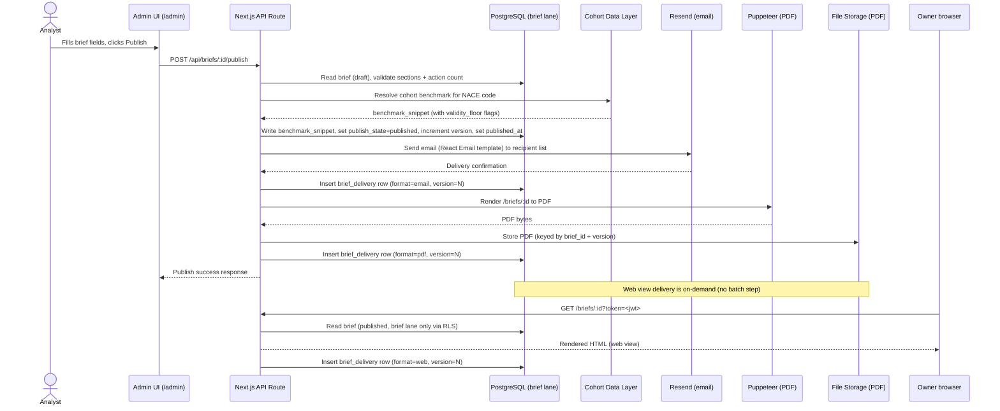

# ADR-0002 — Brief Storage and Delivery

*Owner: engineer · Slug: adr-0002-brief-storage-and-delivery · Last updated: 2026-04-17*

---

## Upstream links

- Product: [docs/product/](../product/) (brief-related feature PRDs — Phase 2; not yet landed)
- Build plan: [docs/project/build-plan.md](../project/build-plan.md) §4 (Phase 1 scope)
- Decision log: D-001 (hand-assigned cohorts), D-003 (8 MVP metrics), D-005 (no cadence commitment), D-006 (NACE-only grain), D-009 (no in-product sharing), D-010 (canonical lane identifiers), D-013 (Supabase Postgres + Vercel hosting)
- PRD §9 (Multi-Format Delivery, Monthly Briefing Generation), §10 (data/privacy)
- Data Engineer artifacts (Phase 1, parallel — not yet landed):
  - `docs/data/privacy-architecture.md` — authoritative lane definitions
  - `docs/data/cohort-math.md` — how cohort references resolve (NACE × floor rules)

---

## Context

Once an authored brief exists it must be stored in a way that:

1. Enforces the four privacy-lane separation required by PRD §10 at the application layer — brief content must not leak into RM-visible, user-contributed, or credit-risk lanes.
2. Supports three delivery formats from a single source of truth: email, in-app web view, downloadable PDF.
3. Provides enough audit trail for the trial (who authored, when, what version was delivered to whom) without building a full audit system.
4. Stays minimal — the trial is less than one month. No event sourcing, no multi-region replication, no complex versioning tree.

---

## Decisions

### ADR-0002-A — Storage engine: PostgreSQL on Supabase (single managed instance)

**Decision:** Store brief records in a PostgreSQL database — one managed Supabase Postgres instance for the entire MVP. (D-013, 2026-04-17.)

**Rationale:**
- PostgreSQL is the most widely understood relational database; it supports row-level security (RLS) which is the mechanism used to enforce lane separation at the database layer (see ADR-0002-C).
- A relational model is appropriate for structured brief data (fixed fields, relationships to cohort references and delivery records).
- The trial's data volume is trivially small (tens of briefs, hundreds of delivery records); no performance consideration applies.
- Supabase Postgres is upstream Postgres with RLS enabled by default — the zero-ops hosting posture chosen in ADR-0001-F is preserved, and the RLS lane-enforcement approach in ADR-0002-C transfers unchanged.
- `DATABASE_URL` in the deployment environment points to the Supabase connection string (pooler endpoint for Vercel serverless; direct endpoint for migrations).

**Consequences:** Introduces a Supabase managed-database dependency. If ČS security policy requires Azure-hosted infrastructure (Q-003), this becomes Azure Database for PostgreSQL; the RLS and lane-enforcement approach is unchanged since both are standard Postgres.

**Rejected alternatives:**
- *Vercel Postgres (Neon-backed)* — engineer-recommended initially; rejected by user at OQ-002 in favour of Supabase (D-013). Functionally equivalent for this ADR's RLS requirements.
- *SQLite (file-based)* — serverless deployments on Vercel do not have a persistent filesystem; SQLite is not viable.
- *MongoDB / document store* — the brief data model is structured and relational (brief → cohort references, brief → delivery records); a relational model fits better and RLS is unavailable in MongoDB.
- *Prisma Accelerate / PlanetScale (MySQL)* — MySQL lacks the RLS feature that enforces lane separation; rejected on privacy grounds.

**Status:** Accepted — 2026-04-17. Updated 2026-04-17 to reflect D-013 (Supabase Postgres). Provider decision resolved — Q-004 closed.

---

### ADR-0002-B — Brief data model

**Decision:** A `briefs` table with the fields below, plus supporting tables for delivery records and cohort references. The model reflects D-006 (NACE-only targeting grain at MVP) and D-003 (8 MVP metrics referenced but not stored in the brief).

#### Core brief fields (`briefs` table)

| Field | Type | Notes |
|-------|------|-------|
| `id` | UUID | Primary key |
| `title` | text | Czech-language brief title |
| `nace_code` | text | NACE level-2 code; targeting grain per D-006 |
| `publish_state` | enum(`draft`, `published`, `archived`) | Analyst-controlled |
| `authored_by` | text | Analyst identifier (email or user ID) |
| `authored_at` | timestamptz | Set on first save |
| `published_at` | timestamptz | Set on first publish action; null if draft |
| `version` | integer | Monotonically incremented on each save; see ADR-0002-D |
| `content_sections` | jsonb | Array of content-section objects (see below) |
| `benchmark_snippet` | jsonb | Cohort benchmark data embedded at publish time; see ADR-0002-B-1 |
| `data_lane` | text | Always `'brief'`; enforced by CHECK constraint and RLS policy |

#### Content sections schema (inside `content_sections` jsonb)

Each element of the array:

```json
{
  "section_id": "string (e.g. 'sector-context', 'observations', 'actions')",
  "heading": "string (Czech)",
  "body": "string (Czech plain-text or minimal markdown)",
  "order": "integer"
}
```

Mandatory sections at MVP: `sector-context`, `observations` (2–4 items), `actions` (2–4 time-horizon-tagged items). The analyst UI enforces the minimum observation/action count before allowing publish.

#### Benchmark snippet schema (inside `benchmark_snippet` jsonb)

This field carries the cohort-level benchmark data for the brief's NACE cohort. It is populated at publish time by resolving the cohort reference (D-001: hand-assigned cohorts on pre-populated data) against the data layer. The field does **not** store individual client financial data — it stores cohort-aggregate outputs (quartile ranges, medians) for the 8 MVP metrics (D-003).

```json
{
  "cohort_id": "string (references cohort registry)",
  "resolved_at": "ISO-8601 timestamp",
  "metrics": [
    {
      "metric_id": "string (e.g. 'gross_margin')",
      "metric_label": "string (Czech display label)",
      "cohort_median": "number",
      "quartile_boundaries": [0.0, 0.0, 0.0, 0.0],
      "validity_floor_met": "boolean"
    }
  ]
}
```

`validity_floor_met: false` means the cohort does not meet the minimum-participant threshold (PRD §10, §13.5). The delivery pipeline must suppress that metric's benchmark snippet in the rendered brief — it is never shown silently. The exact floor threshold is defined in `docs/data/cohort-math.md` (Data Engineer artifact, Phase 1 parallel — not yet landed).

#### Delivery records (`brief_deliveries` table)

| Field | Type | Notes |
|-------|------|-------|
| `id` | UUID | Primary key |
| `brief_id` | UUID | FK → `briefs.id` |
| `brief_version` | integer | Snapshot of version at delivery time |
| `recipient_id` | text | Owner identifier (anonymous trial ID or George token sub) |
| `format` | enum(`email`, `web`, `pdf`) | |
| `delivered_at` | timestamptz | |
| `data_lane` | text | Always `'brief'`; enforced by RLS |

**Status:** Accepted — 2026-04-17

---

### ADR-0002-C — Data-lane enforcement at the storage layer

**Decision:** Enforce lane separation using PostgreSQL row-level security (RLS) policies and a `data_lane` column on every table that touches brief data.

**Rationale:**
- The four-lane model (brief / user-contributed / RM-visible / credit-risk) is the foundational privacy architecture of the product (PRD §10, CLAUDE.md). At MVP, only the `brief` lane is active (D-002 defers RM-visible; no user-contributed data is collected; credit-risk data is ČS-internal and never ingested).
- RLS policies on PostgreSQL are enforced by the database engine — they cannot be bypassed by application bugs that forget to add a WHERE clause.
- The application connects using a role that is granted access only to rows where `data_lane = 'brief'`. If a future increment activates the RM-visible lane, it uses a separate database role with a separate RLS policy — not a flag in the application.
- The `data_lane` column has a CHECK constraint (`data_lane IN ('brief', 'user_contributed', 'rm_visible', 'credit_risk')`) and a NOT NULL constraint. The application-layer ORM (Prisma) models the column as an enum with the same values, so any attempt to insert a row without specifying a lane fails at compile time.

**Dependency:** The lane names used here (`brief`, `user_contributed`, `rm_visible`, `credit_risk`) must align with those defined in `docs/data/privacy-architecture.md`. Alignment was ratified at the Phase 1 gate — see [D-010](../project/decision-log.md) (these identifiers are the canonical form; Q-005 resolved).

**Consequences:** The RLS approach means lane boundary enforcement is a database concern, not solely an application concern. This is the correct posture for a privacy-load-bearing boundary. However, it means database migrations that touch the `data_lane` column require careful review (and must be escalated per the irreversible-action rule before execution).

**Rejected alternatives:**
- *Application-layer filtering only (no RLS)* — insufficient; a single missed WHERE clause leaks cross-lane data. Rejected on privacy grounds.
- *Separate databases per lane* — correct in principle but operationally disproportionate for a one-month trial where only one lane is active.
- *Schema-per-lane (same database, separate schemas)* — viable but more complex to set up than RLS; deferred to post-MVP if lane activation requires it.

**Status:** Accepted — 2026-04-17. Lane-naming alignment confirmed via D-010 (2026-04-17); Q-005 resolved.

---

### ADR-0002-D — Versioning: optimistic version counter, no full history at MVP

**Decision:** Each `briefs` row carries a monotonically-incrementing `version` integer. On each analyst save, the version increments. The `brief_deliveries` table records the `brief_version` at delivery time. No full version-history table (no row-per-version snapshot store) at MVP.

**Rationale:**
- The trial window is less than one month. It is unlikely that a published brief will need to be materially edited after delivery — and if it is, the analyst can republish and a new delivery record is created.
- Full version history (immutable row-per-version) is the correct architecture for a production system but adds schema complexity, migration risk, and query complexity that the trial does not justify.
- The delivery record's `brief_version` integer provides the audit link: "this delivery used version N of this brief." Combined with `authored_at` and `published_at`, this is sufficient for trial-window traceability.
- If a brief is edited after delivery, the web view renders the current (latest) version. This is the simplest behavior. A "version mismatch" warning on the web view is a Phase 2 concern (logged as Q-006).

**Consequences:** Email and PDF are point-in-time snapshots delivered at a moment — they do not update if the brief is later edited. The web view always shows the current version. This asymmetry is acceptable for a short trial (few edits expected post-publish) but must be reconsidered if the trial extends.

**Rejected alternatives:**
- *Full immutable version history (append-only row per version)* — correct architecture for post-MVP; rejected as YAGNI for a one-month trial.
- *Git-based versioning for brief content* — adds operational complexity and a second storage system for a short trial.

**Status:** Accepted — 2026-04-17. Post-publish edit behavior (web view vs. delivered formats) logged as Q-006.

---

### ADR-0002-E — Delivery pipeline

**Decision:** Analyst publish action triggers a sequential server-side pipeline: validate → snapshot benchmark data → render email → send via Resend → render PDF → store PDF → mark delivery records. The web view is served on-demand from the database; it is not a pre-rendered artifact.

**Happy-path flow:**



**Rationale:**
- Sequential pipeline is the simplest implementation and sufficient for a trial with a small number of recipients per brief.
- Benchmark snapshot at publish time (not at read time) means all three formats receive identical data — no drift between email and web view.
- Web view rendered on-demand from the database keeps the serving path simple and ensures the analyst can see the latest version without re-publishing.
- PDF stored in file storage (Vercel Blob or equivalent) so owners can download it without re-triggering Puppeteer on each request.

**Consequences:** The publish action is synchronous and may take 3–8 seconds for Puppeteer PDF generation. For a trial with a small analyst team and small recipient list, this is acceptable. If the trial scales, the PDF step must move to a background job — logged as Q-007.

**Rejected alternatives:**
- *Async queue (e.g., BullMQ, Inngest)* — correct architecture for scale; rejected as YAGNI for a one-month trial with a small team.
- *Pre-rendering all three formats at author time (not at publish time)* — confusing analyst UX (draft state has artifacts); publish-time rendering is the intuitive model.

**Status:** Accepted — 2026-04-17. Synchronous pipeline scalability logged as Q-007.

---

### ADR-0002-F — PDF storage: Vercel Blob

**Decision:** Generated PDFs are stored in Vercel Blob, keyed as `briefs/{brief_id}/v{version}.pdf`. Download links are signed with a short TTL (e.g., 1 hour). Vercel Blob is retained following the D-013 provider decision — Vercel hosting is unchanged, and Vercel Blob is the zero-configuration pairing for that host.

**Rationale:**
- Vercel Blob is the zero-configuration object storage that pairs with Vercel hosting (ADR-0001-F / D-013). No S3 bucket setup, no IAM, no additional ops.
- Signed URLs prevent unauthenticated download — the PDF carries brief content and must not be publicly accessible.
- Keying by `brief_id/version` makes it trivial to serve the correct PDF version matching the delivery record.
- Supabase Storage was considered for operational coherence with the Supabase Postgres choice (D-013), but the marginal coherence benefit does not outweigh the zero-config advantage of Vercel Blob when Vercel remains the hosting platform. Switching to Supabase Storage would add SDK and credential configuration without materially improving the privacy or reliability posture.

**Consequences:** If ČS security policy requires internal storage (Q-003), this becomes Azure Blob Storage. The application code switches only the SDK call — the URL-signing pattern is identical.

**Rejected alternatives:**
- *Supabase Storage* — considered for operational coherence after D-013; rejected — marginal coherence benefit does not outweigh Vercel Blob's zero-config pairing with Vercel hosting.
- *Serve PDF on-demand by re-running Puppeteer on each download* — Puppeteer startup cost per download is wasteful; rejected.
- *Store PDF as a bytea column in PostgreSQL* — anti-pattern for large binary objects; adds unnecessary database load.

**Status:** Accepted — 2026-04-17. Confirmed 2026-04-17 following D-013: Vercel Blob retained. Cloud storage provider contingent on Q-003 resolution.

---

## Data contracts

This ADR defines the application-layer data model. It depends on two Data Engineer artifacts that are in-flight as parallel Phase 1 work:

- **`docs/data/privacy-architecture.md`** — authoritative definitions of the four data lanes, including the exact lane identifiers to be used in the `data_lane` column and RLS policies (see ADR-0002-C; lane identifier alignment ratified via D-010).
- **`docs/data/cohort-math.md`** — the minimum-cohort floor threshold value, the fields returned by the cohort-resolution service (matching the `benchmark_snippet` schema above), and the exact degradation semantics when `validity_floor_met = false` (see ADR-0002-B-1).

Both artifacts must be read and reconciled against this ADR when they land. Any terminology or schema disagreements are to be flagged in [docs/project/open-questions.md](../project/open-questions.md).

---

## Test plan

*No `src/` code is produced by this ADR. The following test obligations arise from choices made here and will be implemented in Phase 2 alongside the corresponding feature code:*

**Unit tests:**
- Benchmark snapshot resolver: given a NACE code and pre-populated cohort data, returns the correct metric values and correctly sets `validity_floor_met = false` for a cohort below the floor.
- Brief validator: rejects a publish attempt that has fewer than 2 observations or 2 actions; accepts one with 2–4 of each.
- Signed URL generator: a URL generated with a 1-hour TTL is accepted within the window and rejected after it.

**Integration tests:**
- Publish pipeline end-to-end (test database): analyst publishes a brief → `publish_state` transitions to `published`, `brief_deliveries` rows created for email and PDF formats, `published_at` set.
- RLS enforcement: a query using the `brief`-lane database role cannot read rows where `data_lane != 'brief'`; an INSERT without `data_lane = 'brief'` is rejected by the CHECK constraint.
- Web view delivery: GET `/briefs/:id` with a valid JWT returns 200 and a `brief_delivery` row is created; GET with an invalid/expired JWT returns 401 and no delivery row is created.

**Privacy invariant tests:**
- No client financial data (individual-level) appears in any `brief` lane table. (Enforced structurally: the `benchmark_snippet` schema only accepts cohort-aggregate fields; no individual identifier field exists in the schema.)
- The `data_lane` column on `briefs` and `brief_deliveries` cannot be set to a value other than the allowed enum values (CHECK constraint test).
- A database connection using the `brief` role cannot SELECT, INSERT, or UPDATE rows in any table where `data_lane != 'brief'`.

---

## Deployment + rollback

- **Schema migrations:** Run via Prisma Migrate (`prisma migrate deploy`) as a pre-deployment step. Every migration must be reviewed before execution (irreversible-action rule). For the trial, all migrations are additive (no column drops, no table renames).
- **Env vars required:** `DATABASE_URL` (connection string with `brief`-lane role credentials), `STORAGE_BUCKET_URL`, `STORAGE_SIGNING_SECRET`.
- **Rollback:** Vercel instant rollback restores the application code. The database schema cannot be automatically rolled back — additive-only migration discipline ensures that rolling back the app code against the newer schema is safe (old code ignores new columns; new columns are nullable or have defaults).
- **Feature flag:** Not applicable at this ADR level.

---

## Open questions

| ID | Question | Blocking |
|----|----------|---------|
| Q-004 | ~~Which managed PostgreSQL provider?~~ | Resolved — Supabase Postgres per D-013 (2026-04-17). |
| Q-005 | ~~Do the lane identifiers in `docs/data/privacy-architecture.md` match those used in this ADR?~~ | Resolved — D-010 (2026-04-17) ratified `brief` / `user_contributed` / `rm_visible` / `credit_risk` as canonical. |
| Q-006 | Post-publish brief edits: should the web view show a "this brief has been updated since delivery" notice? How should version mismatch between email/PDF (snapshot) and web view (live) be surfaced to the owner? | Phase 2 web view feature |
| Q-007 | If pilot recipient list grows beyond ~50 per brief, the synchronous Puppeteer PDF step will cause publish-button latency >10 s. Trigger to move PDF generation to a background job (e.g., Inngest)? | Phase 2/3 brief delivery scale |

*Q-004 and Q-005 resolved (D-013 and D-010 respectively). Q-006 and Q-007 remain open — also logged in [docs/project/open-questions.md](../project/open-questions.md).*

---

## Changelog

- 2026-04-17 — initial draft — engineer
- 2026-04-17 — §A updated: Supabase Postgres replaces "Vercel Postgres (Neon) or Supabase" per D-013; Vercel Postgres added as rejected alternative; Q-004 closed. §C: D-010 pointer added confirming lane identifier alignment; Q-005 closed. §F: Vercel Blob retained; Supabase Storage considered and rejected with justification; Confirmed after D-013. Upstream-links and Open Questions table updated accordingly — engineer
